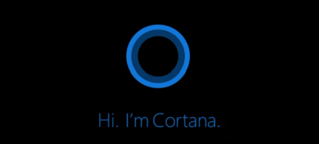
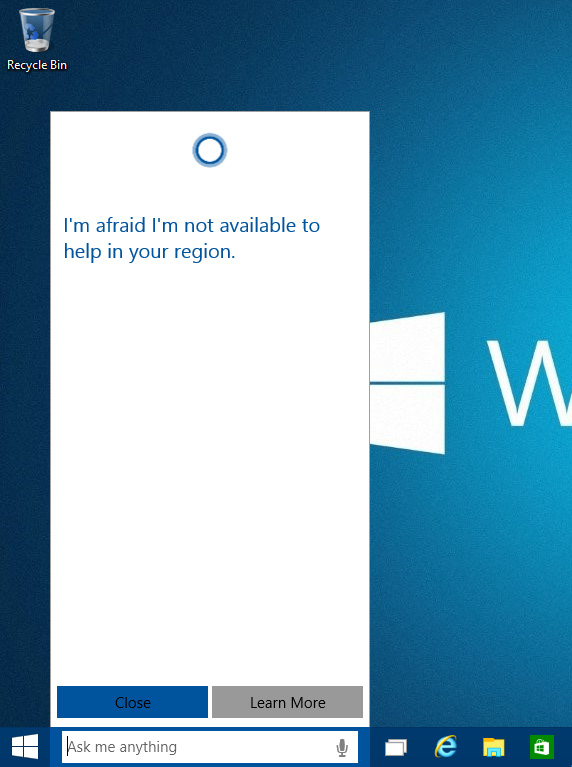
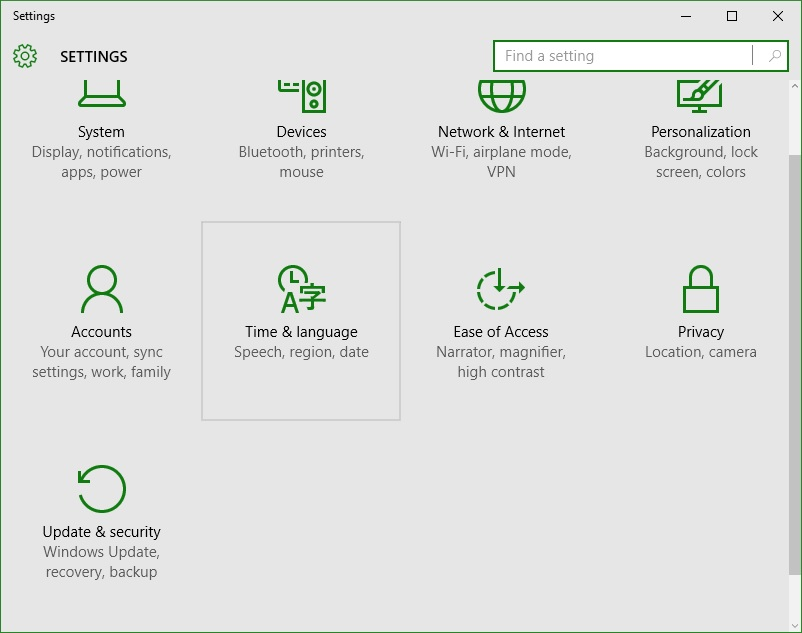
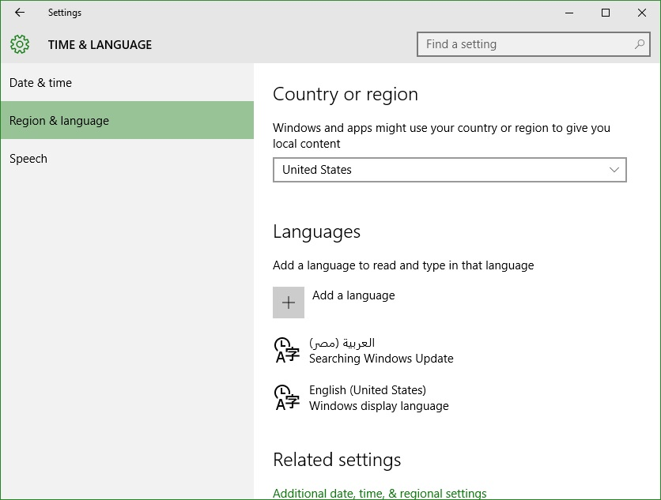
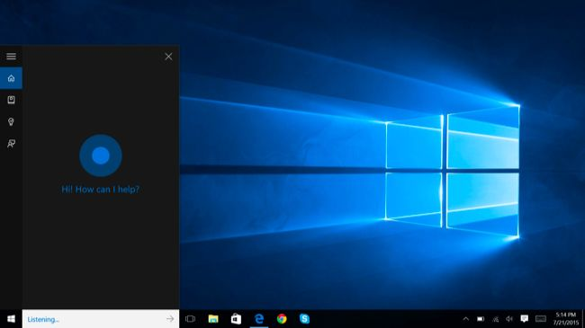

+++
title = "تفعيل المساعدة الصوتية Cortana على ويندوز 10 في أي مكان في العالم"
date = "2015-08-03"
description = "بلا شك فإن خاصية المساعدة الصوتية Cortana واحدة من أفضل المميزات التي جاء بها ويندوز 10، ولكن المشكلة التي تواجهنا كمستخدمين للويندوز هي عدم عملها خارج الولايات المتحدة الأمريكية، في درس اليوم ستتعرف عزيزي القارئ على سر سيمكنك من تفعيل Cortana على ويندوز 10 في أي مكان في العالم"
categories = ["ويندوز",]
series = ["ويندوز 10"]
tags = ["موقع لغة العصر"]
images = ["images/2015-635742175902406034-240.jpg"]

+++

بلا شك فإن خاصية المساعدة الصوتية Cortana واحدة من أفضل المميزات الجديدة التي جاء بها ويندوز 10، ولكن المشكلة الوحيدة التي تواجهنا كمستخدمين لنظام الويندوز هي عدم توافر هذه الخاصية باللغة العربية، وعدم عملها خارج الولايات المتحدة الأمريكية، في درس اليوم ستتعرف عزيزي القارئ على سر سيمكنك من تفعيل لمساعدة الصوتية Cortana على ويندوز 10 في أي مكان في العالم.

## أولا: الدول التي تعمل بها المساعدة الصوتية Cortana بشكل رسمي:

تتوفر هذه الميزة لمستخدمي نظام الويندوز في هذه الدول السبعة: الولايات المتحدة الأمريكية، المملكة المتحدة، فرنسا، اسبانيا، ألمانيا، إيطاليا، والصين.

كما أعلنت مايكروسوفت أنه خلال الأشهر القادمة سوف تنضم اليابان، استراليا، كندا والهند إلى قائمة الدول التي تدعم خاصية المساعدة الصوتية.

## ثانيا: ماذا يحدث عند محاولة تشغيل المساعدة الصوتية Cortana في أي دولة أخرى:

عند تشغيل المساعدة الصوتية لأول مرة عن طريق الضغط على مربع البحث في شريط المهام تظهر للمستخدم هذه الرسالة:

ولا يمكن للمستخدم فعل أي شيء سوى الضغط على Close ومتابعة استخدام شريط البحث بالطريقة التقليدية.

## ثالثا: ما المطلوب لتشغيل المساعدة الصوتية Cortana؟

1. حساب مايكروسوفت تم التسجيل به داخل الويندوز.
2. اتصال بالإنترنت.
3. القيام بالخطوات القادمة.

## رابعا: خطوات تفعيل المساعدة الصوتية Cortana في أي مكان في العالم:

1. قم بالدخول إلى تطبيق الإعدادات، ثم اختر القسم “Time & language”.

2. انتقل إلى التبويب “Region & language”، ثم من القائمة المنسدلة “Country or region” قم باختيار أي دولة من السبع دول التي تعمل بهم خاصية المساعدة الصوتية، ويفضل اختيار “United States”.

3. قم بالدخول إلى مربع البحث مرة أخرى لتجد Cortana قد ظهرت.

---
هذا الموضوع نٌشر باﻷصل على موقع مجلة لغة العصر.

http://aitmag.ahram.org.eg/News/21836.aspx