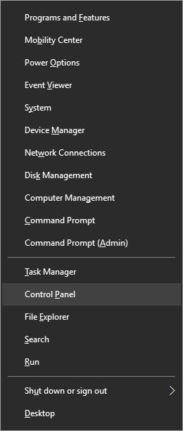
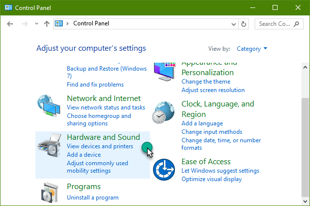
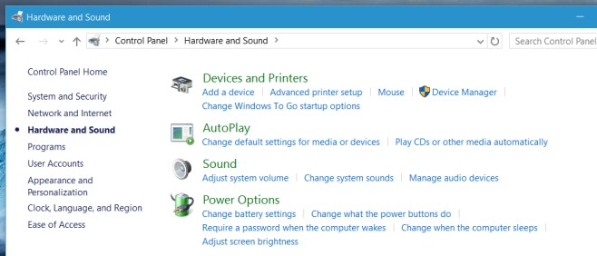
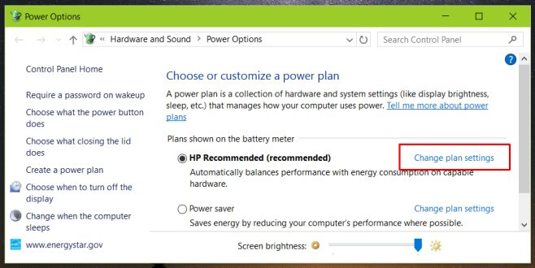
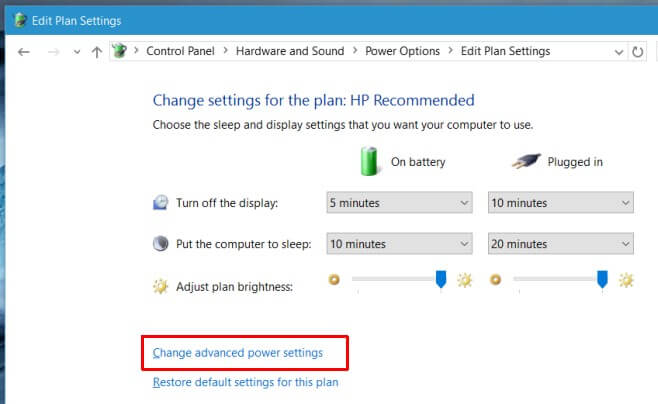

+++
title = "كيفية تفعيل ميزة السطوع المتكيف في ويندوز 10"
date = "2016-06-12"
description = "السطوع المتكيف هو ميزة تقوم بتغيير مستوى الإضاءة وفقا للضوء المحيط بك، كما في الهواتف الذكية، هذه الميزة يمكن تفعيلها على أجهزة الكمبيوتر المحمولة التي تعمل بويندوز 10، إليك طريقة تجربتها"
categories = ["ويندوز",]
series = ["ويندوز 10"]
tags = ["موقع لغة العصر"]
images = ["images/0.png"]
+++

السطوع المتكيف هى ميزة تقوم بتغيير مستوى الإضاءة وفقا للضوء المحيط بك، كما في الهواتف الذكية، هذه الميزة يمكن تفعيلها على أجهزة الكمبيوتر المحمولة التي تعمل بويندوز 10، إليك طريقة تجربتها.

1. قم بالدخول إلى لوحة التحكم Control Panel (يمكنك استخدام الاختصار Win + X).

2. انتقل إلى القسم Hardware and Sound.

3. اختر Power Options.

4. اضغط على Change Plan Settings.

5. ثم اضغط على Change advanced power settings.

6. قم بالنزول إلى الاختيار Display، ثم انتقل إلى الاختيار Enable adaptive brightness، وقم بتغييره إلى On.

---
هذا الموضوع نٌشر باﻷصل على موقع مجلة لغة العصر.

http://aitmag.ahram.org.eg/News/52803.aspx