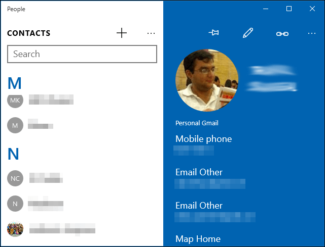
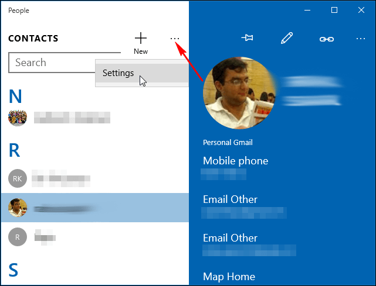
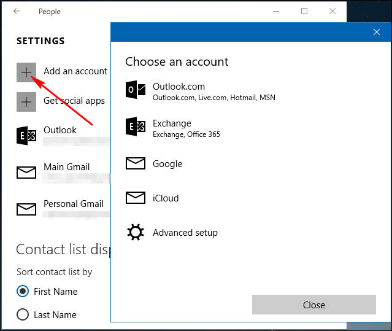

+++
title = "كيفية إضافة الأسماء من بريدك الالكتروني إلى تطبيق الأشخاص في ويندوز 10"
date = "2016-01-25"
description = "يستخدم العديد منا حسابات منفصلة للعمل وللحياة العامة، وفي ويندوز 10 يمكنك إدارة دفتر العناوين الخاص بجميع حساباتك في تطبيق واحد وهو تطبيق الأشخاص People"
categories = ["ويندوز",]
series = ["ويندوز 10"]
tags = ["موقع لغة العصر"]

+++

يستخدم العديد منا حسابات منفصلة للعمل وللحياة العامة، وفي ويندوز 10 يمكنك إدارة دفتر العناوين الخاص بجميع حساباتك في تطبيق واحد وهو تطبيق الأشخاص People.

تطبيق الأشخاص هو مدير لجهات الاتصال يتيح للمستخدم الحصول على جميع جهات الاتصال الموجود في جميع الحسابات المختلفة مثل Hotmail، Gmail وYahoo، وعرضها في مكان واحد بحيث يسهل إدارتها.

للدخول إلى التطبيق:

1- قم بفتح قائمة البداية ثم من All apps اختر People أو يمكنك البحث عن التطبيق في شريط البحث والوصول إليه، ستجد واجهة التطبيق كما بالصورة.

2- لاستيراد الأسماء من الحسابات الأخرى:
اضغط على زر الخيارات ثم اختر Settings.

3- سيظهر لك كل حسابات التي سبق وقمت بربطها بالويندوز اختر منها ما تريد، كما يمكنك الضغط على Add an account ثم قم بإضافة الحساب الجديد.

4- ستجد الآن جميع جهات الاتصال الخاصة بك قد ظهرت في تطبيق الأشخاص.

---
هذا الموضوع نٌشر باﻷصل على موقع مجلة لغة العصر.

http://aitmag.ahram.org.eg/News/41751.aspx