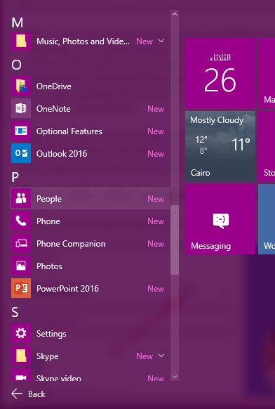
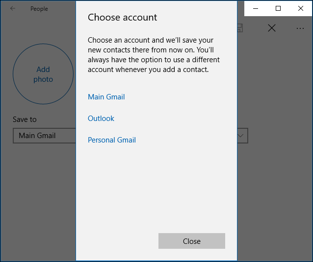
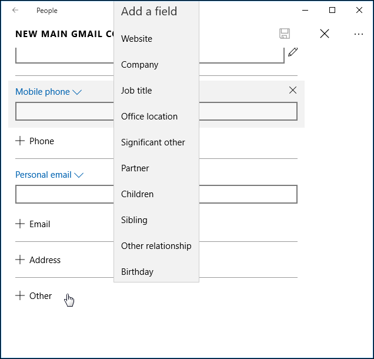
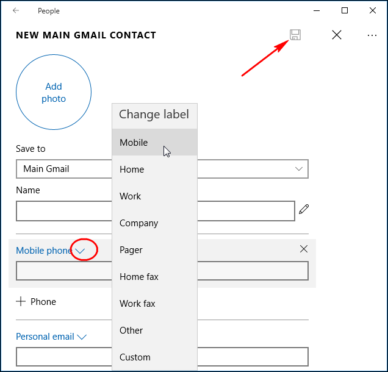
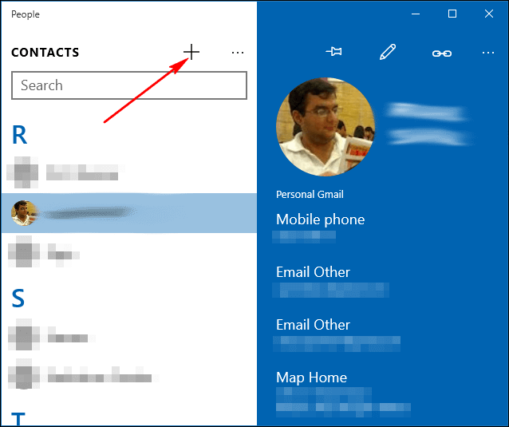
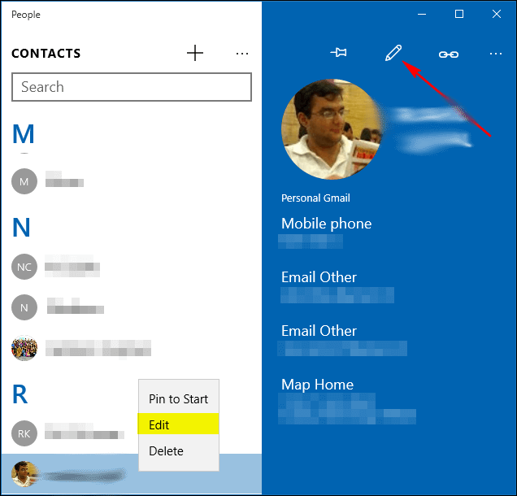

+++
title = "كيفية إضافة جهات اتصال إلى تطبيق الأشخاص في ويندوز 10"
date = "2016-01-26"
description = "تحدثنا في الدرس السابق عن طريق إضافة الأسماء من بريدك الالكتروني إلى تطبيق الأشخاص وفي درس اليوم نتابع شرح تطبيق الأشخاص في ويندوز 10 ومع طريقة انشاء جهات اتصال جديدة"
categories = ["ويندوز",]
series = ["ويندوز 10"]
tags = ["موقع لغة العصر"]
images = ["images/0.png"]

+++

تحدثنا في الدرس السابق عن طريق إضافة الأسماء من بريدك الالكتروني إلى تطبيق الأشخاص وفي درس اليوم نتابع شرح تطبيق الأشخاص في ويندوز 10 ومع طريقة انشاء جهات اتصال جديدة.

1. قم بفتح تطبيق الأشخاص.

2. اضغط على زر + بجانب زر القائمة.

3. اختر الحساب الذي تود انشاء جهة الاتصال به.

4. قم بمليء بيانات جهة الاتصال كما تريد، يمكنك أيضا تغيير نوع الرقم كما تفعل في تطبيق الأشخاص على هاتفك، أيضا يمنك إضافة خانات أخري كما بالصورة.

5. اضغط على زر الحفظ.

**- لتعديل أي جهة اتصال حالية**:

 قم بتحديد الشخص ثم اضغط على زر تحرير.

---
هذا الموضوع نٌشر باﻷصل على موقع مجلة لغة العصر.

http://aitmag.ahram.org.eg/News/42120.aspx