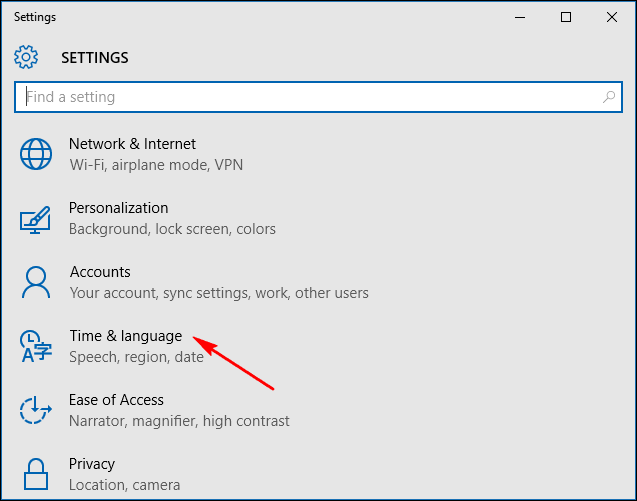
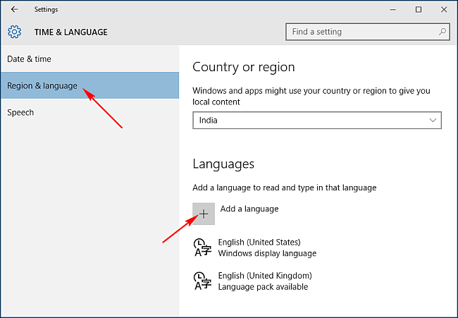
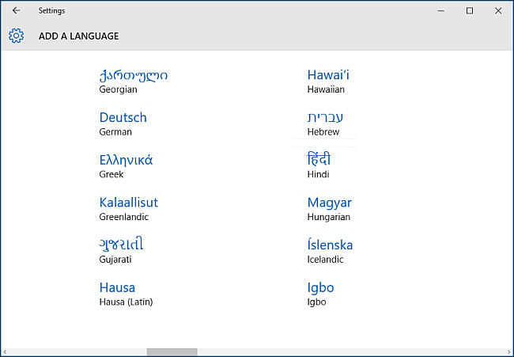
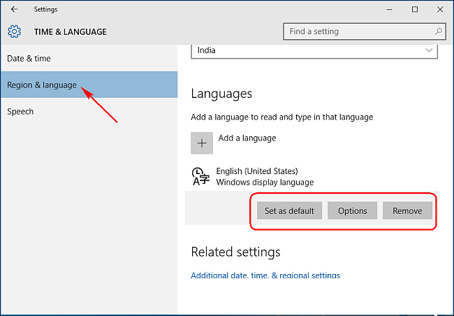

+++
title = "كيفية إضافة مزيد من اللغات إلى ويندوز 10"
date = "2015-11-05"
description = "في ويندوز 10 إضافة المزيد من اللغات متاحة للجميع، فحتى إذا لم تقم بإعداد اللغات عند التثبيت يمكنك إضافة اللغات عن طريق تطبيقات الإعدادات، إليك الطريقة."
categories = ["ويندوز",]
series = ["ويندوز 10"]
tags = ["موقع لغة العصر"]
+++

في ويندوز 10 إضافة المزيد من اللغات متاحة للجميع، فحتى إذا لم تقم بإعداد اللغات عند التثبيت يمكنك إضافة اللغات عن طريق تطبيقات الإعدادات، إليك الطريقة.

يجب أن تسجل الدخول بصلاحيات المدير Administrator بعد ذلك قم بالخطوات الاتية:

1- قم بالدخول إلى تطبيق الإعدادات ثم إلى قسم "Time & Language".

2- انتقل إلى التبويب Region & language، ثم اضغط "Add a language" كما بالصورة.

3- ستفتح نافذة جديدة تعرض جميع اللغات المتاحة للتثبيت مرتبة أبجديا، بمجرد أن تضغط على اللغة التي تريد اضافتها سيبدأ الويندوز تحميلها.

4. قم بالرجوع إلى شاشة "Time & Language" ثم اضغط على اللغة الجديدة، ستجد ثلاثة خيارات هي:

- Set as default: لتعيين اللغة كافتراضية.
- Options: مزيد من الاعدادات الخاصة باللغة.
- Remove: إزالة تثبيت اللغة.

---
هذا الموضوع نٌشر باﻷصل على موقع مجلة لغة العصر.

http://aitmag.ahram.org.eg/News/36571.aspx