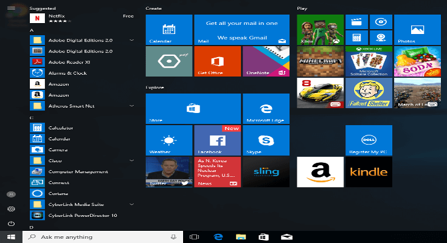
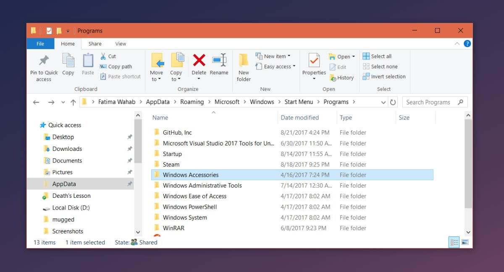
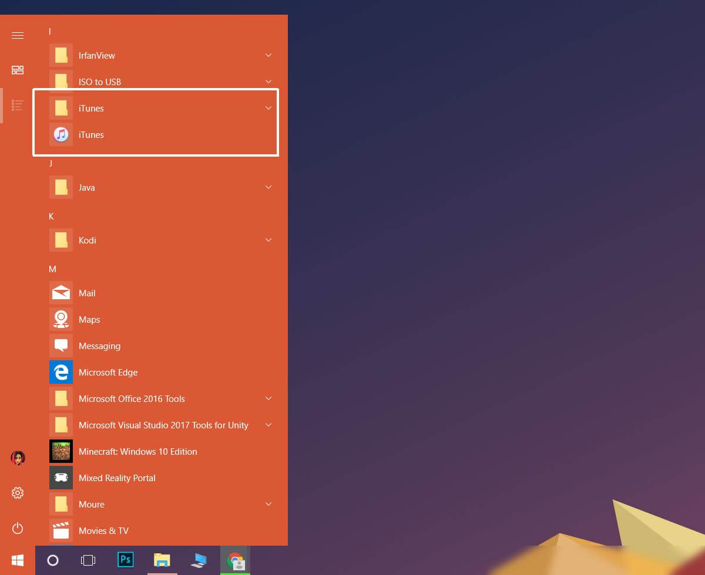

+++
title = "كيفية إضافة البرامج إلى قائمة البداية فى ويندوز 10"
date = "2017-10-09"
description = "عندما تقوم بتثبيت أحد البرنامج فإن الويندوز يقوم بإضافته إلى قائمة البداية، ولكن في بعض الأحيان يحدث خطأ يؤدي إلى عدم إضافة البرنامج، إليك عزيزي القارئ طريقة إضافة البرامج يدويا إلى قائمة البداية."
categories = ["ويندوز",]
series = ["ويندوز 10"]
tags = ["المدونة",]
images = ["images/0.png"]
+++

عندما تقوم بتثبيت أحد البرنامج فإن الويندوز يقوم بإضافته إلى قائمة البداية، ولكن في بعض الأحيان يحدث خطأ يؤدي إلى عدم إضافة البرنامج، إليك عزيزي القارئ طريقة إضافة البرامج يدويا إلى قائمة البداية.



## **الطريقة الأولي:** **إضافة اختصار البرنامج إلى مجلد قائمة البداية:**

وهي الطريقة التقليدية للقيام بهذا الأمر في جميع إصدارات الويندوز، قم بالدخول إلى القرص المثبت عليه الويندوز ثم المجلد user ثم المستخدم الخاص بك.

بعد ذلك قم بالدخول للمسار التالي:

```
%AppData%\Roaming\Microsoft\Windows\Start Menu\Programs
```



ثم قم بنسخ ولصق اختصار البرنامج الذي تريد إضافته بداخل أي من المجلدات الموجودة أمامك.


## **الطريقة الثانية:** **إنشاء مجلد جديد بداخل قائمة البداية:**

بعد دخولك لنفس المسار السابق، قم بإنشاء مجلد جديد باسم البرنامج الذي تود إضافته، ثم قم بلصق اختصار البرنامج بداخله، ليظهر لك البرنامج في قائمة  البداية كما بالصورة.




