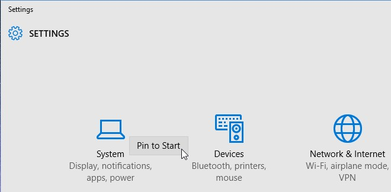
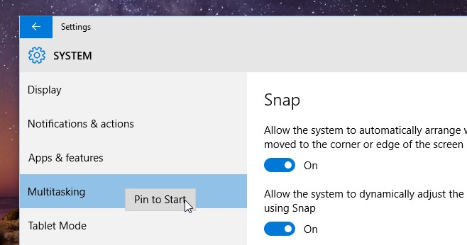

+++
title = "إضافة اختصارات الإعدادات لقائمة البداية في ويندوز 10"
date = "2015-07-22"
description = "تعتبر قائمة البداية في ويندوز 10 مختلفة تماما عن ويندوز 7، ومن ضمن التغييرات التي جاءت بها قائمة البداية في ويندوز 10 إمكانية إضافة اختصارات إعدادات لوحة التحكم إليها، إليكم الطريقة."
series = ["ويندوز 10"]
categories = ["ويندوز",]
tags = ["موقع لغة العصر"]
images = ["images/2015-635731698403198384-319.jpg"]

+++

تعتبر قائمة البداية في ويندوز 10 مختلفة تماما عن ويندوز 7، ومن ضمن التغييرات التي جاءت بها قائمة البداية في ويندوز 10 إمكانية إضافة اختصارات إعدادات لوحة التحكم إليها، إليكم الطريقة.

1. قم بفتح تطبيق الإعدادات Settings App.

2. يمكنك إضافة اختصار لأي من مجموعات الإعدادات إلى قائمة البداية عن طريق الضغط بزر الفأرة الأيمن واختيار ‘Pin to Start’.

3. يمكنك أيضا الدخول الى أي من مجموعات الإعدادات وتثبيت 
تبويب معين في قائمة البداية بالضغط على التبويب بزر الفأرة الأيمن واختيار
 ‘Pin to Start’.

بهذه الطريقة تكون قد استطعت الوصول بسهولة شديدة الى إعداداتك المفضلة بدون البحث أو حتى فتح تطبيق الإعدادات!

---
هذا الموضوع نٌشر باﻷصل على موقع مجلة لغة العصر.

http://aitmag.ahram.org.eg/News/20795.aspx