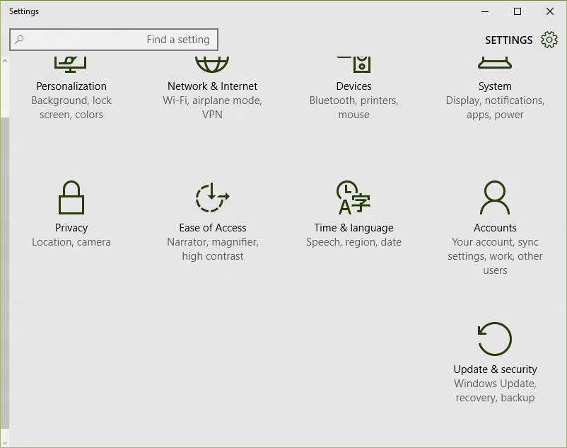

+++
title = "الخصائص المتقدمة لميزة أسطح المكتب المتعددة"
date = "2015-07-10"
description = "تحدثنا في الدرس السابق عن التعامل مع ميزة أسطح المكتب المتعددة في ويندوز 10 وفى درس اليوم ستنعرف على الخصائص المتقدمة لميزة أسطح المكتب الوهمية، إليكم طريقة إخفاء التطبيقات المفتوحة على سطح المكتب الوهمي من شريط المهام في ويندوز 10."
categories = ["ويندوز",]
series = ["ويندوز 10"]
tags = ["موقع لغة العصر"]

+++

تحدثنا  في الدرس السابق عن التعامل مع ميزة أسطح المكتب المتعددة في ويندوز 10 وفى درس اليوم ستنعرف على الخصائص المتقدمة لميزة أسطح المكتب الوهمية، إليكم طريقة إخفاء التطبيقات المفتوحة على سطح المكتب الوهمي من شريط المهام في ويندوز 10.

تبعا للإعدادات الافتراضية للويندوز فإنه يقوم بإظهار جميع التطبيقات المفتوحة على شريط المهام، حتى لو كانت مفتوحة في أكثر من سطح مكتب واحد، فمثلا لو قمت بفتح جوجل كروم في سطح المكتب الأول، ثم قمت بإنشاء سطح مكتب جديد، ستظهر أيقونة جوجل كروم أيضا على شريط مهام سطح المكتب الثاني أيضا، ولكن حتى تصبح ميزة أسطح المكتب الوهمية أفضل يمكنك التحكم في إعدادات إظهار التطبيقات المفتوحة على شريط المهام لجعل الويندوز يقوم بإظهار التطبيقات المفتوحة في سطح المكتب الحالي فقط، إليكم الطريقة.

1. قم بالدخول إلى تطبيق الإعدادات.

2. اختر القسم System Settings.
3. اختر التبويب Multitasking، أسفل Virtual desktops ستجد قائمتين منسدلتين.

4. القائمة الأولى: On the Taskbar, show windows that are open on:
قم باختيار Only the desktop I'm using وبهذا لن يظهر على شريط المهام إلا التطبيقات المفتوحة على سطح المكتب الحالي.
5. القائمة الثانية: Pressing Alt+Tab shows windows that are open on:
من خلال هذه القائمة تستطيع التحكم في اظهار 
جميع التطبيقات المفتوحة على جميع أسطح المكتب عند الضغط على Alt+Tab أم 
اظهار التطبيقات المفتوحة على سطح المكتب الحالي فقط، يفضل أن تختار Only 
the desktop I'm using.
6. هكذا تكون قد حصلت على أفضل إعدادات لخاصية أسطح المكتب الوهمية في ويندوز 10.

---
هذا الموضوع نٌشر باﻷصل على موقع مجلة لغة العصر.