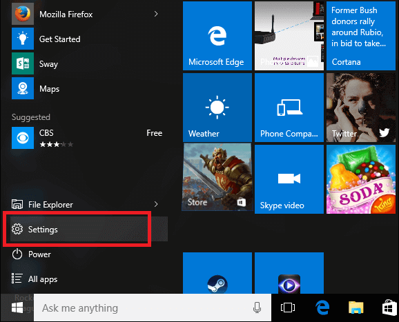
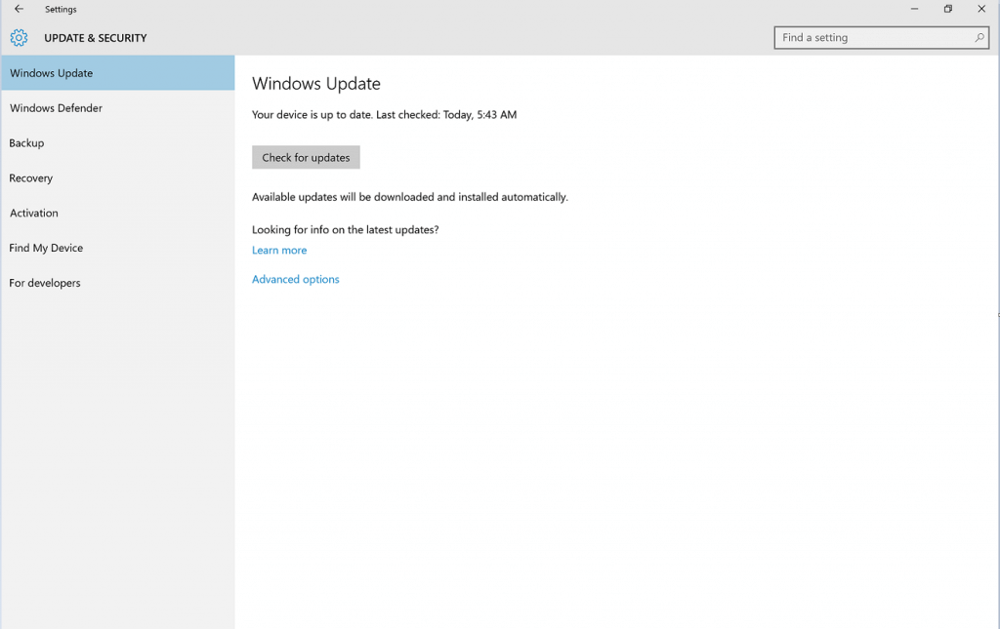
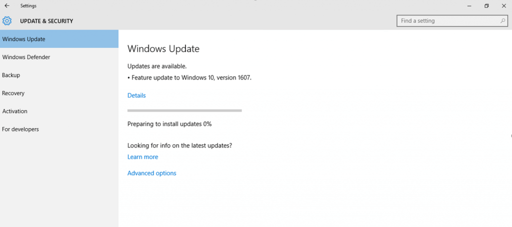
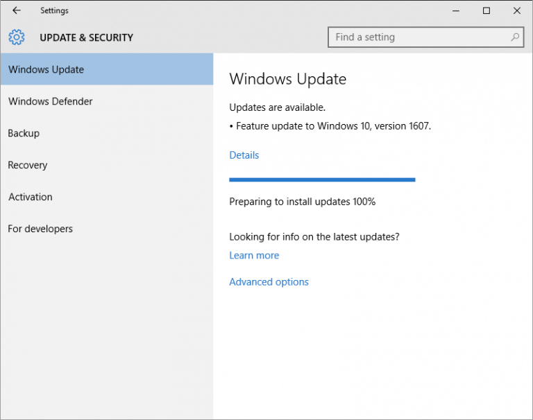
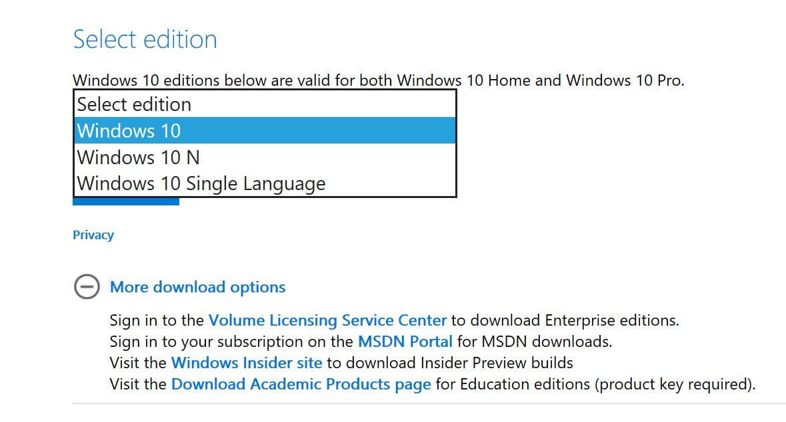
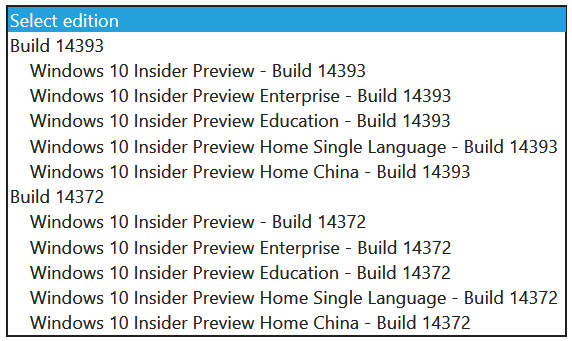
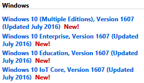

+++
title = " طرق تحميل تحديث ويندوز 10 Anniversary Update (1)"
date = "2016-08-10"
description = "الجميع متشوق لتجربة التحديث الجديد لويندوز 10، كما أن البعض لم يصل له التحديث بعد، في هذا الدرس ستتعرف عزيزي القارئ على أربعة طرق لتحميل التحديث حتى وإن لم يصلك!"
categories = ["ويندوز",]
series = ["ويندوز 10"]
tags = ["موقع لغة العصر"]
+++

الجميع متشوق لتجربة التحديث الجديد لويندوز 10، كما أن البعض لم يصل له التحديث بعد، في هذا الدرس ستتعرف عزيزي القارئ على أربعة طرق لتحميل التحديث حتى وإن لم يصلك!

**الطريقة الأولى: التحديث من داخل إعدادات الويندوز:**

1. قم بالدخول إلى [تطبيق الإعدادات](()ٕعدادات.aspx).

2. انتقل إلى القسم Update and Security ثم التبويب Windows Update.

3. اضغط على زر Check for update وانتظر حتى يكتمل البحث عن التحديث.

4. في حالة وصول التحديث لجهازك سيبدأ الويندوز بتحميله كما بالصورة.

5. انتظر حتى الانتهاء من التثبيت والتحديث وإعادة تشغيل الجهاز.

**الطريقة الثانية: التحديث بواسطة ملفات ال** **ISO** **الرسمية من مايكروسوفت:**

1. عن طريق موقع مايكروسوفت:

قم بالدخول إلى الموقع [من هنا](https://www.microsoft.com/en-us/software-download/windows10ISO/?tduid=(9de4d740fb3540b70081de67b83ff607)(259740)(2542549)(d_wp)()) ثم اختر النسخة التي تريد تحميلها واللغة، بعد ذلك اضغط على رابط التحميل 32 أو 64.

2. عن طريق Windows Insider:

قم بالدخول إلى هذا [الرابط](https://www.microsoft.com/en-us/software-download/windowsinsiderpreviewadvanced) ثم سجل الدخول بحساب Insider الخاص بك، بعد ذلك قم بتحميل ملف ال ISO الذي تريده.

3. عن طريق شبكة MSDN:

يجب أن يتوفر لديك حساب Microsoft Developer Network للتحميل.

قم بالدخول إلى [هذا الرابط](https://msdn.microsoft.com/en-us/subscriptions/downloads/) ثم حمل ملف ال ISO الذي تريده.

---
هذا الموضوع نٌشر باﻷصل على موقع مجلة لغة العصر.

http://aitmag.ahram.org.eg/News/57598.aspx