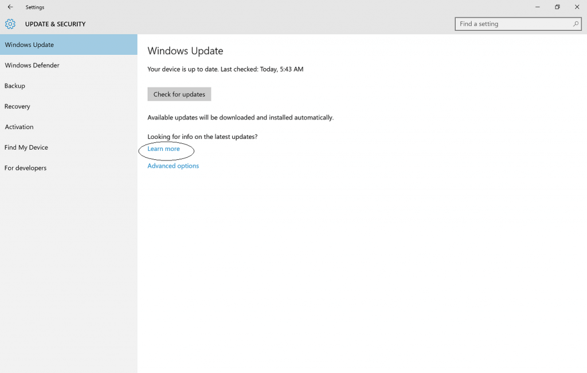
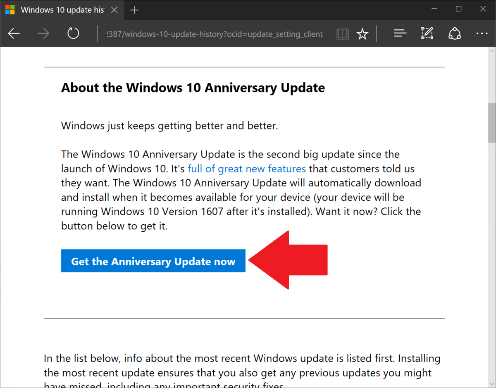
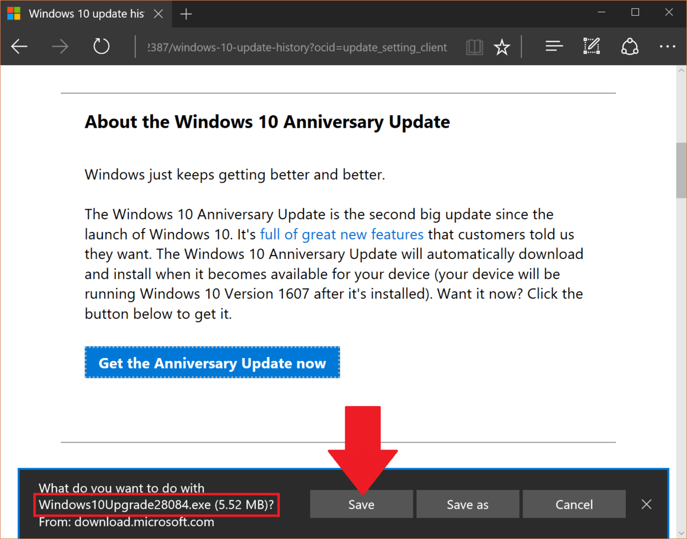
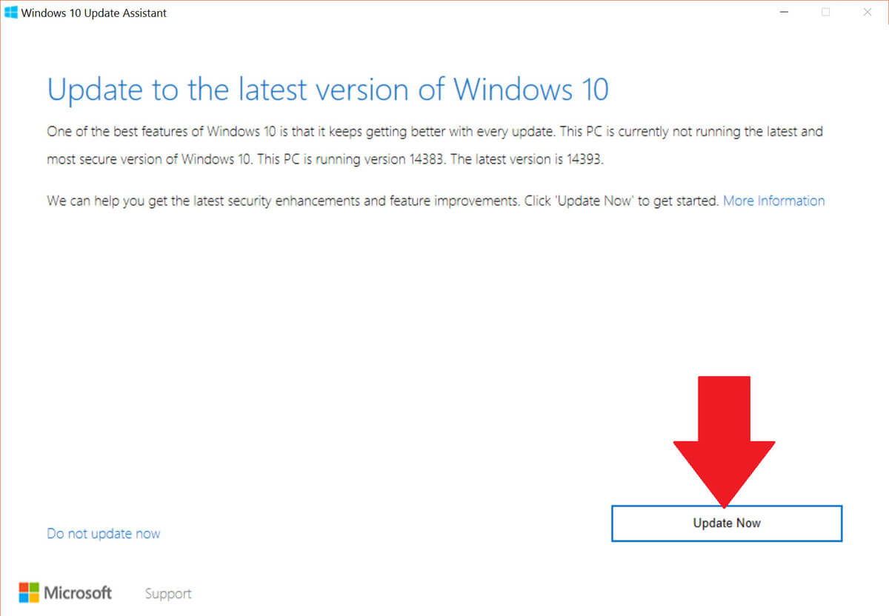
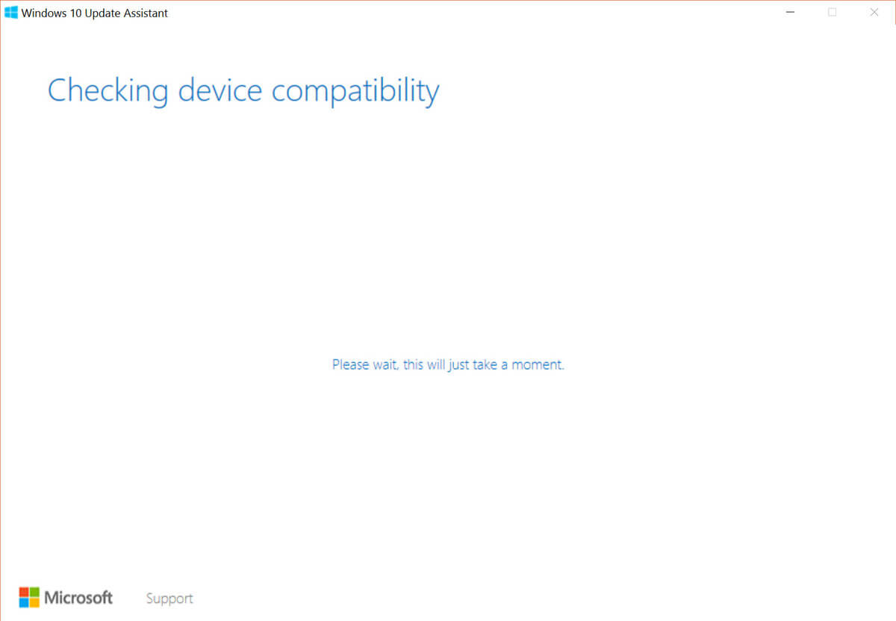
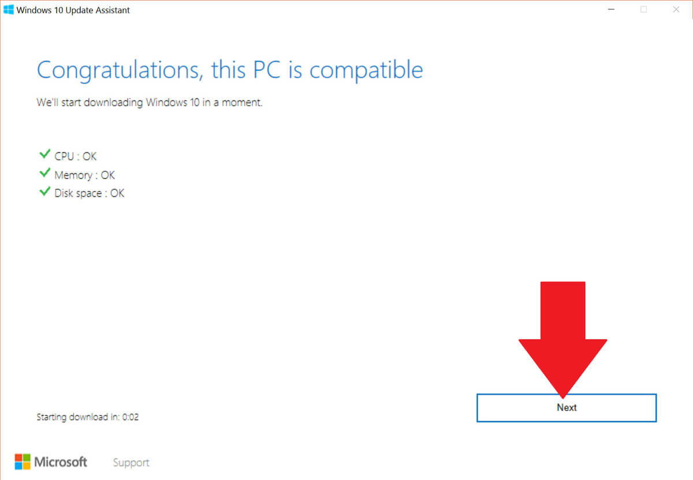
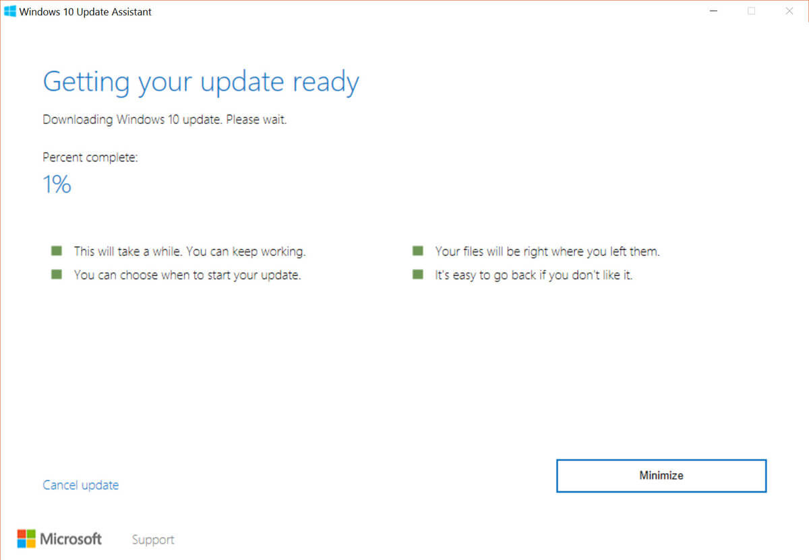
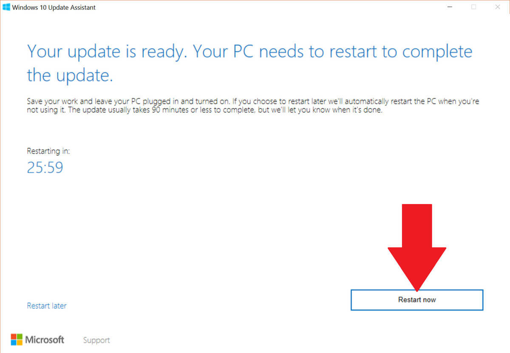
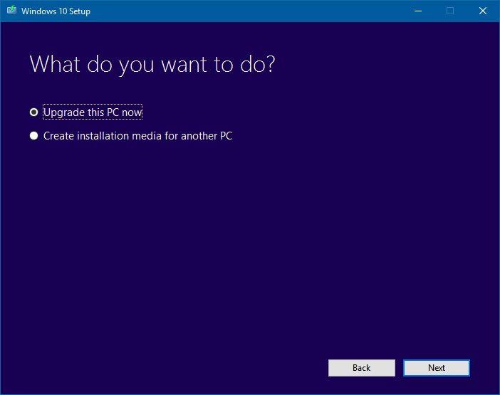

+++
title = "كل طرق تحميل تحديث ويندوز 10 Anniversary Update (2)"
date = "2016-08-13"
description = "تحدثنا في الدرس السابق عن أول طريقتين لتحميل تحديث الذكري السنوية لويندوز 10، واليوم نستكمل طرق التحميل الأخري"
categories = ["ويندوز",]
series = ["ويندوز 10"]
tags = ["موقع لغة العصر"]
+++

تحدثنا في الدرس السابق عن أول طريقتين لتحميل تحديث الذكري السنوية لويندوز 10، واليوم نستكمل طرق التحميل الأخري.

**الطريقة الثالثة: التحديث بواسطة أداة** **Windows 10 Update Assistant:**

1. قم بالدخول إلى إعدادات التحديث ثم اضغط على الرابط [“Learn more”](https://support.microsoft.com/en-us/help/12387/windows-10.update-history).

2. اضغط على الزر Get the Anniversary Update now لتحميل الأداة.

3. سيتم تحميل وحفظ الأداة Windows10Upgrade28084.exe بحجم 5.52 ميجا.

4. قم بفتح الأداة ثم اضغط Update Now.

5. ستقوم الأداة بفحص توافق التحديث مع جهازك.

6. يحتاج التحديث 20 جيجا مساحة خالية على القرص الصلب، وفى حالة توافر كل المتطلبات سيظهر لك الرسالة التالية، اضغط Next.

7. ستبدأ الأداة بتحميل التحديث ثم تثبيته، وبالطبع ستأخذ العملية بعض الوقت اعتمادا على سرعة الانترنت لديك.

8. بعد اكتمال التحميل ستتطلب الأداة إعادة التشغيل لإكمال التثبيت.

9. باستخدام هذه الطريقة ستحافظ على كل الملفات والبرامج والإعدادات الموجودة على جهازك.

**الطريقة الرابعة: التحديث بواسطة أداة** **Media Creation Tool:**

1. قم بتحميل الأداة [من هنا](http://go.microsoft.com/fwlink/?LinkId=691209).

2. بعد فتح الأداة اختر عمل ترقية للنظام أو انشاء ملف ISO للتحديث واتبع الخطوات التي تطلبها الأداة منك.

---
هذا الموضوع نٌشر باﻷصل على موقع مجلة لغة العصر.

http://aitmag.ahram.org.eg/News/57738.aspx