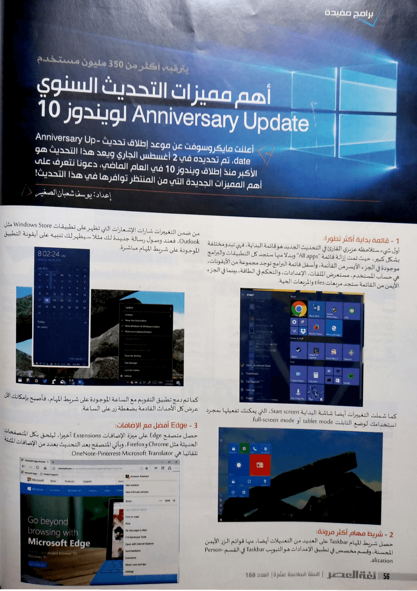
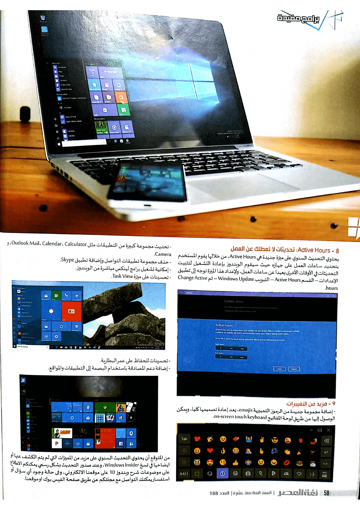

+++
title = "أهم مميزات التحديث السنوي Anniversary Update لويندوز 10"
date = "2016-08-01"
description = "أعلنت مايكروسوفت سابقا عن موعد إطلاق تحديث Anniversary Update، والذي تم تحديده في 2 أغسطس، ويعد هذا التحديث هو الأكبر منذ إطلاق ويندوز 10 في العام الماضي، دعونا نتعرف على أهم المميزات الجديدة التي من المنتظر في هذا التحديث!"
categories = ["ويندوز",]
tags = ["مجلة لغة العصر"]
images = ["images/0.jpg"]
series = ["ويندوز 10"]
+++
أعلنت مايكروسوفت سابقا عن موعد إطلاق تحديث Anniversary Update، والذي تم تحديده في 2 أغسطس، ويعد هذا التحديث هو الأكبر منذ إطلاق ويندوز 10 في العام الماضي، دعونا نتعرف على أهم المميزات الجديدة التي من المنتظر في هذا التحديث!

## 1- قائمة بداية أكثر تطورا

أول شيء ستلاحظه عزيزي القارئ في التحديث الجديد هو قائمة البداية، فهي تبدو مختلفة بشكل كبير، حيث تم إزالة قائمة "All apps" وبدلا منها ستجد كل التطبيقات والبرامج موجودة في الجزء الأيسر من القائمة، وأسفل قائمة البرامج توجد مجموعة من الأيقونات، هي حساب المستخدم، مستعرض الملفات، الإعدادات، والتحكم في الطاقة، بينما في الجزء الأيمن من القائمة ستجد مربعات tiles والمربعات الحية.

كما شملت التغييرات أيضا شاشة البداية Start screen، التي يمكنك تفعيلها بمجرد استخدامك لوضع التابلت tablet mode أو full-screen mode.

## 2- شريط مهام أكثر مرونة

حصل شريط المهام Taskbar على العديد من التعديلات أيضا، منها قوائم الزر الأيمن المحسنة، وقسم مخصص في تطبيق الإعدادات هو التبويب Taskbar في القسم Personalization.

من ضمن التغييرات أيضا شارات الإشعارات التي تظهر على تطبيقات Windows Store مثل Outlook، فعند وصول رسالة جديدة لك مثلا سيظهر لك تنبيه على أيقونة التطبيق الموجودة على شريط المهام مباشرة.

كما تم دمج تطبيق التقويم مع الساعة الموجودة على شريط المهام، فأصبح بإمكانك الآن عرض كل الأحداث القادمة بضغطة زر على الساعة.

## 3- متصفح Edge يعتمد عليه

حصل متصفح Edge على ميزة الإضافات Extensions أخيرا، ليلحق بها كل المتصفحات الحديثة مثل Chrome وFirefox، ويأتي المتصفح بعد التحديث بعدد من الإضافات المثبتة تلقائيا هي OneNote-Pinterest-Microsoft Translator.

كما حصل أيضا على عدد كبير من التغييرات أهمها:

- إمكانية عمل تثبيت pin للتبويبات.
- إضافة اختيار paste-and-go إلى شريط العنوان.
- إمكانية الوصول إلى قائمة history عن طريق الضغط مطولا بالماوس على زر الرجوع او التقدم.
- إمكانية سحب وإفلات الملفات والمجلدات عند استخدام خدمات التخزين السحابي.
- تحسين تنظيم الواقع المفضلة والإشارات المرجعية.
- تنبيه المستخدم عند إغلاق المتصفح أثناء التحميل.
- دعم إشعارات الإنترنت، وتشغيل ملفات الفلاش.

## 4- Windows Ink

وهي الميزة التي تحدثنا عنها سابقا، حيث تمكن المستخدم من استخدام قلم الجهاز اللوحي أو الحاسب المحمول للكتابة على شاشة اللمس، وتوفر العديد من الأدوات الأخرى مثل Sticky Notes وSketchpad ويمكن الوصول لهذه الميزة عن طريق الضغط على زر Windows Ink Workspace الموجود بشريط المهام.

## 5- Cortana أصبحت أكثر ذكاء

أصبح بإمكان المستخدم في هذا التحديث الوصول إلى Cortana من خلال شاشة القفل مباشرة عن طريق الأمر الصوتي Hello, Cortana أو الضغط على أيقونة Cortana الموجودة على شاشة القفل.

## 6- Action Center أكثر فائدة:

حصل مركز العمل على العديد من التغييرات التي تجعل العمل معه أكثر سهولة، منها تغيير طريقة عرض الإشعارات ليتم تجميع إشعارات كل تطبيق معا، ويمكن للمستخدم تحديد أولوية إشعارات كل تطبيق منفردا من خلال تطبيق الإعدادات، كما يظهر للمستخدم عدد الإشعارات على أيقونة Action Center أيمن شريط المهام.

## 7- إضافة الثيم الليلي للتطبيقات

اللون الأساسي لويندوز 10 هو الأبيض، ولكن قريبا سيستطيع المستخدم تحويل لون جميع التطبيقات إلى الأسود المريح للعين، ويمكن للمستخدم ذلك عن طريق التبويب Color في القسم Personalization.

## 8- Active Hours

يحتوي التحديث السنوي على ميزة جديدة هي Active Hours، فمن خلال هذه الميزة يقوم المستخدم بتحديد ساعات العمل على جهازه حيث سيقوم الويندوز بإعادة التشغيل لتثبيت التحديثات في الأوقات الأخرى بعيدا عن ساعات العمل، ولإعداد هذا الميزة توجه إلى تطبيق الإعدادات – القسم Active Hours – التبويب Windows Update – ثم Change Active hours.

## 9- مزيد من التغييرات

- إضافة مجموعة جديدة من الرموز التعبيرية emojis، حيث تم إعادة تصميمها كليا، ويمكن الوصول إليها عن طريق لوحة المفاتيح on-screen touch keyboard.

  

- تحديث مجموعة كبيرة من التطبيقات مثل Outlook Mail، Calendar، Calculator، وCamera.

- حذف مجموعة تطبيقات التواصل وإضافة تطبيق Skype.

- إمكانية تشغيل برامج لينكس مباشرة من الويندوز.

- تحسينات على ميزة Task View.

  

- تحسينات للحفاظ على عمر البطارية.

- إضافة دعم المصادقة باستخدام البصمة إلى التطبيقات والمواقع.

---

هذا الموضوع نُشر باﻷصل في مجلة لغة العصر العدد 188 شهر 08-2016 ويمكن الإطلاع عليه [هنا](https://drive.google.com/file/d/1P2m107ySRrnYB1tKOfZf5wgPJ0tWsoRZ/view?usp=sharing).

