+++
title = "تعرف على التحديث المنتظر لويندوز 10 وكيفية تجربته قبل صدوره!"
date = "2016-06-01"
description = "أعلنت مايكروسوفت عن موعد أكبر تحديثات ويندوز 10 منذ إصداره في 29 يوليو من العام الماضي، وهو تحديث الذكري السنوية Anniversary Update الذي من المتوقع إطلاقه في شهر يوليو القادم بمناسبه مرور عام على إصدار ويندوز 10، في الأسطر التالية سنسلط الضوء على التحديث المنتظر ونتعرف على المميزات الجديدة التي سيأتي بها التحديث، كما سنتعرف في نهاية موضوعنا على كيفية تجربة هذه المميزات قبل صدورها رسميا."
categories = ["ويندوز",]
tags = ["مجلة لغة العصر"]
series = ["ويندوز 10"]
+++
أعلنت مايكروسوفت عن موعد أكبر تحديثات ويندوز 10 منذ إصداره في 29 يوليو من العام الماضي، وهو تحديث الذكري السنوية Anniversary Update الذي من المتوقع إطلاقه في شهر يوليو القادم بمناسبه مرور عام على إصدار ويندوز 10، في الأسطر التالية سنسلط الضوء على التحديث المنتظر ونتعرف على المميزات الجديدة التي سيأتي بها التحديث، كما سنتعرف في نهاية موضوعنا على كيفية تجربة هذه المميزات قبل صدورها رسميا.

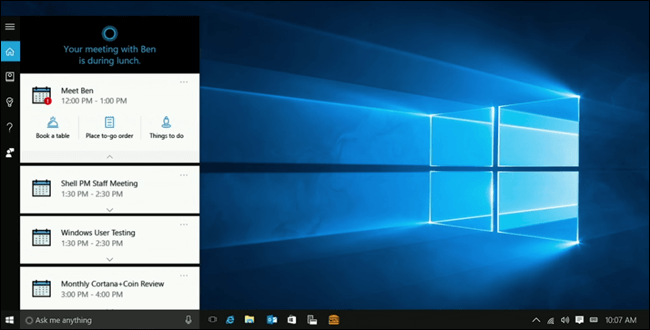

كما عودتنا مايكروسوفت فإنها تتيح تجربة التحديثات الجديدة قبل إطلاقها رسميا من خلال برنامج Windows 10 Insider، فبعد الاشتراك بهذا البرنامج تصلك التحديثات قبل صدورها على جهازك عن طريق نسخ المعاينة التي وصلت اللي الإصدار Windows 10 build 14342 حاليا، مما أتاح لنا معرفة بعض من المميزات الجديدة في تحديث Anniversary Update.

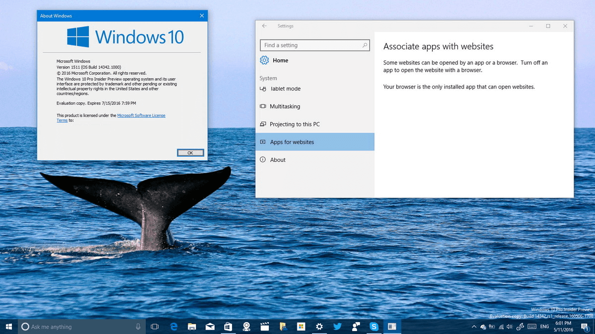

## 1- المساعدة الصوتية Cortana أصبحت أكثر ذكاء ً وسهولة

في هذا التحديث حصلت كورتانا على العديد من التغييرات والتحسينات، فمايكروسوفت تواصل التوسع فيما يمكن القيام به بواسطة كورتانا، في محاولة واضحة لجعلها المساعد الأقوى في ظل المنافسة المتزايدة مع Siri وGoogle Now.

- يمكن للمستخدم الان الوصول إلى كورتانا مباشرة من شاشة القفل، مما جعل استدعائها أسهل في أي وقت.

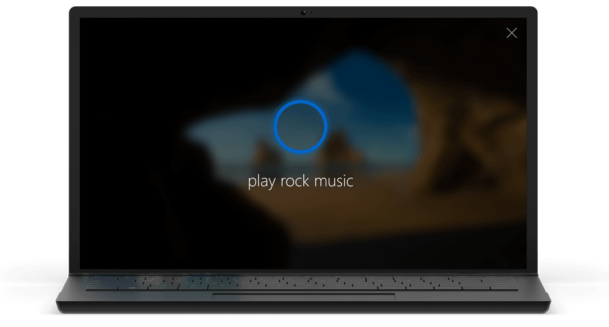

- كما أصبح بإمكان كورتانا إرسال الأشياء من وإلى هاتفك المحمول، بما في ذلك الإشعارات والرسائل النصية، سواء كان هاتفك يعمل بنظام ويندوز فون أم أندرويد.

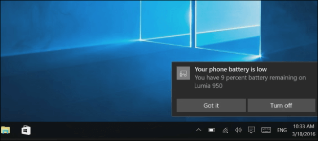

- أيضا تم تحسين ميزة البحث عبر كورتانا، والاستجابة للأوامر الصوتية، وتقديم اقتراحات أفضل عند طرح الأسئلة عليها.

## 2- إمكانية تثبيت الإضافات على متصفح Microsoft Edge:

وهي الميزة التي انتظرها بشدة كل مستخدمي متصفح ويندوز 10 الافتراضي، فقد أصبح يدعم تثبيت الإضافات الخارجية مثل بقية المتصفحات، هذه الميزة التي ظلت غائبة وكان من المفترض أن يتم دمجها مع المتصفح منذ إطلاقه للمرة الأولى ولكن ذلك لم يحدث مما أدي لفقدانه للعديد من المستخدمين.

- الإضافات المثبتة تلقائيا هي OneNote وPinterest وترجمة مايكروسوفت Microsoft Translator.
- بينما يمكن تثبيت الإضافات الأخرى مثل Adblock Plus وPocket عن طريق المتجر.

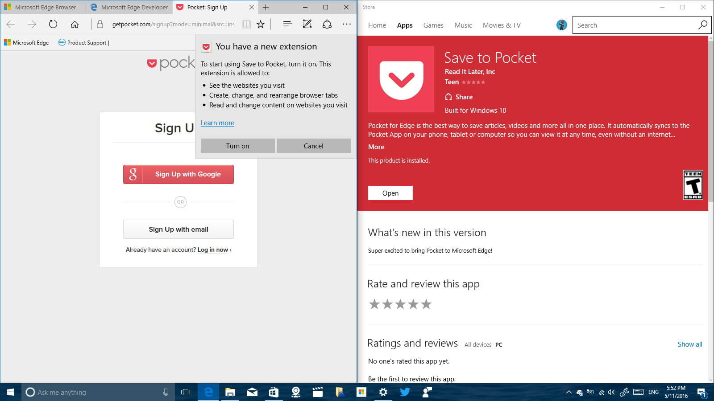

- كما حصل متصفح Edge على تغييرات أخري هي:
إضافة دعم تشغيل ملفات الفلاش – دعم إشعارات الإنترنت – إمكانية تثبيت التبويبات.

## 3- عودة تطبيق Skype مرة أخرى

حيث تم إعادة تطويره وتحويله إلى تطبيق موحد Universal App، مع إمكانية استخدام أكثر من حساب والتبديل بينهم بدون أي مشاكل.

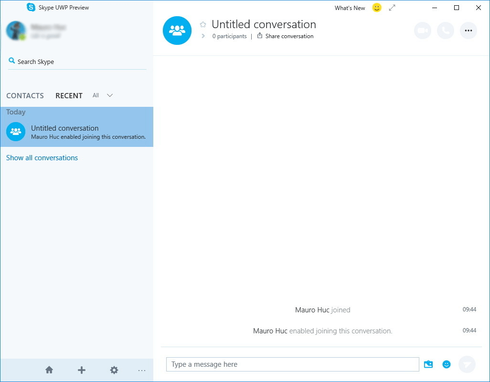

## 4- إمكانية تشغيل برامج لينكس مباشرة من الويندوز:

حيث تم دمج صدفة الـ bash النصية الخاصة بتوزيعه أوبنتو مع الويندوز دمجا كاملا بتعاون مايكروسوفت مع شركة Canonical المطورة لنظام أوبنتو، وهذه الميزة تهم المطورين أكثر من المستخدم العادي، ولكنها لن تدعم برامج الخادم أو التطبيقات الرسومية وستعمل من خلال سطر الأوامر فقط.

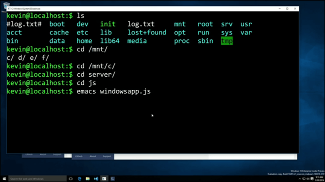

## 5- تصميم جديد لقائمة البداية:

حصلت قائمة البداية على بعض التجديدات مثل إلغاء زر All Apps وجعل التطبيقات تظهر بشكل دائم على الجانب الأيسر من قائمة البداية، وتم نقل زر الطاقة وباقي الاختصارات إلى قائمة صغيرة أقصى اليسار.

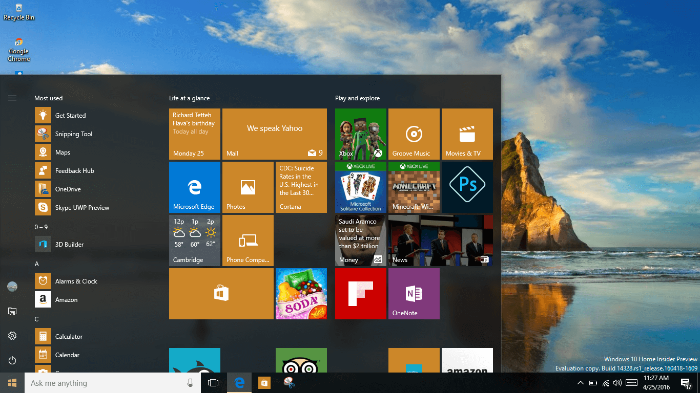

## 6- تغيير ثيم التطبيقات إلى الوضع الليلي

حيث تم دمج هذه الميزة في تطبيق الإعدادات ولم يعد المستخدم بحاجة إلى القيام بتعديلات في محرر الويندوز "الريجستري" لتفعيل الوضع الليلي، ستجد هذا الاختيار في تطبيق الإعدادات، القسم Personalization ثم التبويب Colors.

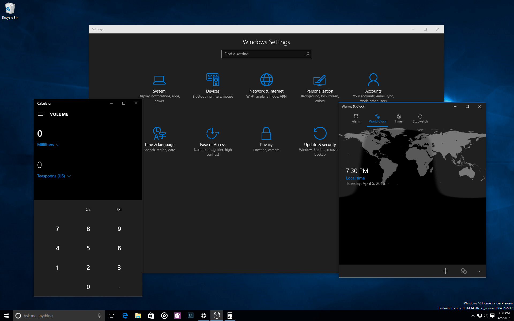

## 7- Windows Ink

يتضمن التحديث ميزة جديدة تسمي Windows Ink وهي تمكن المستخدم من استخدام قلم الجهاز اللوحي أو الحاسب المحمول للكتابة على شاشة اللمس، وتوفر العديد من الأدوات الأخرى مثل Sticky Notes وSketchpad ويمكن الوصول لهذه الميزة عن طريق الضغط على زر Windows Ink Workspace الموجود بشريط المهام.

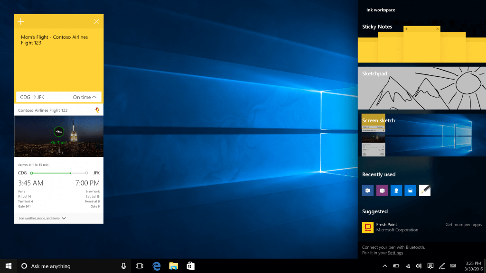

## 8- تحسينات على ميزة Task View:

حيث يمكنك الآن تثبيت أي نافذة لتجعلها تظهر على كل أسطح المكتب الافتراضية، عن طريق الضغط بزر الماوس الأيمن على النافذة واختيار “Show this window on all desktops”.
كما تم إضافة إيماءة جديدة للانتقال السريع بين أسطح المكتب عن طريق السحب بأربع أصابع لليمين أو اليسار على لوحة اللمس.

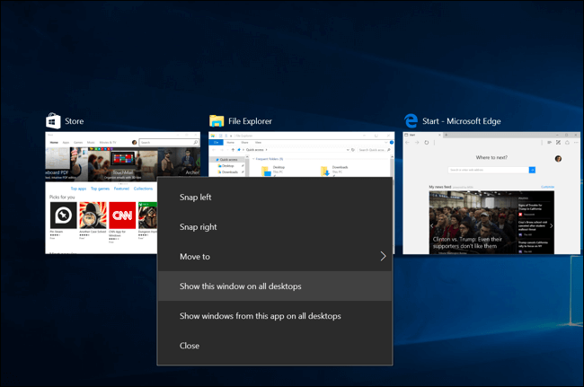

## 9- تغييرات في شريط المهام:

حيث تم إضافة تكامل مع تطبيق التقويم ليعرض الأحداث المسجلة بمجرد الضغط على زر الساعة، أيضا تم إضافة اختيار جديد بالقائمة المختصرة يقوم بفتح تطبيق الإعدادات مباشرة.

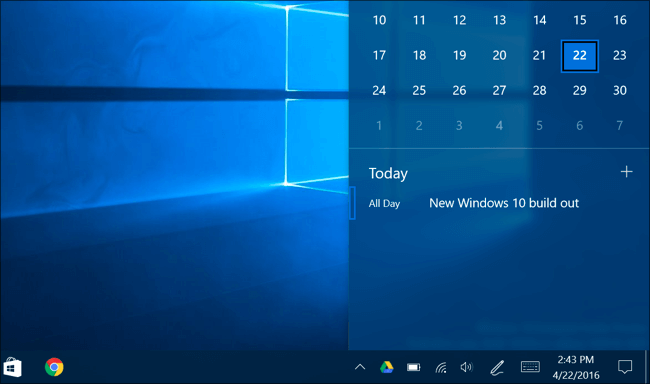

## 10- تحسينات للحفاظ على عمر البطارية:

سيحل التحديث التجديد مشاكل سرعة انخفاض البطارية على أجهزة اللاب توب، حيث أضافت مايكروسوفت خيارات للتحكم في البرامج المثبتة على الجهاز من حيث استهلاكها للبطارية بحيث بعد الدخول للإعدادات ثم System الوصول لقسم Battery ثم Battery Usage.

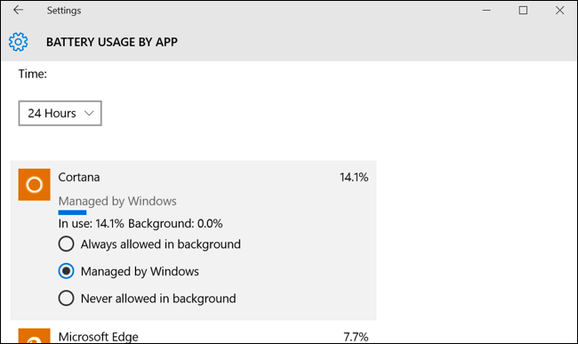

## 11- تغييرات في ميزة Action Center:

حيث تم نقل زر الوصول إليه إلى أقصى اليمين، وأصبحت الإشعارات تُجمع بحسب كل تطبيق، ويمكن للمستخدم تحديد أولوية إشعارات كل تطبيق عن طريق الإعدادات.
أيضا أصبح الويندوز يعرض عدد الإشعارات في دائرة صغيرة أعلى زر Action Center.
وعلاوة على ذلك أصبحت أزرار المهام أكثر قابلية للتخصيص (الإعدادات، القسم System، التبويب Notifications & actions)، وتم تغيير وظيفة زر ال Wi-Fi إلى إظهار قائمة الشبكات المتاحة بدلا من فتح وغلق ال Wi-Fi.

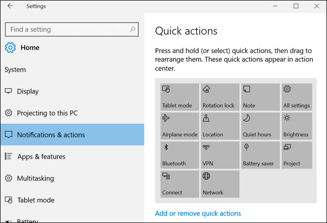

## 12- باقي التغييرات

- إضافة دعم المصادقة باستخدام البصمة إلى التطبيقات والمواقع.
- تغيير شكل وضع Tablet Mode ليصبح أقرب لويندوز 8.
- إمكانية اختيار وقت محدد (ساعات النشاط) التي لن يقوم الويندوز بتثبيت التحديثات فيها.
- العديد من التغييرات في تطبيق الإعدادات مثل إضافة حالة الاتصال بالإنترنت واختبار سرعته، كما يمكن للمستخدم عمل reset للتطبيقات في حالة حدوث مشاكل.
- والعديد من التغييرات الأخرى التي لم تظهر في نسخ Windows Insider ولم يتم الإعلان عنها بعد.

كيفية تجربة مميزات تحديث Anniversary Update والحصول عليها قبل إطلاقه:
1- قم بالدخول إلى https://insider.windows.com/ ثم اضغط بدء الاستخدام‬ أو Get Started، بعد ذلك قم تسجيل الدخول بحساب مايكروسوفت الخاص بك ثم اقبل الشروط واضغط إرسال.
2- قم بالدخول إلى تطبيق الإعدادات ثم القسم Update & Security ثم التبويب Windows Update، بعد ذلك اضغط على Advanced options.

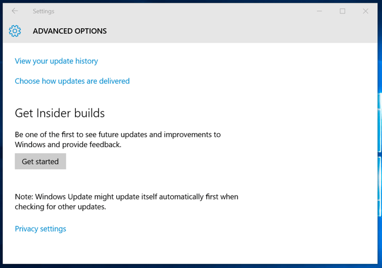

3- ستظهر لك نافذة جديدة اضغط على الزر Get Started، سيتم تحذيرك من أن النظام الذي تود تجربته ليس مختبرا بالكامل وقد تكون به بعض المشاكل، اضغط Next.

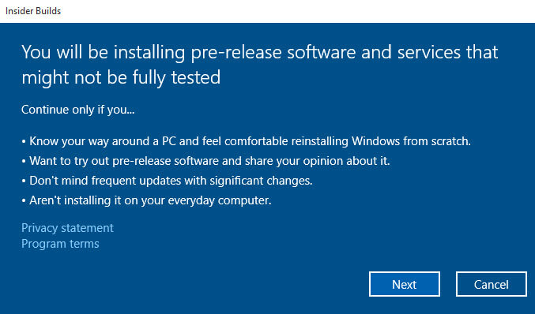

4- اضغط Confirm، ثم ارجع إلى Advanced options مرة أخرى وقم بتغيير Slow إلى Fast. لتحصل على التحديثات أولا بأول.

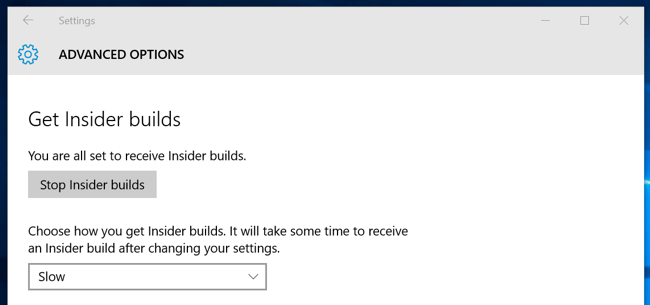

5- قم بالتحقق من وجود تحديثات، في حالة وجود نسخة جديدة من ويندوز 10 ستظهر لك، انتظر حتى يقوم الويندوز بحميل التحديث وتثبيته، واستمتع بتجربة المميزات الجديدة قبل إصدارها رسميا.

---

هذا الموضوع نُشر باﻷصل في مجلة لغة العصر العدد 186 شهر 06-2016 ويمكن الإطلاع عليه [هنا](https://drive.google.com/file/d/1TdbDItdt3oW2spC75DIG-lEzQulReOE0/view?usp=sharing).

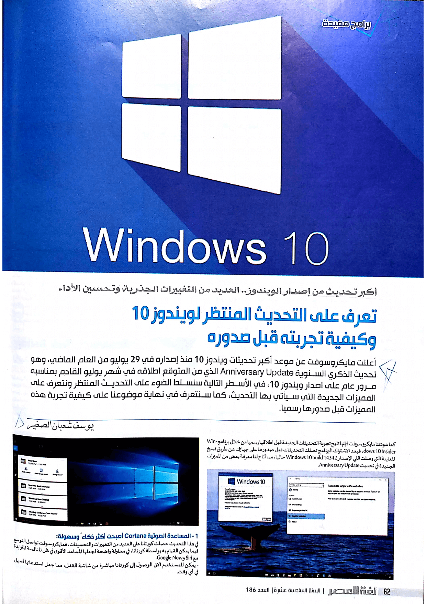

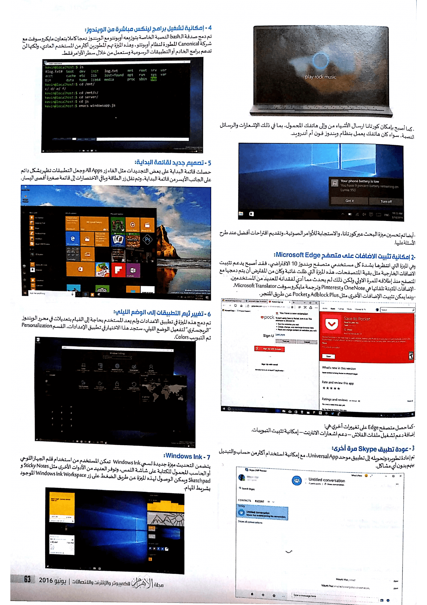

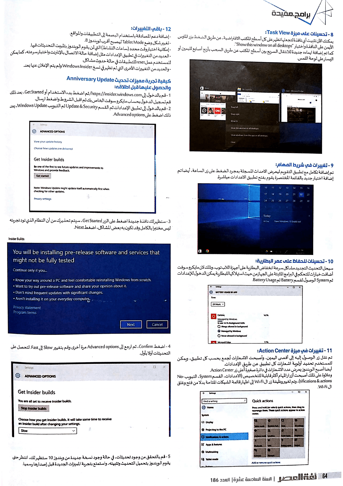

