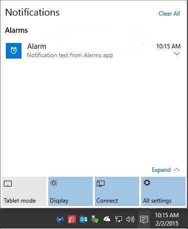
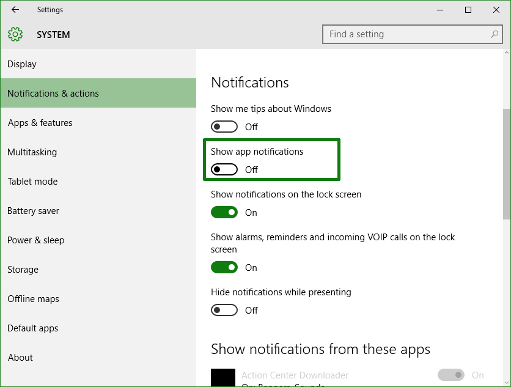
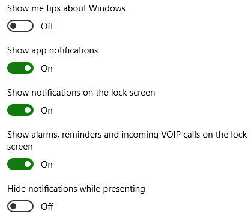
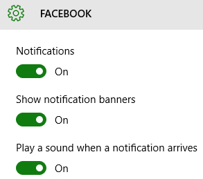

+++
title = "كيف تتعامل مع إشعارات التطبيقات في ويندوز 10؟"
date = "2015-08-15"
description = "في ويندوز 10 تمت إضافة Action Center يمكن المستخدم من رؤية اشعارات جميع التطبيق الموجودة على جهازه، كما يعرض أيضا اشعارات الويندوز الخاصة بالحماية وغيرها، في درس اليوم نسلط الضوء على Action Center وكيفية إدارة إشعارات التطبيقات في ويندوز 10."
categories = ["ويندوز",]
series = ["ويندوز 10"]
tags = ["موقع لغة العصر"]

+++

في ويندوز 10 تمت إضافة Action Center يمكن المستخدم من رؤية اشعارات جميع التطبيق الموجودة على جهازه، كما يعرض أيضا اشعارات الويندوز الخاصة بالحماية وغيرها، في درس اليوم نسلط الضوء على Action Center وكيفية إدارة إشعارات التطبيقات في ويندوز 10.

في البداية يجب أن تعلم أن الويندوز لا يسمح بإغلاق الإشعارات الخاصة به ولذا يمكنك عزيزي القارئ استخدام هذه الحيلة لإيقاف اشعارات النظام، تابع موضوع “تخلص من كل الاشعارات المزعجة في الويندوز”.

**أولا: إيقاف تشغيل جميع إشعارات التطبيقات من تطبيق الإعدادات:**
تظهر الإشعارات في Action Center كما بالصورة:

1. قم بالدخول إلى تطبيق الإعدادات ثم القسم System ثم التبويب **Notifications & actions.**
2. قم بإغلاق الاختيار **Show app notifications.**

**ثانيا: الاختيارات الأخرى للتحكم في الإشعارات:**

1. Show me tips about Windows وهو الاختيار الخاص بعرض تنبيهات ونصائح عن الويندوز (يُفضل إغلاقه).
2. Show notifications on the lock screen من خلال هذا الاختيار تستطيع التحكم في ظهر الإشعارات على شاشة القفل.
3. الاختيار Show alarms, reminders and incoming VOIP calls on the lock screen من خلاله يمكن التحكم في اشعار المكالمات الصوتية مثل سكايب، والتي تظهر على شاشة القفل.

**ثالثا: التحكم في إشعارات كل تطبيق على حدي:**

1. قم بالضغط على التطبيق الذي تريد تعديل إعدادات اشعاراته.
2. سيظهر لك اعداداته كما بالصورة:

3. اختيار notifications تستطيع من خلاله اغلاق أو تشغيل الإشعارات لهذا التطبيق.
4. اختيار Show notification banners ومن خلاله يمكن اغلاق أو تشغيل الاشعارات التي تأتى على شكل بانر كما بالصورة.

5. الاختيار الأخير هو الخاص بتشغيل صوت عند وصول إشعار جديد.

---

هذا الموضوع نٌشر باﻷصل على موقع مجلة لغة العصر.

http://aitmag.ahram.org.eg/News/22720.aspx
