+++
title = "أتمتة مهام الصيانة التلقائية فى ويندوز 10"
date = "2018-08-01"
description = "كما هو الحال مع أى نظام تشغيل، يتطلب إبقاء جهاز يعمل بنظام ويندوز فى حالة جيدة إجراء بعض أعمال الصيانة، ولحسن الحظ يتيح ويندوز للمستخدمين إمكانية إعداد أغلب مهام الصيانة للعمل بشكل تلقائي حتي يظل الويندوز يعمل بشكل جيد كما كان عند تثبيته لأول مرة."
categories = [",ويندوز",]
tags = ["مجلة لغة العصر"]
series = ["ويندوز 10"]
images = ["images/0.jpg"]

+++
كما هو الحال مع أى نظام تشغيل، يتطلب إبقاء جهاز يعمل بنظام ويندوز فى حالة جيدة إجراء بعض أعمال الصيانة، ولحسن الحظ يتيح ويندوز للمستخدمين إمكانية إعداد أغلب مهام الصيانة للعمل بشكل تلقائي حتي يظل الويندوز يعمل بشكل جيد كما كان عند تثبيته لأول مرة.

## الصيانة التلقائية المجدولة

يمكن لكل من ويندوز 8 و 10 القيام بمهام صيانة النظام الأساسية وفقا للجدولة التي يمكنك تخصيصها، وتتضمن هذه المهام أشياء مثل تحديثات النظام وتحديثات تعريفات وعمليات الفحص، إلى جانب تحسين القرص الصلب وإلغاء التجزئة وبعض المهام التشخيصية الأخري.

وعلى الرغم من أنه لا يمكنك تعطيل هذه الصيانة التلقائية، فإنه يمكنك تغيير متي يجب أن تعمل، وما إذا كان بإمكانها إيقاظ الجهاز لتشغيل مهام الصيانة. حيث أن الويندوز يقوم افتراضيا بتشغيل هذه المهام يوميا فى الثانية صباحا، وفى حالة كان الجهاز بوضع النوم Sleep فإنه يقوم بإيقاظه.

ولإدارة هذه الأداة، توجه إلى لوحة التحكم Control Panel ثم النظام والأمان System and Security ومنها إلى الأمان والصيانة Security and Maintenance. كما يمكنك أيضا الضغط على قائمة البداية Start وكتابة maintenance فى صندوق البحث، ثم اختر النتيجة Security and Maintenance.

من نافذة Security and Maintenance قم بتوسيع القسم Maintenance ثم اضغط على الرابط "Change maintenance settings”.

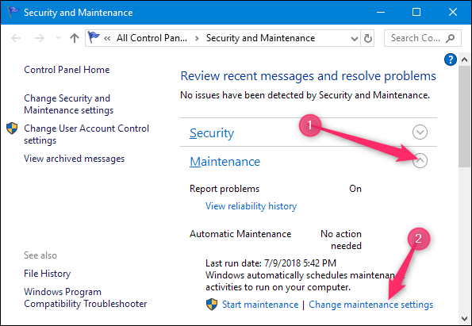

في نافذة الصيانة التلقائية يمكنك تغيير الوقت الذي تعمل فيها هذه المهام يوميا، ويمكنك تعطيل إمكانية إيقاظ الويندوز للجهاز فى حالة كان بوضع النوم لإجراء مهام الصيانة.

لاحظ أنه حتي إذا كان الويندوز يوقظ الجهاز لإجراء المهام فإنه سيقوم بإرجاع النظام إلى وضع النوم بعد أن ينتهي.

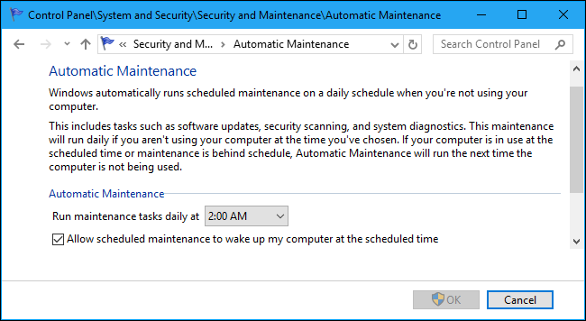

## تنظيف القرص الصلب الخاص بك تلقائيا

إذا كنت تريد التأكد من أن لديك مساحة كبيرة على القرص الصلب الخاص بك، وأن تتخلص من الملفات القديمة التي لم تعد بحاجة إليها،  أو أن تتخلص من الكثير من الملفات المؤقتة والأشياء الأخرى التي لا تحتاج إلى أن تكون موجودة بعد الآن، إليك الحل.

### ويندوز 10: دع احساس التخزين يقوم بتظيف القرص الصلب تلقائيا

يتمتع مستخدمو ويندوز 10 برفاهية استخدام ميزة Storage Sense وهي ميزة صغيرة سهلة الاستخدام تقوم تلقائيًا بتنظيف ملفاتك المؤقتة وسلة المهملات وبعض الأشياء التي ظلت موجودة لأكثر من شهر. وقد تم إضافة هذه الميزة فى تحديث ربيع 2017. وهي أداة رائعة لتنظيف الأشياء تلقائيًا بأمان. حيث أنها متحفزة جدًا حول ما يمكن يحذفه، لذا يجب ألا تواجه أي مشاكل في تركها قيد التشغيل.

وللوصول إليها توجه إلي تطبيق الإعدادت ثم التخزين وقم بتغيير حالة Storage Sense إلى On.

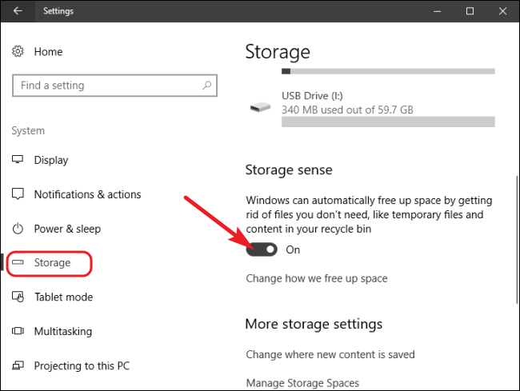

ثم اضغط على الرابط "Change how we free up space” لتعديل الإعدادات.

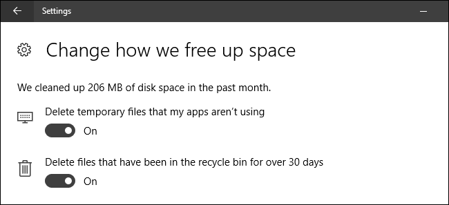

ليس هناك العديد من الإعدادات هناك، فكما ذكرت هذه الأداة  متحفزة جدا، ستجد اختيارين فقط يمكنك التحكم بهما.

### جدولة مهمة تنظيف القرص الصلب (أى اصدار ويندوز)

كانت أداة تنظيف القرص الصلب موجودة منذ وقت طويل جدا، وإلى الآن ما زالت تعمل جيدا. في الحقيقة، إنها تقوم بتنظيف المزيد من الأشياء أكثر من أداة احساس التخزين في نظام ويندوز 10.
وبينما يمكنك تشغيل أداة تنظيف القرص بنفسك من وقت لآخر، لما لا تقوم بجدولتها للعمل تلقائيا؟
يمكنك استخدام برنامج جدولة المهام في الويندوز لتشغيل عملية فحص أساسية لتنظيف القرص كما ترغب.

اضغط على قائمة البداية ثم ابحث عن " task scheduler” واضغط Enter.

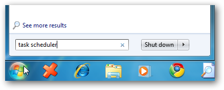

ستظهر نافذة برنامج جدولة المهام، من قائمة Action اختر Create Basic Task.

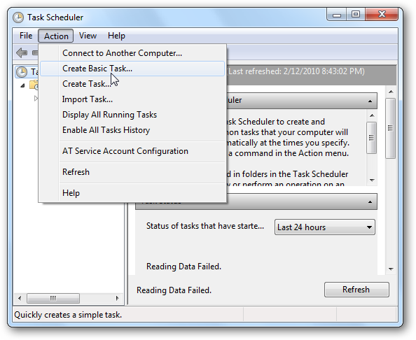

فى نافذة معالج إنشاء مهمة أساسية قم بكتابة اسم ووصف للمهمة ثم اضغط Next.

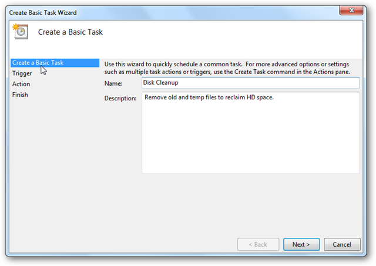

الآن قم باختيار الفترة التي ترغب فى تشغيل تنظيف القرص عندها، فمثلا سأقوم باختيار اسبوعيا.

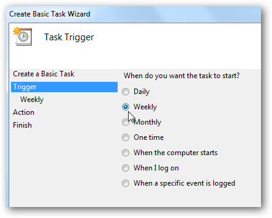

بعد ذلك قم بتحديد متي تبدأ هذه المهمة بالعمل، ومتي يتم تكرارها، وفى أى أيام الأسبوع يجب أن تعمل.

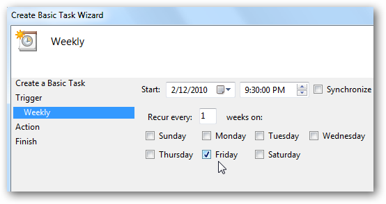

ثم أسفل الاختيار Action حدد Start a program.

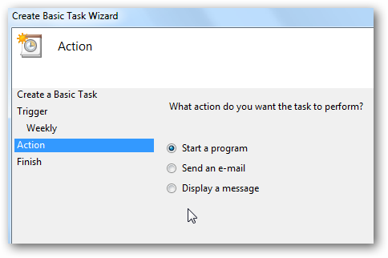

وفى الخانة Program/script قم بكتابة cleanmgr.exe

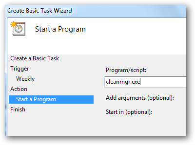

وأخيرا ستظهر لك نافذة بخلاصة ما ستقوم به هذه المهمة، اضغط Finish فى حالة كان كل شيء يبدو سليما.

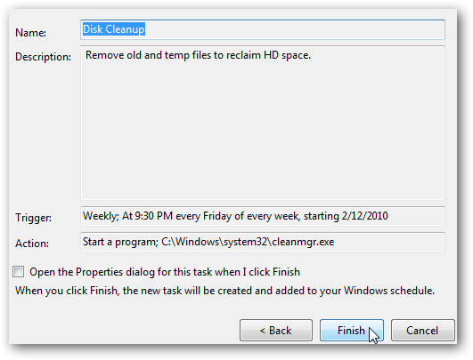

### استخدم CCleaner للحصول على قوة أكبر (أى اصدار ويندوز):

CCleaner هو برنامج تنظيف معروف متوفرة بشكل مجاني. وهو يعمل بشكل مشابهة ل Disk Cleanup، ولكنه يمتد إلى أبعد الحدود ما يمكن تنظيفه. فبالإضافة إلى الملفات المؤقتة والمخبأة ، يمكن لـ CCleaner أيضًا تنظيف البيانات لبرامج إضافية، وحتى مسح البيانات لمتصفح الويب الخاص بك. فهو أداة قوية، يمكنك الحصول عليها من هنا.
https://www.ccleaner.com/

ولإعداد البرنامج ليقوم بعملية التنظيف بشكل تلقائي، قم بالخطوات التالية:

قم باتباع نفس الخطوات السابقة حتي تصل إلى نافذة Create Basic Task.

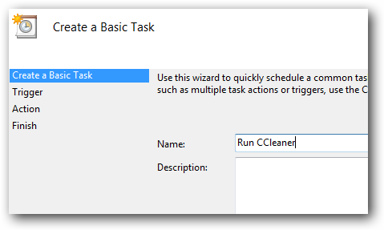

اكتب اسم المهمة Run Ccleaner مثلا أو أى شيء آخر، وقم باختيار مدة التكرار أسبوعية، ثم اختر متي يجب أن تبدأ المهمة العمل.

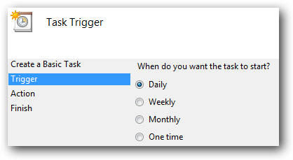

فى النافذة التالية قم باختيار Start a program، اضغط Browse ثم اختر المسار لذي يوجد به البرنامج وهو غالبا (C:\Program Files\CCleaner\CCleaner.exe)، وتأكد من كتابة /AUTO فى خانة Add arguments.

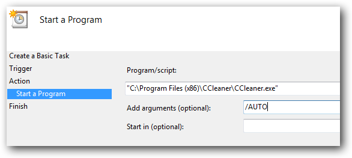

عند ظهور شاشة المخلص تأكد من تحديد اختيار "Open the Properties dialog” قبل الضغط على Finish.

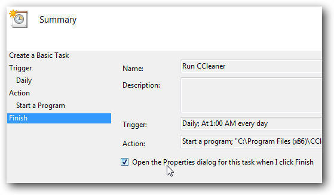

بعد ذلك اختر “Run with highest privileges” حتي يتم تشغيل هذه المهمة مع صلاحيات المدير.

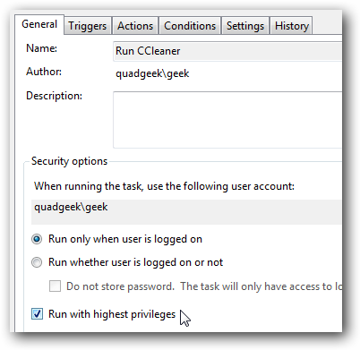

## إلغاء تجزئة القرص الصلب

إذا كنت تستخدم جهاز كمبيوتر لفترة طويلة بما فيه الكفاية، فربما قد تكون معتادًا على إلغاء تجزئة القرص الصلب الخاص بك. والخبر السار هو أن هذا شيء لا تحتاج إلى القلق بشأنه مجددا.

أولا، إذا كنت تستخدم هارد من نوع SSD لا تقم بعمل إعادة تجزئة أبدا، لأن ذلك بلا فائدة، بل إنه يؤدي فقط إلى إنهاك القرص.

وإذا كنت تستخدم نظام ويندوز 7 أو 8 أو 10 ، فإن ويندوز أيضًا يقوم تلقائيًا بتمكين عملية إلغاء التجزئة وفقًا لجدول معين للأقراص من نوع HDD التقليدية. لذلك، أنت لا تحتاج إلى القلق بشأنه. فقط دع ويندوز يقوم بأعماله.

بشكل افتراضي، يقوم الويندوز بإلغاء تجزئة أقراص HDD كل يوم أربعاء في 1 ص، إذا كنت لا تستخدم جهاز الكمبيوتر الخاص بك في ذلك الوقت. يمكنك تخصيص جدول إلغاء التجزئة إذا كنت تريد ذلك، ولكن كما أوضحت لا يوجد سبب لفعل ذلك.

## إبقاء الويندوز وتعريفات الهاردوير محدثة

إبقاء جهاز الكمبيوتر الخاص بك محدثا قد يكون صعبا. فيعتبر ويندوز 10 أكثر عدوانية حول استخدام Windows Update للحفاظ على نفسه محدثًا مقارنة بالإصدارات السابقة من ويندوز وبالنسبة للجزء الأكبر من المستخدمين، هذا أمر جيد.
أما إذا كنت تستخدم نظام ويندوز 7، فلديك قدر أكبر من التحكم في التحديثات مثل مالذي سيتم تثبيته ومتي يتم ذلك.

لذلك، على الرغم من أنه لا يمكنك منع التحديثات من الترقية في نظامي التشغيل ويندوز 8 و 10 (على الأقل ليس بشكل دائم)، يمكنك تغيير أشياء مثل ساعات العمل النشطة (عندما تستخدم جهاز الكمبيوتر الخاص بك)، وبذلك لن يتم تطبيق التحديثات أو إعادة التشغيل جهاز الكمبيوتر الخاص بك أثناء استخدامك له.

أما ابقاء البرامج الخارجية محدّثة تلقائيًا فهو أصعب بشكل أكبر قليلاً. تحتوي بعض التطبيقات على برامج تحديث مدمجة يمكنها تنزيل التحديثات وتثبيتها تلقائيًا، وبعض البرامج الأخري يمكنها التحقق من وجود تحديثات وإعلامك على الأقل، كما يوجد برامج أخري تحتاج لأن تقوم بنفسك بالبحث عن الإصدارات الجديدة من حين إلى آخر.

لا يخفي على أغلب المستخدمين أهمية برامج الأمان، مثل برامج مكافحة الفيروسات، فهي بشكل خاص يجب ابقاءها محدثه. ويحتوي معظمها على ألية تحديث تلقائية مضمنة. ومع ذلك، من المهم التحقق منها مرة واحدة كل فترة - مثل إجراء فحص يدوي - للتأكد فقط. وكمثال على ذلك، يحصل Windows Defender على تحديثات منتظمة لتعريفات الفيروسات من خلال تحديثات الويندوز، لكنه لا يزال يوفر إمكانية البحث عن التحديثات يدويًا عند فتحه.

وهناك بعض الأدوات المساعدة، مثل Patch My PC، والتي يمكنها فحص جميع التطبيقات المثبتة ، والتحقق من وجود تحديثات، ثم تثبيتها نيابة عنك. أما برنامج Secunia PSI الذي ذكرته فى موضوع سابق للأسف قد تم إيقافه مؤخرًا.

وهناك تعريفات الهاردوير أيضا، ولحسن الحظ إذا كنت قد قمت بتثبيتها من خلال الويندوزفسيقوم Windows Update بالاعتناء بتحديثها تلقائيًا. والحقيقة هي أن التعريفات الأساسية من الويندوز جيدة بما يكفي لمعظم أنواع الأجهزة. أما بالنسبة إلى بعض أنواع الهاردوير، مثل بطاقات الجرافيك، ستحتاج على الأرجح إلى التعريفات الخاصة بها من الشركة المصنعة، حيث يتم إبقاؤها محدثة بشكل أفضل وتتوفر ميزات إضافية بها. لذلك سيتعين عليك الاعتماد على أدوات التعريف الخاصة بالمصنعين للحفاظ علي هذه القطع محدثة.

هذه مجرد لمحة عامة عن إبقاء الأمور محدثة على جهازك، وقد قامت المجلة من قبل بنشر [موضوع مفصل](/ar/posts/how-to-keep-your-pc-up-to-date/) حول كيفية ابقاء جهازك محدثا دائما، قم بالرجوع إليه فى العدد 209 إذا كنت ترغب فى الحصول على مزيد من التفاصيل.

---

هذا الموضوع نُشر باﻷصل في مجلة لغة العصر العدد 212 شهر 08-2018 ويمكن الإطلاع عليه [هنا](https://drive.google.com/file/d/1sd3_v4BcX3LS86oOPUQWxN4MkhDXw9Nh/view?usp=sharing).

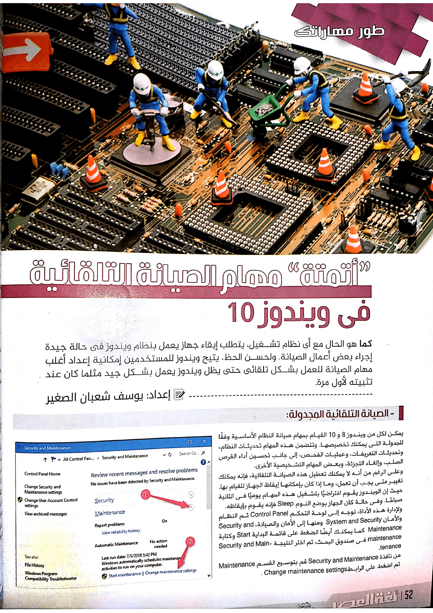

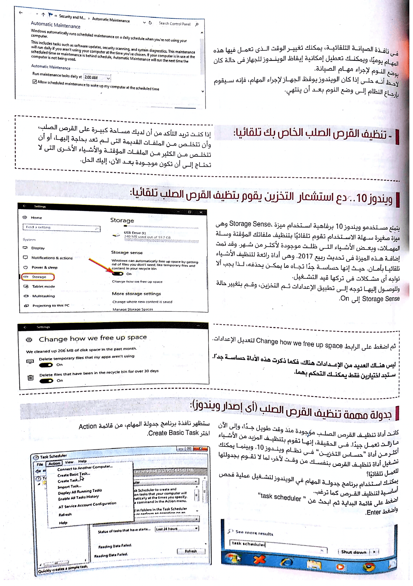

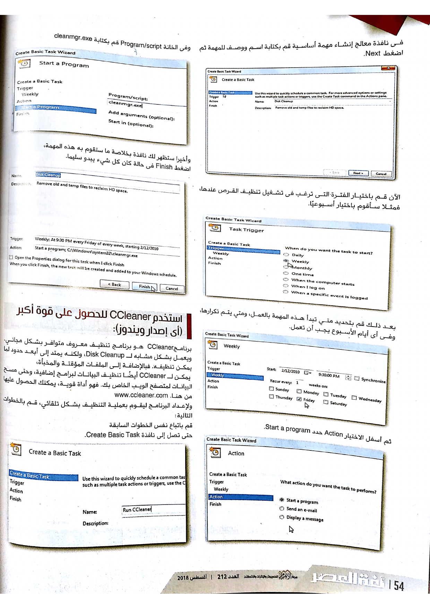

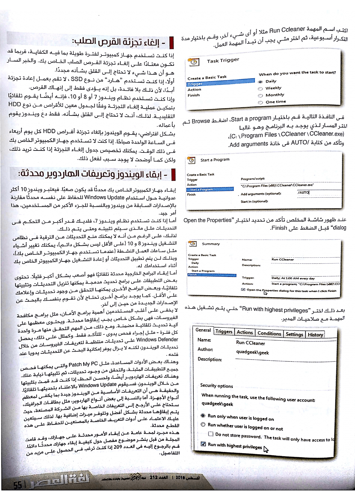

