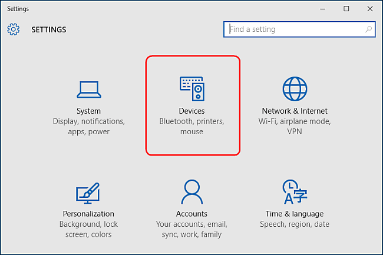
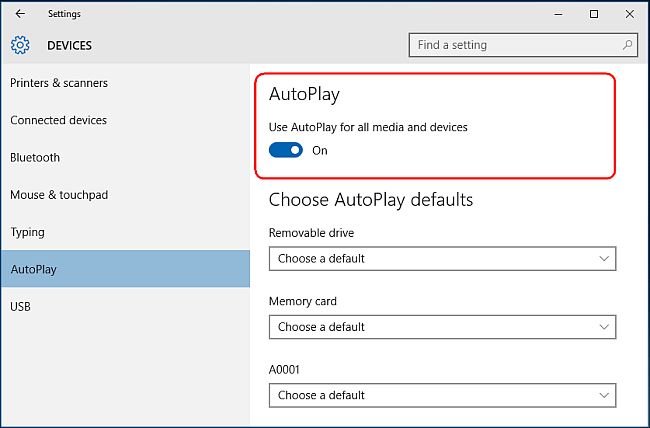
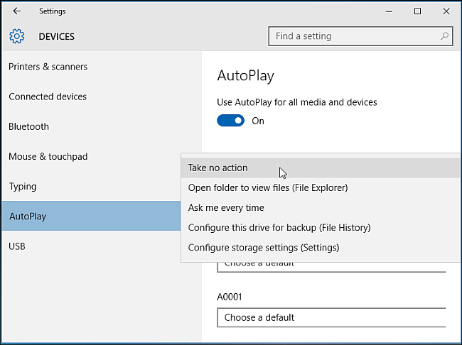
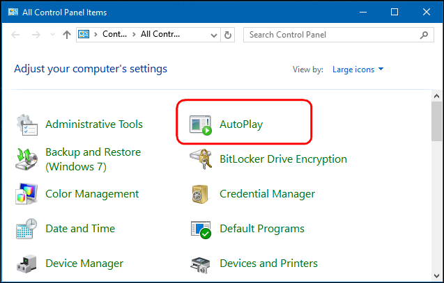
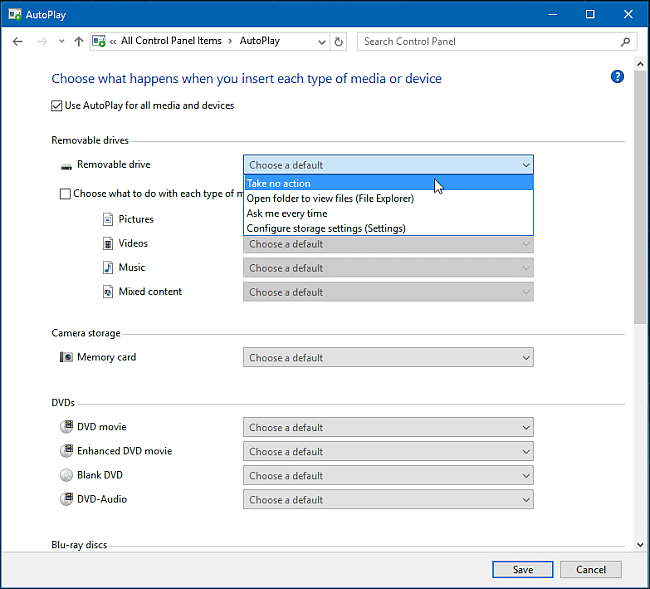

+++
title = "كيفية التحكم في التشغيل التلقائي في ويندوز 10"
date = "2016-01-17"
description = "عندما تقوم بإدخال DVD، USB، أو بطاقة ذاكرة في جهازك فإن الويندوز يقوم بعرض نافذة تتيح لك تشغيل الوسائط الموجودة عليه، أو فتحه، الخ، اليك طريقة التحكم فيها"
categories = ["ويندوز",]
series = ["ويندوز 10"]
tags = ["موقع لغة العصر"]
images = ["images/2016-635886322017123519-712.png"]

+++

عندما تقوم بإدخال DVD، USB، أو بطاقة ذاكرة في جهازك فإن الويندوز يقوم بعرض نافذة تتيح لك تشغيل الوسائط الموجودة عليه، أو فتحه، الخ، اليك طريقة التحكم فيها.

**أولا: تفعيل أو تعطيل** **AutoPlay** **من تطبيق الإعدادات:**

1- قم بفتح تطبيق الإعدادات ثم انتقل الى القسم Devices.

2- اضغط على التبويب AutoPlay من الجانب الأيسر، ستجد اختيار " Use AutoPlay for all media and devices." الذي يمكنك تفعيل ال AutoPlay أو تعطيله من خلاله.

3- يمكنك أبضا التحكم في إعدادات التشغيل التلقائي لكل ما اتصل بجهازك على حدي، فمثلا تستطيع تعيين اختيار " Open folder to view files" لكل ال USB التي ستتصل بجهازك وهكذا بالنسبة ل أسطوانات DVD أو بطاقات الذاكرة.

4- إذا أردت تجاهل التشغيل التلقائي لأحد الأجهزة قم بتعيين الاختيار " Take no action" له.

**ثانيا: تفعيل أو تعطيل** **AutoPlay** **من لوحة التحكم:**

1- قم بفتح Control Panel ثم اختر AutoPlay.

2- قم بتفعيل " Use AutoPlay for all media and devices" أو الغاء تفعيها كما تريد، كما يمكنك أيضا تطبيق ما تريد من خصائص بنفس الطريقة السابقة.

---
هذا الموضوع نٌشر باﻷصل على [موقع مجلة لغة العصر](http://aitmag.ahram.org.eg/News/40396/%D8%AF%D8%B1%D9%88%D8%B3/%D8%B4%D8%B1%D8%AD-%D9%88%D8%AA%D8%B9%D9%84%D9%8A%D9%85/%D8%B7%D8%B1%D9%8A%D9%82%D8%A9-%D8%B3%D8%AD%D8%B1%D9%8A%D8%A9-%D9%84%D8%A5%D9%8A%D9%82%D8%A7%D9%81-%D8%AA%D8%AD%D8%AF%D9%8A%D8%AB%D8%A7%D8%AA-%D9%88%D9%8A%D9%86%D8%AF%D9%88%D8%B2--%D8%A7%D9%84%D8%AA%D9%84%D9%82%D8%A7%D8%A6%D9%8A%D8%A9.aspx).