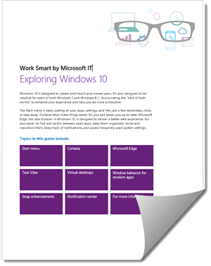
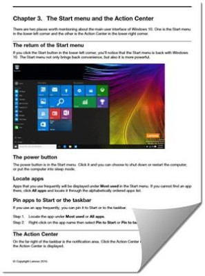

+++
title = "للمبتدئين.. احترف ويندوز 10 كتاب جديد من مايكروسوفت ولينوفو"
date = "2015-08-08"
description = "هل ما زلت لم تقم بتثبيت ويندوز؟ أو قمت بتثبيته ولا تعرف كيفية استخدام المميزات الجديدة المدمجة فيه، في درس اليوم أقدم لك عزيزي القارئ كتابين من مايكروسوفت ولينوفو سيخبرانك بالجديد في ويندوز 10 وكيفية استخدامه."
categories = ["ويندوز",]
series = ["ويندوز 10"]
tags = ["موقع لغة العصر"]

+++

هل ما زلت لم تقم بتثبيت ويندوز؟ أو قمت بتثبيته ولا تعرف كيفية استخدام المميزات الجديدة المدمجة فيه، في درس اليوم أقدم لك عزيزي القارئ كتابين من مايكروسوفت ولينوفو سيخبرانك بالجديد في ويندوز 10 وكيفية استخدامه.

الكتاب الأول من مايكروسوفت: Windows 10 eBook – Exploring Windows 10

[لتحميل هذا الكتاب من هنا](http://www.microsoft.com/en-us/download/details.aspx?id=47716)
يتحدث الكتاب عن جميع الخصائص الجديدة التي جاء بها ويندوز 10، كما يتضمن دروسا عن تخصيص قائمة البداية، شاشة القفل، صورة الحساب، وتطبيق الإعدادات.

الكتاب الثاني من لينوفو: Starting to use Windows 10

[لتحميل هذا الكتاب من هنا](https://download.lenovo.com/ibmdl/pub/pc/pccbbs/mobiles_pdf/lnb_win10_qsg_en.pdf)
في الفصل الأول من هذا الكتاب ستجد تعليمات مفصلة عن عمل نسخة احتياطية من نظامك الحالي ثم تفعيل ويندوز 10، وفى الفصل الثاني التحكم في الحسابات وعمل حساب مايكروسوفت جديد، باقي الفصول تتناول مميزات الويندوز الجديدة، وفى الفصل الأخير تحدث عن طريقة استرجاع النسخة الاحتياطية من الويندوز.

---
هذا الموضوع نٌشر باﻷصل على موقع مجلة لغة العصر.

http://aitmag.ahram.org.eg/News/22226.aspx