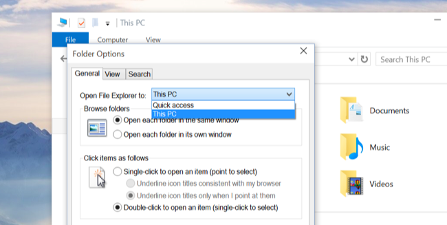
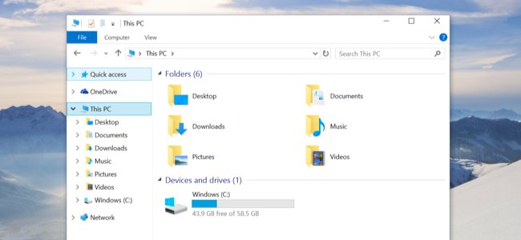

+++
title = "طريقة إعادة تفعيل This PC في ويندوز 10"
date = "2015-06-27"
description = "أتى مدير الملفات الخاص بويندوز 10 بخاصية جيدة تسمى الوصول السريع Quick Access والتي تمكنك من الوصول إلى الملفات والمجلدات التي قمت بالدخول إليها مؤخرا، لكن العديد من المستخدمين لم يعجبهم هذا التغيير، ويريدون إرجاع This PC فإذا كنت منهم إليك هذا الدرس."
series = ["ويندوز 10"]
categories = ["ويندوز",]
tags = ["موقع لغة العصر"]

+++

أتى مدير الملفات الخاص بويندوز 10 بخاصية جيدة تسمى الوصول السريع Quick Access والتي تمكنك من الوصول إلى الملفات والمجلدات التي قمت بالدخول اليها مؤخرا، لكن العديد من المستخدمين لم يعجبهم هذا التغيير، ويريدون إرجاع This PC فإذا كنت منهم إليك هذا الدرس.

حاولت مايكروسوفت أن يكون نظام الويندوز ذكيا حيث يتعرف على الأماكن التي تقوم بالدخول اليها كثيرا ويرتبها حسب درجة الأهمية، ولكن العديد من المستخدمين لا يرغبون في ظهور هذه الأماكن دائما في متصفح الملفات.

**تغيير إعدادات متصفح الملفات ليقوم بفتح** **My Computer** **بدلا من** **Quick Access** **عند الضغط عليه:**
1. قم بالضغط على قائمة File.
2. اختر Change folder and search options.
3. قم باختيار This PC من القائمة المنسدلة Open File Explorer.

4. بعد الدخول على متصفح الملفات سيظهر لك كما بالصورة.

---
هذا الموضوع نٌشر باﻷصل على موقع مجلة لغة العصر.

http://aitmag.ahram.org.eg/News/18134.aspx