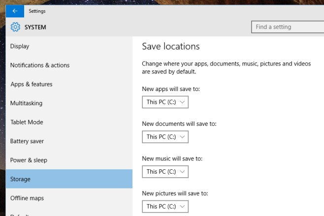

+++
title = "تغيير المكان الافتراضي لتثبيت التطبيقات الحديثة في ويندوز 10"
date = "2015-07-04"
description = "تغيير المكان الافتراضي لتثبيت التطبيقات الحديثة في ويندوز 10شرح وتعليم"
categories = ["ويندوز",]
series = ["ويندوز 10"]
tags = ["موقع لغة العصر"]
+++

تحدثنا في موضوع سابق عن طريقة نقل تطبيق مثبت في ويندوز 10 إلى قسم مختلف من الهارد وكما ذكرنا في هذا الموضوع فإن الويندوز يثبت التطبيقات الجديدة تلقائيا على القرص C، في درس اليوم نقدم لك عزيزي القارئ طريقة تغيير المكان الافتراضي لتثبيت التطبيقات الحديثة في ويندوز 10.

1. قم بالدخول الى تطبيق الإعدادات.
2. انتقل الى القسم System، ثم التبويب Storage.
3. ستجد أسفل الاختيار Save Locations ستجد الأماكن التي يتم حفظ جميع أنواع الملفات فيها مقسمة الى Apps، documents، music، photos.

4. قم بالضغط على القائمة المنسدلة الموجودة أسفل " New apps will save to" ثم قم باختيار المكان الجديد الذي تريد اختياره.

5. تستطيع تطبيق هذه الطريقة على أي من أنواع الملفات الموجودة أمامك.
6. يجب أن تعلم أن هذه الطريقة تعمل على التطبيقات التي سيتم تثبيتها ولكن لن تغير من مكان التطبيقات المثبتة حاليا، لذا يمكنك استخدام الطريقة التي سبق ذكرها في درس "نقل تطبيق مثبت في ويندوز 10 إلى قسم مختلف من الهارد".

---

هذا الموضوع نٌشر باﻷصل على [موقع مجلة لغة العصر](http://aitmag.ahram.org.eg/News/18879/%D8%AF%D8%B1%D9%88%D8%B3/%D8%B4%D8%B1%D8%AD-%D9%88%D8%AA%D8%B9%D9%84%D9%8A%D9%85/%D8%AA%D8%BA%D9%8A%D9%8A%D8%B1-%D8%A7%D9%84%D9%85%D9%83%D8%A7%D9%86-%D8%A7%D9%84%D8%A7%D9%81%D8%AA%D8%B1%D8%A7%D8%B6%D9%8A-%D9%84%D8%AA%25).
