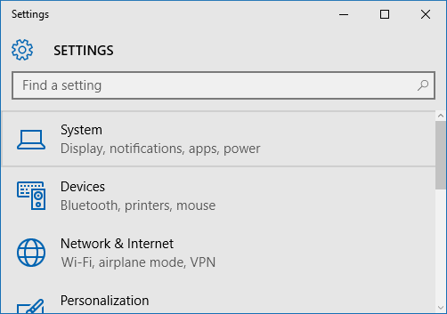
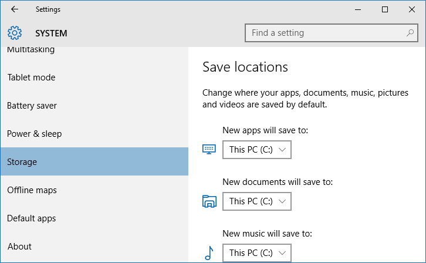
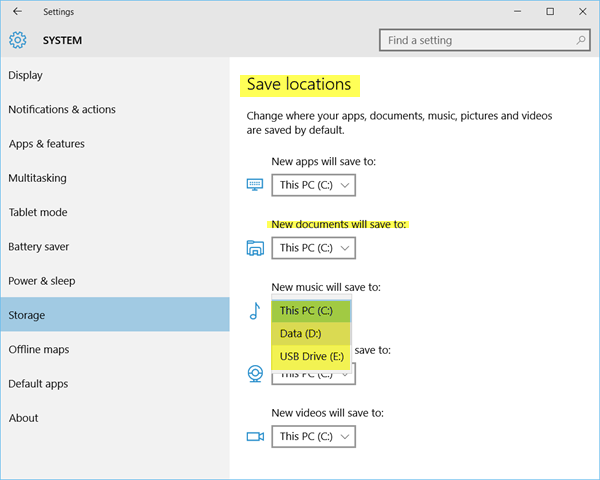

+++
title = "طريقة تغيير المكان الافتراضي لحفظ المستندات والصور في ويندوز 10"
date = "2015-12-08"
description = "يتيح ويندوز 10 لمستخدميه تغيير المكان الافتراضي بحفظ المستندات، الصور، ملفات الموسيقي والفيديو بطريقة بسيطة عن طريق تطبيق الاعدادات، إليك عزيزي القارئ الطريقة"
categories = ["ويندوز",]
series = ["ويندوز 10"]
tags = ["موقع لغة العصر"]
images = ["images/2015-635851789201760769-176.png"]

+++

يتيح ويندوز 10 لمستخدميه تغيير المكان الافتراضي بحفظ المستندات، الصور، ملفات الموسيقي والفيديو بطريقة بسيطة عن طريق تطبيق الاعدادات، إليك عزيزي القارئ الطريقة.

1- قم بالدخول إلى تطبيق الإعدادات.

2- قم بالدخول إلى القسم System.

3- اختر التبويب Storage.

4- ستجد الإعدادات كما بالصورة:

5- اضغط على مربع New documents will save to ثم قم باختيار المكان الجديد الذي سيتم حفظ الملفات فيه.
- وهكذا يمكنك تعيين أماكن مختلفة للحفظ لأنواع مختلفة من الملفات.

---
هذا الموضوع نٌشر باﻷصل على موقع مجلة لغة العصر.

http://aitmag.ahram.org.eg/News/38501.aspx