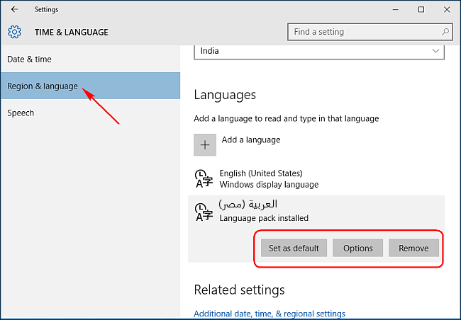
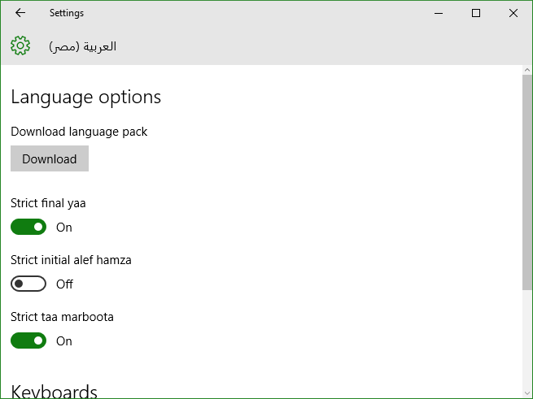
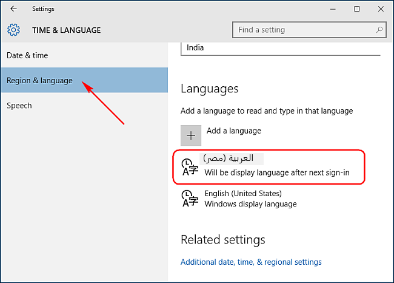
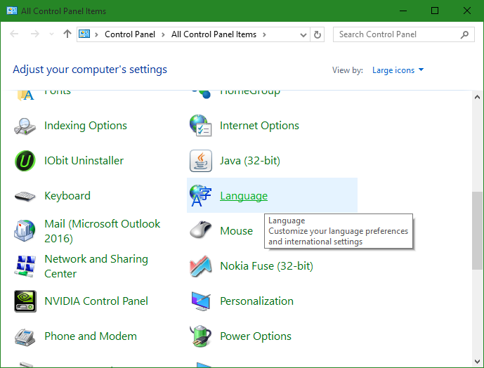
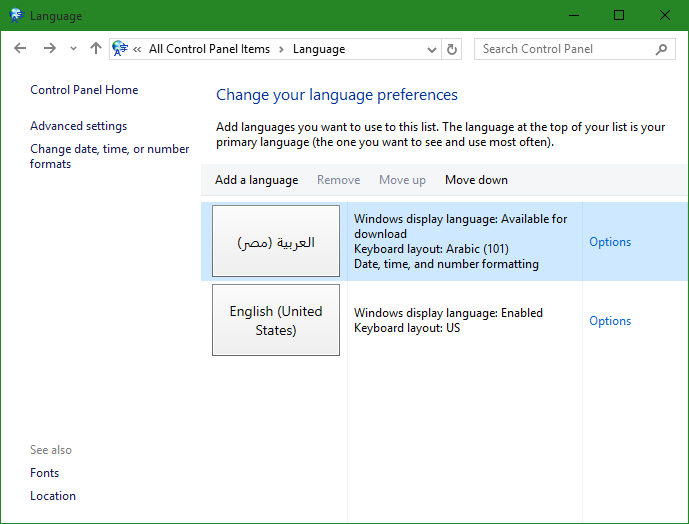
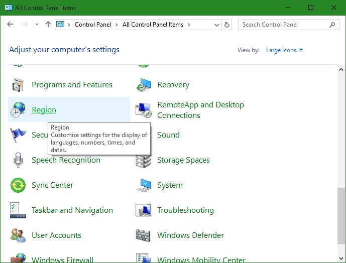
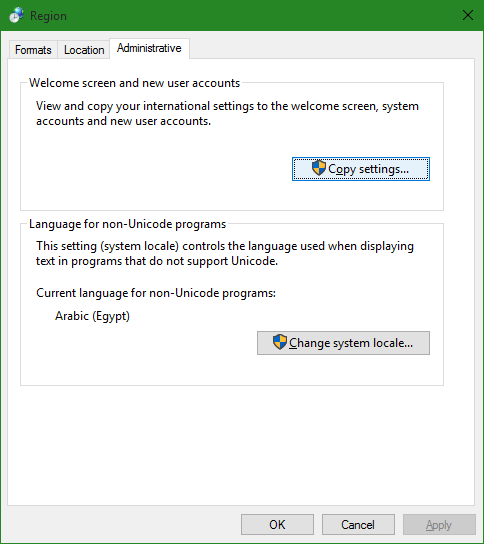
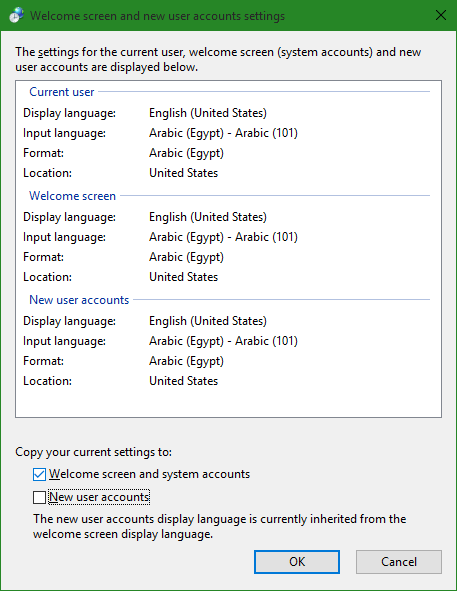

+++
title = "كيفية تغيير لغة الواجهة في ويندوز 10"
date = "2015-11-10"
description = "تحدثنا في الدرس السابق من سلسلة دروس ويندوز 10 عن إضافة كيفية إضافة مزيد من اللغات إلى ويندوز 10، وفي درس اليوم ستنعرف على كيفية تغيير لغة الواجهة بطريقة بسيطة"
categories = ["ويندوز",]
series = ["ويندوز 10"]
tags = ["موقع لغة العصر"]

+++

تحدثنا في الدرس السابق من سلسلة دروس ويندوز 10 عن إضافة كيفية إضافة مزيد من اللغات إلى ويندوز 10، وفي درس اليوم ستنعرف على كيفية تغيير لغة الواجهة بطريقة بسيطة.

بعد أن تقوم بإضافة اللغة الجديدة كما في الدرس السابق قم بالخطوات الاتية:

1- اضغط على "Options" ثم انتظر حتى يبحث الويندوز عن حزمة اللغة، اضغط "Download" عندما تظهر.

2- بعد انتهاء التحميل اضغط على "Set as default" لتعيين اللغة كافتراضية.

2- ستلاحظ ظهر تنبيه بأنه سيتم تغيير اللغة بعد تسجيل الدخول القادم، "Will be display language after next sign-in" كما بالصورة.

يمكنك أيضا عزيزي القارئ تغيير لغة الواجهة عن طريق لوحة التحكم Control Panel بالطريقة التالية:

1- قم بفتح لوحة التحكم ثم اختر "Language".

2- اضغط على الزر " Options" بجانب اللغة الجديدة.

2- اضغط على "Make this the primary language" لتطبيق لغة الواجهة الجديدة، ثم قم بتسجيل الخروج والدخول مرة أخري، أو إعادة التشغيل.

- تغيير لغة شاشة الترحيب وحسابات المستخدمين الجدد:

عندما تقوم بتغيير اللغة في أحد الحسابات، لا يقوم الويندوز باعتماد هذه اللغة كلغته الافتراضية لذلك عليك بالقيام بالآتي:

1- قم بفتح لوحة التحكم ثم اختر "Region".

2- اضغط على التبويب " Administrative" ثم الزر "Copy settings".

3- قم بوضع علامة علي "Welcome screen and system accounts" لتغيير شاشة الترحيب وحسابات النظام إلى لغة الواجهة الجديدة.

4- لتعيين اللغة الجديدة افتراضية لحسابات المستخدمين الجدد ضع العلامة على "New user accounts" أيضا.

---
هذا الموضوع نٌشر باﻷصل على موقع مجلة لغة العصر.

http://aitmag.ahram.org.eg/News/36938.aspx