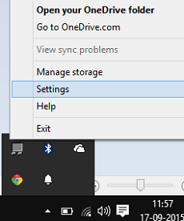
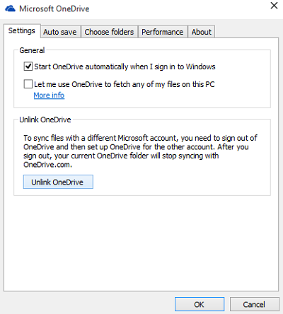
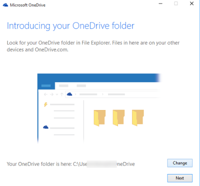
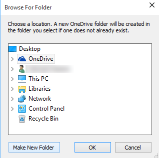

+++
title = "تعلم ويندوز 10.. طريقة تغيير مكان مجلد OneDrive"
date = "2015-10-20"
description = "قد تحتاج إلى نقل مجلد ال OneDrive الموجود على القرص C، سواء بسبب ضيق المساحة أو بسبب أن القرص الرئيسي لجهاز اللاب توب من النوع SSD، استكمالا لسلسلة دروس OneDrive ستنعرف عزيزي القارئ على طريقة تغيير مكان مجلد OneDrive في ويندوز 10"
categories = ["ويندوز",]
series = ["ويندوز 10"]
tags = ["موقع لغة العصر"]

+++

قد تحتاج إلى نقل مجلد ال OneDrive الموجود على القرص C، سواء بسبب ضيق المساحة أو بسبب أن القرص الرئيسي لجهاز اللاب توب من النوع SSD، استكمالا لسلسلة دروس OneDrive ستنعرف عزيزي القارئ على طريقة تغيير مكان مجلد OneDrive في ويندوز 10.

 افتراضيا يقوم OneDrive بتحميل الملفات في المسار C:\User\<username>\OneDrive، ولكن لا يمكن نقله بالطريقة التي ننقل بها الملفات العادية، حيث أنه عند نقلها من المسار الافتراضي تفقد الملفات ارتباطها بالنسخة الموجودة سحابيا.

1. اضغط بزر الفأرة الأيمن على أيقونة OneDrive بجانب الساعة، ثم اختر Settings.

2. قم باختيار " Unlink OneDrive".

3. إذا طلب منك التسجيل قم بذلك، ثم اضغط على الزر Change.

4. قم باختيار المكان الجديد للـ OneDrive ثم اضغط OK.

5. سيقوم OneDrive الآن بنقل جميع ملفاتك إلى المكان الجديد.

---
هذا الموضوع نٌشر باﻷصل على موقع مجلة لغة العصر.

http://aitmag.ahram.org.eg/News/34292.aspx