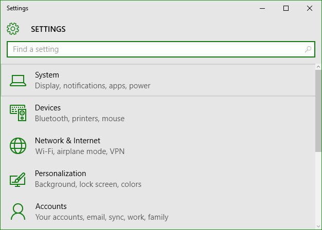
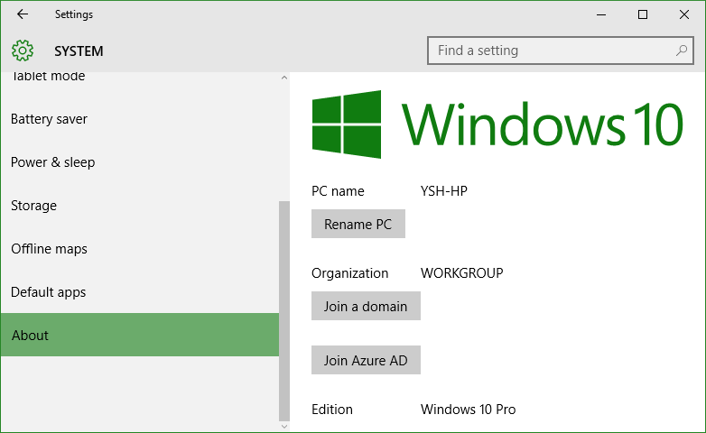
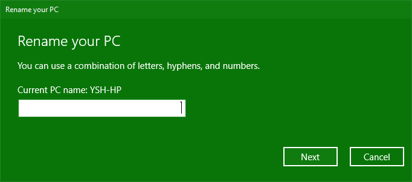

+++
title = "طريقة تغيير اسم الجهاز في ويندوز 10"
date = "2015-11-19"
description = "عملية تثبيت الويندوز بسيطة جدا وتتطلب من المستخدم إدخال القليل جدا ربما باستثناء واحد أو اثنين من الأشياء الصغيرة واحدة من تلك الأشياء الصغيرة هي اسم جهاز الكمبيوتر الخاص بك، في درس اليوم ستتعرف على طريقة تغيير اسم الجهاز في ويندوز 10"
categories = ["ويندوز",]
series = ["ويندوز 10"]
tags = ["موقع لغة العصر"]

+++

عملية تثبيت الويندوز بسيطة جدا وتتطلب من المستخدم إدخال القليل جدا ربما باستثناء واحد أو اثنين من الأشياء الصغيرة. واحدة من تلك الأشياء الصغيرة هي اسم جهاز الكمبيوتر الخاص بك، في درس اليوم ستتعرف على طريقة تغيير اسم الجهاز في ويندوز 10.

1. قم بالدخول إلى تطبيق الإعدادات.

2. انتقل الى القسم System.

3. قم بالنزول إلى الأسفل واختيار التبويب About ستجده كما بالصورة.

4. أمام PC Name ستجد اسم جهازك.

5. اضغط على Rename PC لتغيير الاسم.

6. قم بكتابة الاسم الجديد ثم اضغط Next.

7. سيطلب الويندوز إعادة تشغيل الجهاز، يمكنك الموافقة أو التأجيل، ففي كل الأحوال سيتم تغيير اسم الجهاز عند تسجيل الدخول القادم.

---
هذا الموضوع نٌشر باﻷصل على موقع مجلة لغة العصر.

http://aitmag.ahram.org.eg/News/37628.aspx