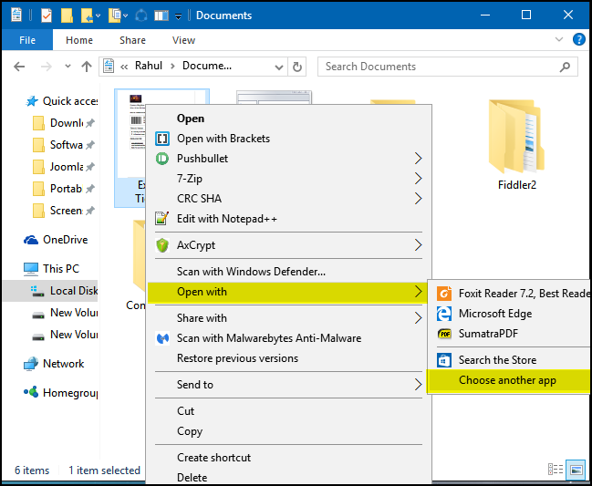
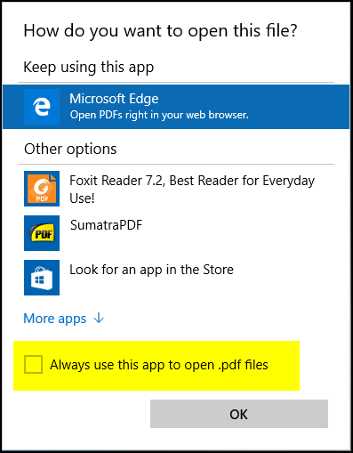
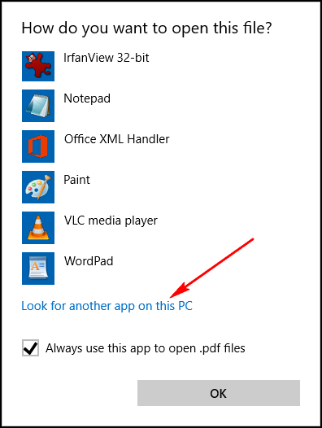
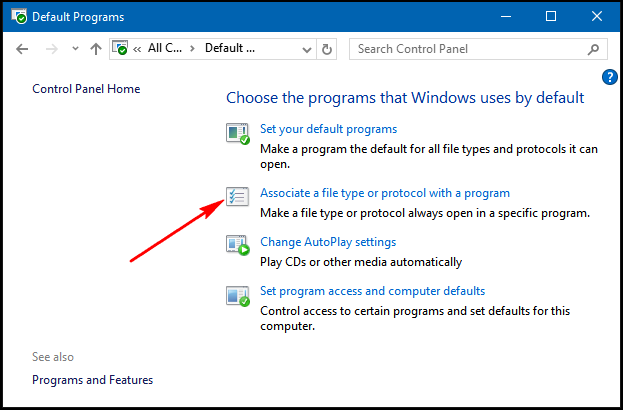
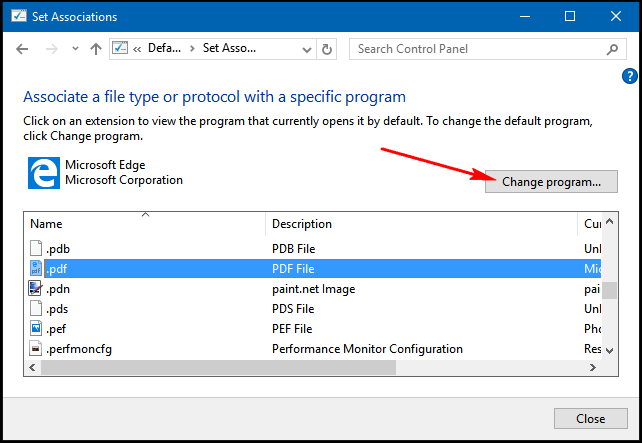
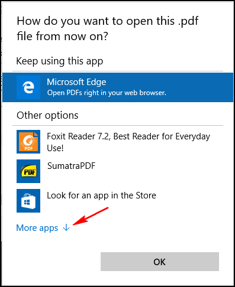
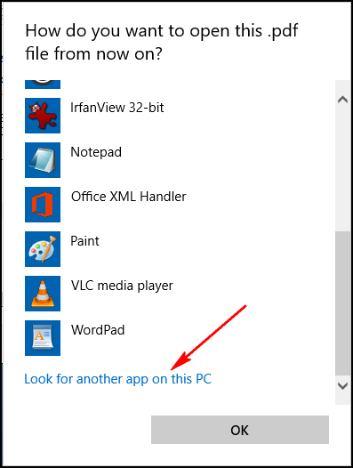

+++
title = "طريقة تغيير قارئ ملفات PDF في ويندوز 10"
date = "2016-01-16"
description = "متصفح Microsoft Edge ليس فقط المتصفح الافتراضي في ويندوز 10، ولكنه أيضا قارئ ملفات PDF الافتراضي، في درس اليوم ستتعرف عزيزي القارئ على طريقه تغييره"
categories = ["ويندوز",]
series = ["ويندوز 10"]
tags = ["موقع لغة العصر"]

+++

متصفح Microsoft Edge ليس فقط المتصفح الافتراضي في ويندوز 10، ولكنه أيضا قارئ ملفات PDF الافتراضي، في درس اليوم ستتعرف عزيزي القارئ على طريقه تغييره.

بالتأكيد دعم متصفح Edge لعرض ملفات PDF هو نقطة تحتسب لصالح مايكروسوفت، ولكن ما يعيب قارئ الملفات هو افتقاره الي العديد من الخصائص الموجودة في البرامج الأخرى.

**الطريقة الأولي: باستخدام** **Open With** **في مستعرض الملفات** **File Explorer:**

1- قم بفتح مستعرض الملفات ثم انتقل الي المجلد الموجود به ملفات PDF.

2- اضغط بزر الماوس الأيمن على الملف ثم من قائمة Open with اختر Choose another app.

3- ستظهر لك هذه النافذة لاختيار البرنامج الذي سيفتح الملف، اختر " Always use this app" لتعيين البرنامج الذي ستختاره كافتراضي لفتح ملفات PDF.

4- إذا كان البرنامج الذي تريد تعيينه غير موجود في قائمة البرامج اضغط " Look for another app in this PC" ثم قم بفتح البرنامج الذي تريد اختياره من مكانه على القرص الصلب.

**الطريقة الثانية: باستخدام** **Control Panel:**

1- قم بفتح لوحة التحكم Control Panel ثم Default Programs، بعد ذلك اضغط علي Associate a file type or protocol with a program وانتظر حتي تظهر لك امتدادات الملفات.

2- قم بالبحث عن امتداد .pdf ثم حدده واضغط زر Change program كما بالصورة.

3- ستظهر نفس النافذة كما بالطريقة الأولي، اختر البرنامج الذي تريد تعيينه.

4- أيضا إذا لم تجد البرنامج الذي تريد تعيينه في قائمة البرامج اضغط " Look for another app in this PC" ثم قم بفتح البرنامج الذي تريد اختياره من مكانه على القرص الصلب.

---
هذا الموضوع نٌشر باﻷصل على [موقع مجلة لغة العصر](http://aitmag.ahram.org.eg/News/41474/%D8%AF%D8%B1%D9%88%D8%B3/%D8%B4%D8%B1%D8%AD-%D9%88%D8%AA%D8%B9%D9%84%D9%8A%D9%85/%D8%B7%D8%B1%D9%8A%D9%82%D8%A9-%D8%AA%D8%BA%D9%8A%D9%8A%D8%B1-%D9%82%D8%A7%D8%B1%D8%A6-%D9%85%D9%84%D9%81%D8%A7%D8%AA-PDF-%D9%81%D9%8A-%D9%88%D9%8A%D9%86%D8%AF%D9%88%D8%B2-.aspx).

