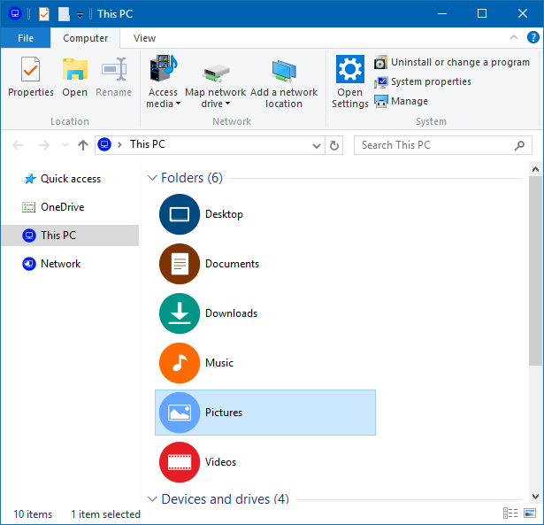
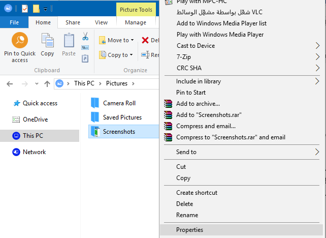
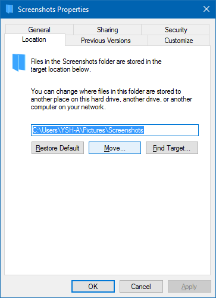

+++
title = "طريقة تغيير المكان الافتراضي لحفظ لقطات الشاشة في ويندوز 10"
date = "2015-11-24"
description = "يأتي ويندوز 10 مدمجا به اختصارات لالتقاط صور للشاشة بدقة عالية، فكما هو معروف كل ما تحتاجه هو الضغط على Win+Printscreen لتجد الصورة قد تم حفظها، إليك عزيزي القارئ سر تغيير مكان حفظ لقطات الشاشة الافتراضي"
categories = ["ويندوز",]
series = ["ويندوز 10"]
tags = ["موقع لغة العصر"]
images = ["images/0.jpg"]
+++

يأتي ويندوز 10 مثل الإصدارات السابقة مدمجا به اختصارات لالتقاط صورة من الشاشة بدقة عالية، فكما هو معروف كل ما تحتاجه هو الضغط على Win+Printscreen لتجد الصورة قد تم حفظها، إليك عزيزي القارئ سر تغيير مكان حفظ لقطات الشاشة الافتراضي.

1. يجب أن تقوم بإنشاء مكان حفظ لقطات الشاشة عن طريق أخد لقطة جديدة Win+Printscreen.

2. قم بفتح This PC ثم انتقل إلى مكتبة Pictures.

3. اضغط بزر الفأرة الأيمن على مجلد Screenshots ثم اختر Properties.

4. انتقل إلى التبويب Location، اضغط على الزر Move ثم اختر المكان الجديد واضغط Select folder.

---
هذا الموضوع نٌشر باﻷصل على موقع مجلة لغة العصر.

http://aitmag.ahram.org.eg/News/37993.aspx
