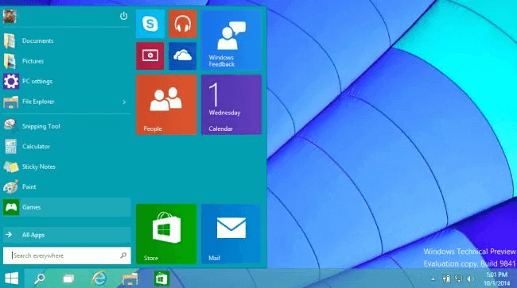
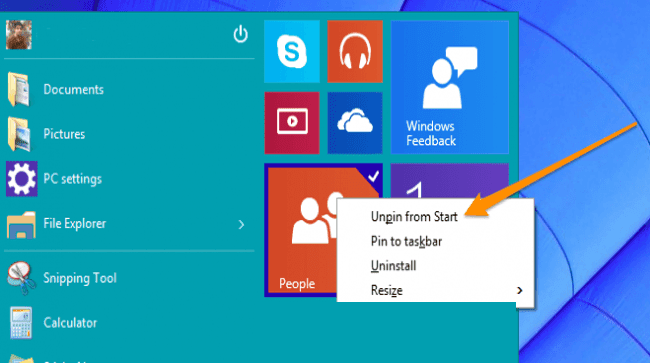
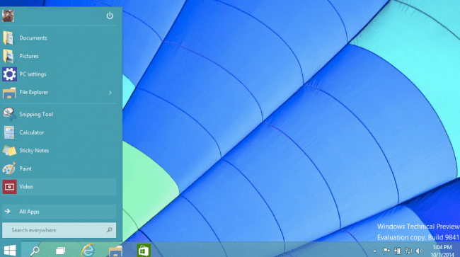
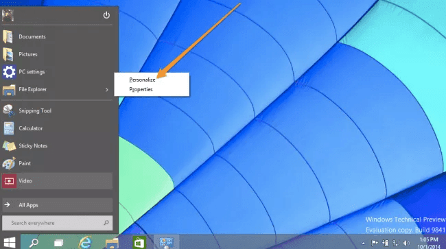
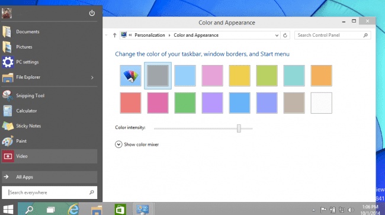
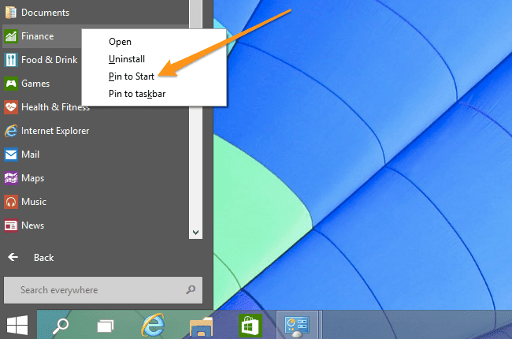

+++
title = "تحويل شكل قائمة ابدأ فى ويندوز 10 الى شكل ويندوز 7 بدون برامج"
date = "2014-10-03"
description = "حيلة لجعل شكل قائمة ابدأ في ويندوز 10 أقرب ما يكون لشكل القائمة فى ويندوز 7 بدون برامج خارجية."
categories = ["ويندوز",]
tags = ["حيل", "افهم تكنولوجيا"]
series = ["ويندوز 10"]

+++

تكتظ قائمة البداية فى ويندوز 10 بالعديد من المربعات الحية (Live Tiles) التى يمكن الاستغناء عنها بسهولة.

بكل بساطة قم بالضغط بزر الفأرة الأيمن على المربع ثم اخترUnpin from Start.

بعد الانتهاء من حذف كل المربعات ستجد أن شكل القائمة قد أصبح كما بالصورة:

تستطيع أيضا تغيير لون القائمة عن طريق الضغط بزر الفأرة الأيمن فى أى مساحة فارغة فى القائمة ثم اختيار Personalize من القائمة.

بعد ذلك قم بتغيير اللون كما تريد مثلما فى الصورة:

وإذا رغبت فى إعادة المربعات الحية مرة أخرى الى القائمة قم بالوقوف على التطبيق المراد تثبيته ثم قم بالضغط بزر الفأرة الأيمن وبعدها اختر Pin to the Start.

---

هذا المقال نشر باﻷصل على مدونة افهم تكنولوجيا ويمكن الإطلاع عليه [هنا](https://efhamtechnology.blogspot.com/2014/10/start10-7.html).
