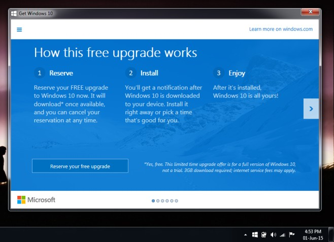
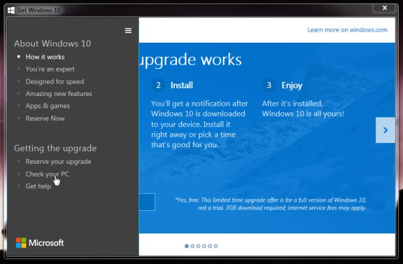
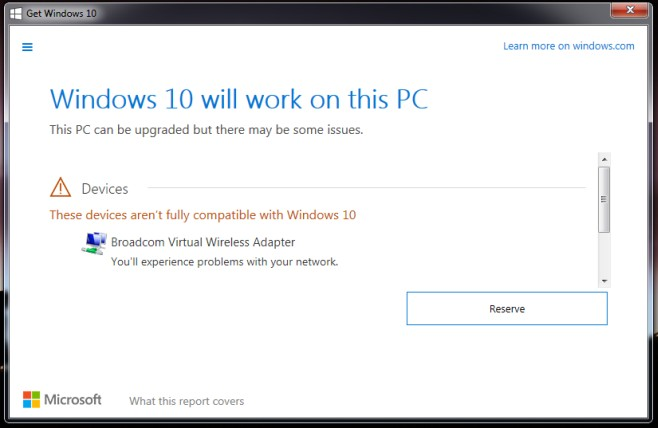

+++
title = "كيف تتحقق من توافق التعريفات والبرامج مع ويندوز 10؟"
date = "2015-06-03"
description = "ويندوز 10 قادم في 29 يوليو 2015 كما أعلنت مايكروسوفت منذ يومين، وقد حسنت مايكروسوفت من الويندوز بشكل كبير وقامت فيه بالعديد من التغييرات، فكل ما كان مكروها في ويندوز 8 قد عالجته مايكروسوفت، لذا قبل أن تقوم بالترقية الى ويندوز 10 يجب عليك التحقق من توافق التعريفات والبرامج معه حتى لا تقع في مشكلة، اليك الطريقة."
categories = ["ويندوز",]
series = ["ويندوز 10"]
tags = ["موقع لغة العصر"]
images = ["images/0.jpg"]

+++

ويندوز 10 قادم في 29 يوليو 2015 كما أعلنت مايكروسوفت منذ يومين، وقد حسنت مايكروسوفت من الويندوز بشكل كبير وقامت فيه بالعديد من التغييرات، فكل ما كان مكروها في ويندوز 8 قد عالجته مايكروسوفت، لذا قبل أن تقوم بالترقية الى ويندوز 10 يجب عليك التحقق من توافق التعريفات والبرامج معه حتى لا تقع في مشكلة، اليك الطريقة.

استعدادا للترقية لويندوز 10 قامت مايكروسوفت بإطلاق تطبيق Get Windows 10 والذي سيظهر بجانب الساعة بعد قيامك بتحميل التحديث KB3035583 وإعادة تشغيل الجهاز.

1. قم بفتح التطبيق ستجده في شريط المهام بجانب الساعة.

2. اضغط على ايقونة القائمة أعلى اليسار، ستظهر كما بالصورة.
3. قم بالضغط على Check Your PC.

4. سيأخذ التطبيق بعض الوقت ليتحقق من كافة أجزاء جهازك، كما سيقوم أيضا بفحص التطبيقات المثبتة لديك ليتأكد من توافقها مع الويندوز.
5. إذا وجد التطبيق تعريفا غير متوافق سيخبرك كما بالصورة:

6. إذا أخبرك التطبيق أن كل شيء على ما يرام، قم بالضغط على Reserve your free upgrade لحجز نسختك المجانية من ويندوز 10.

---
هذا الموضوع نٌشر باﻷصل على موقع مجلة لغة العصر.

http://aitmag.ahram.org.eg/News/16596.aspx 