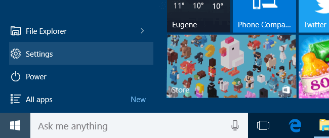
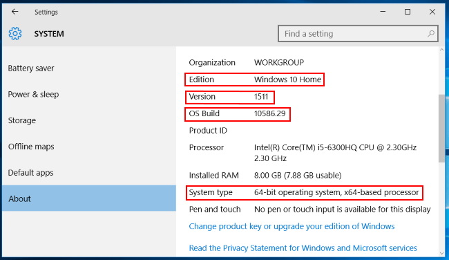
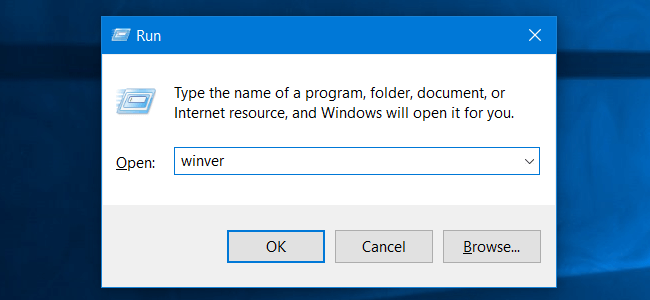
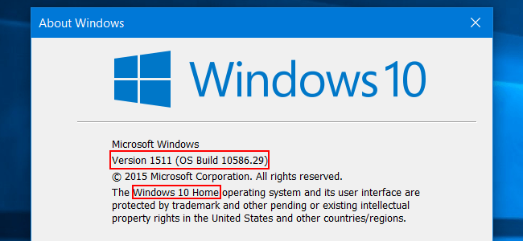
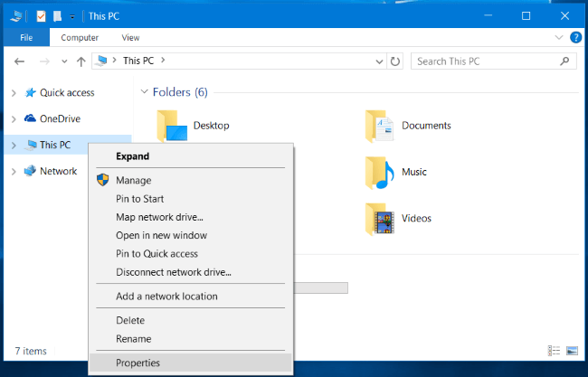
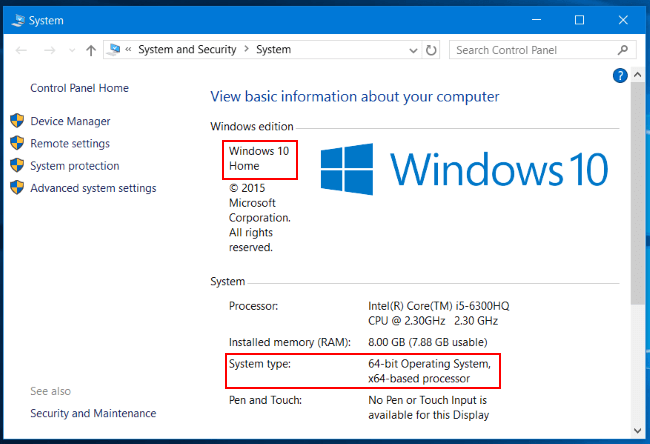

+++
title = "كيف تعرف إصدار وبناء ويندوز 10 الموجود على جهازك؟"
date = "2015-12-15"
description = "نحتاج في بعض الأحيان إلى معرفة معلومات عن إصدار الويندوز الموجود على جهازنا، من هذه المعلومات رقم البناء في ويندوز 10، فعلى ما يبدو أن ويندوز 10 وجد ليبقى لذا يتم تحديث البناء بشكل دوري، إليك الطريقة"
categories = ["ويندوز",]
series = ["ويندوز 10"]
tags = ["موقع لغة العصر"]
images = ["images/2015-635858127191815283-181.png"]

+++

نحتاج في بعض الأحيان إلى معرفة معلومات عن إصدار الويندوز الموجود على جهازنا، من هذه المعلومات رقم البناء في ويندوز 10، فعلى ما يبدو أن ويندوز 10 وجد ليبقى لذا يتم تحديث البناء بشكل دوري من قبل مايكروسوفت لإضافة مميزات جديدة، إليك الطريقة.

**الطريقة الأولى: باستخدام تطبيق الإعدادات:**

1- قم بفتح تطبيق الإعدادات ثم انتقل إلى القسم System.

2- قم بالنزول إلى الأسفل ثم اختر التبويب About.

3- ستجد معلومات جهازك كما بالصورة:

- Edition: نوع ويندوز 10 الموجود على جهازك (Home/Pro/Enterprise/etc.).
- Build Number: رقم بناء ويندوز 10 (في الإصدار الأساسي OS Build 10240) وفى آخر تحديث للويندوز ستجدها version 1511 (OS Build 10576.29) إصدار شهر نوفمبر من عام 2015.
- 64-bit / 32-bit: نوع النظام حالة دعم المعالج لنظام 64 bit.

**الطريقة الثانية: باستخدام أوامر** **RUN:**

1- قم بفتح مربع Run عن طريق Win+R ثم قم بكتابة الأمر winver.

2- ستجد جميع معلومات الويندوز باستثناء نوع النظام.

**الطريقة الثالثة: باستخدام لوحة التحكم** **Control Panel:**

1- قم بالضغط بزر الفأرة الأيمن على This PC ثم اختر من القائمة المختصرة Properties.

2- ستجد نوع الويندوز بجانب شعار ويندوز 10، كما ستجد معلومات المعالج ونوع النظام.

---
هذا الموضوع نٌشر باﻷصل على موقع مجلة لغة العصر.

http://aitmag.ahram.org.eg/News/39104.aspx