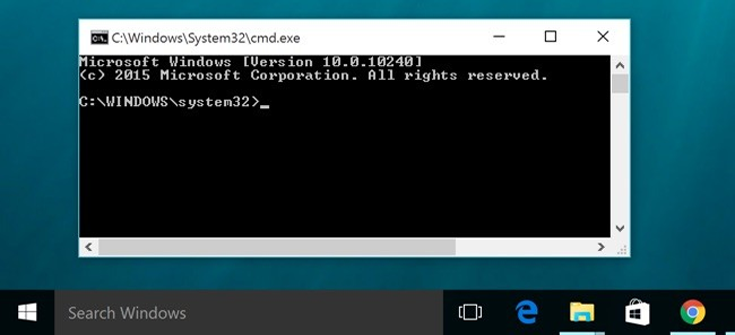

+++
title = "القائمة الكاملة لاختصارات موجه الأوامر في ويندوز 10"
date = "2016-05-11"
description = "إلى كل مستخدمي موجه الأوامر في ويندوز 10، نقدم لكم قائمة الاختصارات الكاملة التي تساعد على استخدام موجه الأوامر بشكل أسرع."
categories = ["ويندوز",]
series = ["ويندوز 10"]
tags = ["موقع لغة العصر"]
images = ["images/2016-635985727239492008-949_thumb705x335.png"]

+++

إلى كل مستخدمي موجه الأوامر في ويندوز 10، نقدم لكم قائمة الاختصارات الكاملة التي تساعد على استخدام موجه الأوامر بشكل أسرع.

| **العمل** | **الاختصار** |
| --- | --- |
| نسخ النص المحدد | Ctrl+C |
| لصق النص المحدد | Ctrl+V |
| الدخول لوضع التحديد Mark mode | Ctrl+M |
| بدء التحديد في block mode | Alt+أزرار الأسهم |
| نقل المؤشر في الاتجاه المطلوب | أزرار الأسهم |
| تحريك المؤشر صفحة لأعلى | Page up |
| تحريك المؤشر صفحة لأسفل | Page down |
| نقل المؤشر إلى بداية موجه الأوامر | Ctrl+Home |
| نقل المؤشر إلى نهاية موجه الأوامر | Ctrl+End |
| التحرك سطر لأعلى | Ctrl+سهم لأعلى |
| التحرك سطر لأسفل | Ctrl+سهم لأسفل |

---
هذا الموضوع نٌشر باﻷصل على موقع مجلة لغة العصر.

http://aitmag.ahram.org.eg/News/48685.aspx