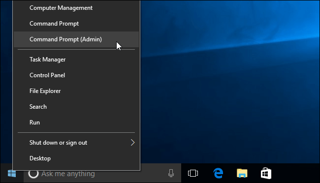
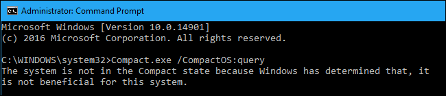
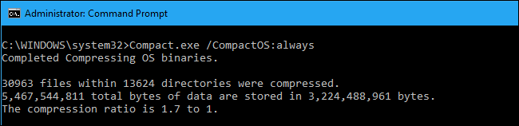

+++
title = "كيفية توفير مساحة القرص الصلب عن طريق ميزة CompactOS في ويندوز 10"
date = "2017-03-21"
description = "يحتوي ويندوز 10 على ميزة تسمي CompactOS حيث تقوم بضغط حجم ملفات النظام لتوفير مزيد من مساحة القرص الصلب، إليك كيفية تفعيل هذه الميزة"
categories = ["ويندوز",]
series = ["ويندوز 10"]
tags = ["موقع لغة العصر"]
images = ["images/0.png"]

+++

يحتوي ويندوز 10 على ميزة تسمي CompactOS حيث تقوم بضغط حجم ملفات النظام لتوفير مزيد من مساحة القرص الصلب، إليك كيفية تفعيل هذه الميزة.

هذه الميزة مصممة في الأساس لأجهزة الكمبيوتر التي تحتوي على قرص صلب صغير مثل بعض أجهزة اللاب توب، حيث تشبه هه الميزة إلى حد كبير ضغط نظام NTFS الموجود ضمن خيارات القرص الصلب.

1. قم بفتح موجه الأوامر Command Prompt عن طريق الضغط بزر الماوس الأيمن على زر البداية (أو اضغط على Windows+X) ثم اختر Command Prompt (Admin).

2. للتحقق من وضع CompactOS الحالي قم بكتابة الأمر:

`Compact.exe /CompactOS:query`

3. لتفعيل CompactOS قم بكتابة:

`Compact.exe /CompactOS:always`

لكن عليك الانتباه إلى أن تفعيل الميزة قد يستغرق 20 دقيقة أو أكثر حسب جهازك، وبعد ذلك سيقوم بتوفير حوالي 2.2 جيجا من المساحة.

4. أما لتعطيل الميزة مرة أخرى نفذ هذا الأمر:

`Compact.exe /CompactOS:never`

---
هذا الموضوع نٌشر باﻷصل على موقع مجلة لغة العصر.

http://aitmag.ahram.org.eg/News/72883.aspx