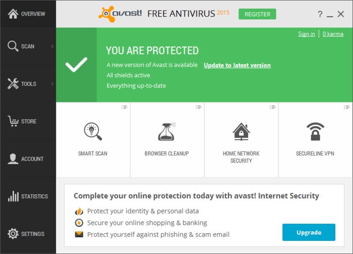
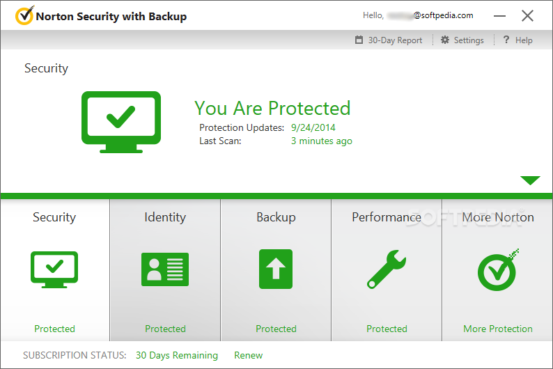
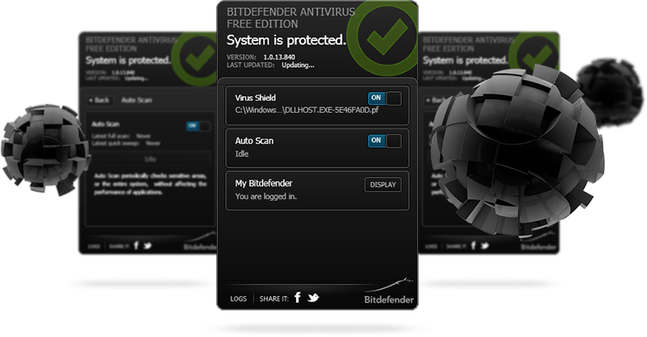
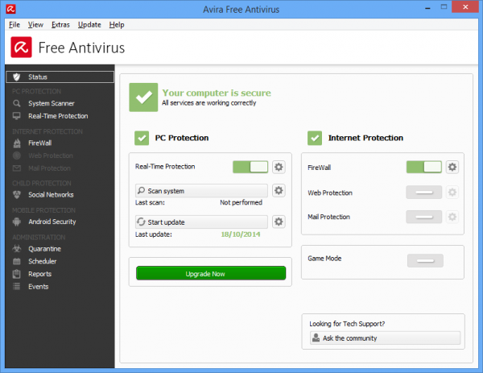
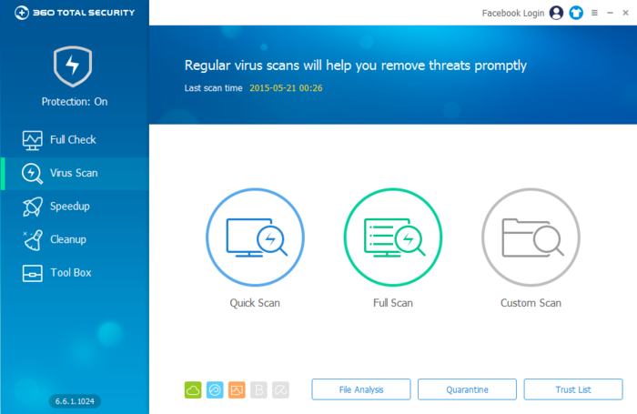

+++
title = "تعرف على برامج ال Anti-Virus المتوافقة مع ويندوز 10"
date = "2015-07-26"
description = "قبل أن تقوم بتثبيت نظام التشغيل الجديد لا بد لك أن تتعرف على برامج مضاد الفيروسات Anti-Virus المتوافقة مع النظام الجديد، حيث إنه عند تثبيت مضاد فيروسات غير متوافق تحدث مشاكل في النظام قد تؤدي إلى سقوطه، في موضوع اليوم سأخبرك عزيزي القارئ بأفضل برامج الـ Anti-Virus المتوافقة مع ويندوز 10"
categories = ["ويندوز",]
series = ["ويندوز 10"]
tags = ["موقع لغة العصر"]

+++

قبل أن تقوم بتثبيت نظام التشغيل الجديد لا بد لك أن تتعرف على برامج مضاد الفيروسات Anti-Virus المتوافقة مع النظام الجديد، حيث أنه عند تثبيت مضاد فيروسات غير متوافق تحدث مشاكل في النظام قد تؤدي إلى سقوطه، في موضوع اليوم سأخبرك عزيزي القارئ بأفضل برامج ال Anti-Virus المتوافقة مع ويندوز 10.

1. Windows Defender (version 4.6.9841.0) مضاد الفيروسات الخاص المجاني الخاص بمايكروسوفت والمدمج مع ويندوز 10.

2. [Avast Free Antivirus 2015 (02/10/2215 Final version)](https://www.avast.com/ar-ww/index)

"مع أكثر من 230 مليون مستخدم، أفاست هو مضاد الفيروسات والأمن الأكثر موثوقية في العالم" بهذه الكلمات وصف البرنامج نفسه، وبعد تجربة البرنامج على ويندوز 10، جميع خصائصه قد عملت بشكل ممتاز، أيضا النسخ المدفوعة من البرنامج تعمل بشكل ممتاز مع ويندوز 10:

Avast Pro Antivirus 2015

Avast Internet Security 2015

Avast Antivirus 2015 Premier

3. [Norton Security (22.5 Beta)](http://us.norton.com/downloads)

نورتن أنتي فايرس هو برنامج منتج من شركة سيمانتك، وواحد من أكثر البرامج المستخدمة في مكافحة الفيروسات. تتمثل مهمته في اكتشاف وإزالة الفيروسات، وملفات التجسس، والإعلانات، وغيرها من المخاطر الأمنية المحتملة، وهو البرنامج المفضل لدى الكثيرين نظرا لبساطة واجهته.

4. [Bitdefender Antivirus Free Edition](http://www.bitdefender.com/solutions/free.html)

عملاق مضادات الفيروسات والبرنامج الأفضل لعامين على التوالي، ويتميز بسرعته الشديدة في عمليات الفحص.

5. [Avira Free Antivirus](http://www.avira.com/en/avira-free-antivirus)

برنامج افيرا واحد من أكثر برامج الحماية شهرةً في العالم، حسب هذا التقرير الذي قدمته الشركة فإن برنامج أفيرا هو برنامج الحماية الأكثر تحميلًا في العالم، فإنه تم تحميل برنامج أفيرا حتى هذه اللحظة 337 مليون مرة، ما يميز البرنامج عن البقية هو خفته وعدم استهلاكه لموارد الجهاز، أيضا النسخ المدفوعة من البرنامج تعمل بشكل ممتاز مع ويندوز 10:

Avira Antivirus Pro

Avira Internet Security Suite

Ultimate Protection Suite Avira

6. [360 Total Security (version 6.8.0.6012 for Windows 10)](http://www.360totalsecurity.com/ar/)

ملاحظة: هذا الترتيب لا يعنى أن البرنامج رقم 1 هو الأفضل.

---

هذا الموضوع نٌشر باﻷصل على موقع مجلة لغة العصر.

http://aitmag.ahram.org.eg/News/21078.aspx
