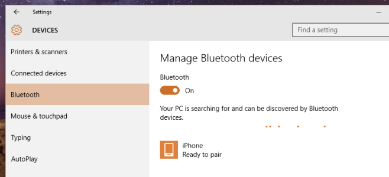
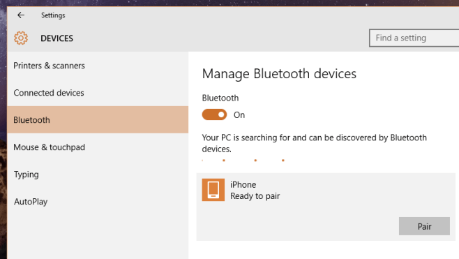
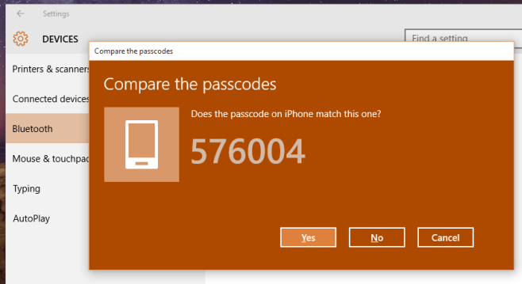

+++
title = "كيفية توصيل أي جهاز بلوتوث مع ويندوز 10"
date = "2016-02-22"
description = "تطبيق الإعدادات هو الأكثر قوة وأكثر بساطة من لوحة التحكم، ومن مميزات تطبيق الإعدادات في ويندوز 10 القدرة على توصيل أي جهاز يعمل بالبلوتوث مع الويندوز، إليك عزيزي القارئ طريقة استخدام هذه الميزة"
categories = ["ويندوز",]
series = ["ويندوز 10"]
tags = ["موقع لغة العصر"]
+++

مر وقت طويل على استخدام الجميع لويندوز 10 وقد أجمعنا كلنا على أن تطبيق الإعدادات هو الأكثر قوة وأكثر بساطة من لوحة التحكم، ومن مميزات تطبيق الإعدادات في ويندوز 10 القدرة على توصيل أي جهاز يعمل بالبلوتوث مع الويندوز، إليك عزيزي القارئ طريقة استخدام هذه الميزة.

1- قم بالدخول إلى تطبيق الإعدادات ثم القسم Devices ثم التبويب Bluetooth.

2- اضغط على زر تشغيل البلوتوث.

3- ستجد قائمة الأجهزة المتاحة موجودة بعد أن يكمل الويندوز البحث.

4- اضغط على الجهاز ثم اضغط زر Pair.

5- قد يظهر لك نافذة قبول الاقتران كما بالصورة:

6- اضغط Yes، ستجد الجهاز قد تمت اضافته إلى قائمة الأجهزة في تبويب بلوتوث.

---
هذا الموضوع نٌشر باﻷصل على موقع مجلة لغة العصر.

http://aitmag.ahram.org.eg/News/44675.aspx