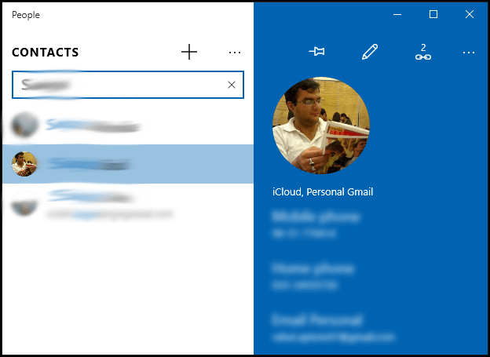
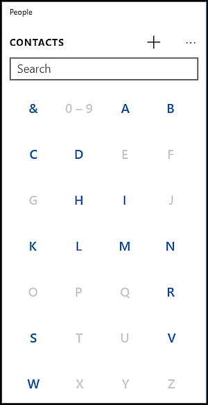
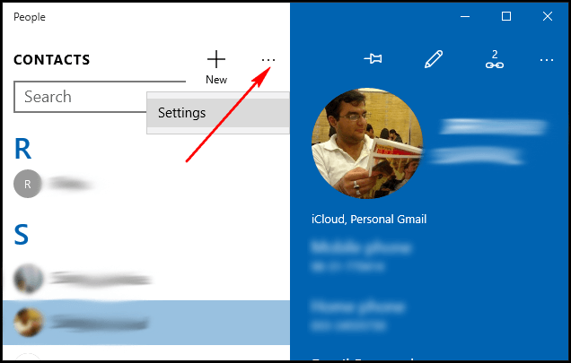
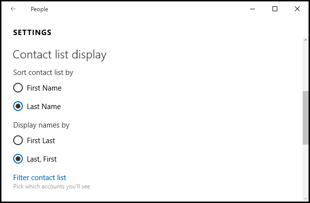

+++
title = "كيف تدير جهات اتصالك بواسطة تطبيق الأشخاص في ويندوز 10؟ (1)"
date = "2016-01-28"
description = "تحدثنا في مجموعة الدروس السابقة عن تطبيق الأشخاص في ويندوز 10، واليوم نستكمل دروسنا وسنعرف على كيفية إدارة جهات الاتصال بواسطة تطبيق الأشخاص"
categories = ["ويندوز",]
series = ["ويندوز 10"]
tags = ["موقع لغة العصر"]
+++

تحدثنا في مجموعة الدروس السابقة عن تطبيق اﻷشخاص في ويندوز 10، واليوم نستكمل دروسنا وسنعرف على كيفية إدارة جهات الاتصال بواسطة تطبيق اﻷشخاص.

**أولا: البحث عن جهات اتصال:**
بعد فتح تطبيق اﻷشخاص يمكنك البحث عن الأسماء عن طريق مربع البحث كما بالصورة.

أو يمكنك الضغط على الحرف الذي يظهر فوق الأسماء للانتقال السريع إلى اسم يبدأ بحرف معين.

**ثانيا: تعديل طريقة ترتيب الأسماء:**

يتم ترتيب الأسماء تلقائيا بحسب الاسم الأول، ويمكنك تغيير طريقة العرض عن طريق الضغط على زر الخيارات واختيار الإعدادات Settings.

تحت Contact list display اختر الترتيب بواسطة First Name أو Last Name كما تريد.

---
هذا الموضوع نٌشر باﻷصل على موقع مجلة لغة العصر.

http://aitmag.ahram.org.eg/News/42254.aspx