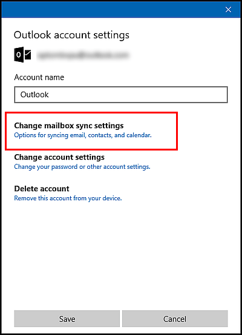
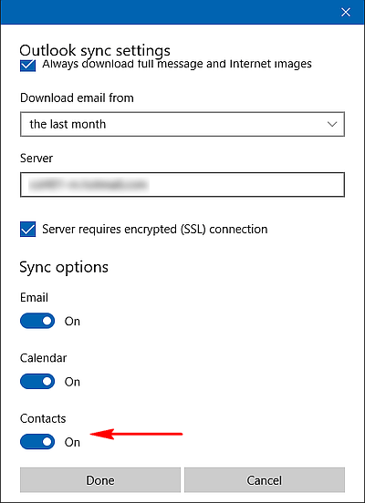
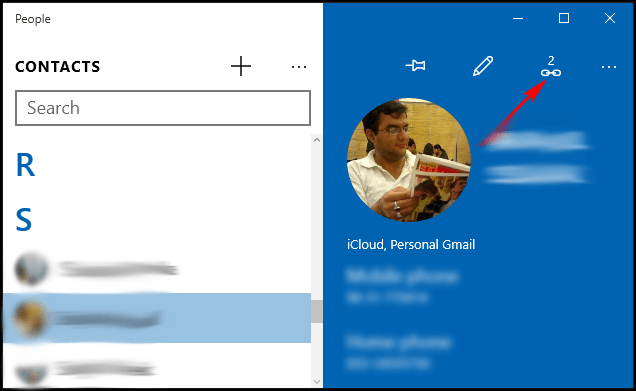
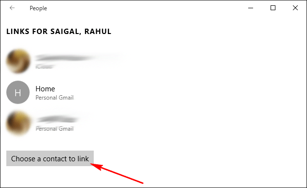
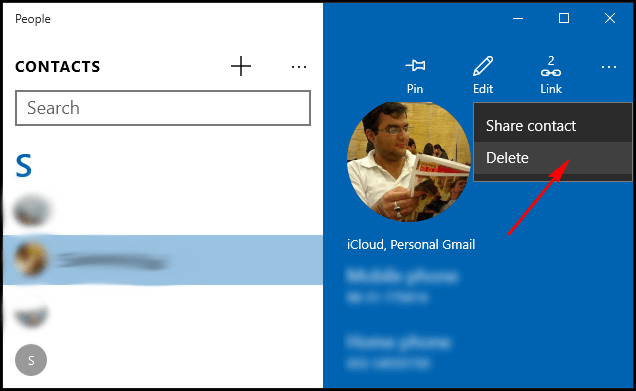

+++
title = "كيف تدير جهات اتصالك بواسطة تطبيق الأشخاص في ويندوز 10؟ (2)"
date = "2016-01-29"
description = "تحدثنا في الدرس السابق عن الجزء الأول من كيفية إدارة جهات الاتصال بواسطة تطبيق الأشخاص وفي درس اليوم سنختتم مجموعة دروس شرح تطبيق الأشخاص ومع الجزء الثاني"
categories = ["ويندوز",]
series = ["ويندوز 10"]
tags = ["موقع لغة العصر"]
+++

تحدثنا في الدرس السابق عن الجزء الأول من كيفية إدارة جهات الاتصال بواسطة تطبيق الأشخاص وفي درس اليوم سنختتم مجموعة دروس شرح تطبيق الأشخاص ومع الجزء الثاني.

**ثالثا: تصفية قائمة جهات الاتصال بواسطة الحسابات:**

- إيقاف مزامنة الأسماء مع حساب معين:

قم بالدخول إلى الاعدادات ثم اضغط على الحساب الذي تريد إيقاف مزامنة الأسماء معه، ستظهر لك نافذة كما بالصورة، اضغط Change Mailbox Sync Settings.

قم بالنزول للأسفل ثم اغلق الاختيار Contacts.

- اخفاء الأسماء من حساب معين:

قم بالدخول إلى الاعدادات ثم اضغط Filter Contact List.

قم بإزالة العلامة من الحساب الذي لا تريد عرض اسماؤه.

**رابعا: ربط جهات الاتصال المكررة:**

عند إضافة حسابات متعددة، من الممكن أن لديك بعض الأسماء المكررة، إذا وجد التطبيق شخصا بنفس الاسم مع معلومات مختلفة فإنه يقوم بالربط بينهم تلقائيا، ستجد علامة الربط تحمل عددا صغيرا مثل 2 أو 3.

عند الضغط عليها يعرض لك بيانات الاسم في الحسابات المختلفة.
كما يمكنك الربط بينهم وبين مزيد من الأسماء بالضغط على زر Choose a contact to link، ثم ابحث عن الاسم الذي تريد ربطه واضغط Save.

**خامسا: حذف جهات الاتصال:**

لحذف جهة اتصال اضغط على زر الاختيارات ثم اضغط Delete كما بالصورة.

---
هذا الموضوع نٌشر باﻷصل على موقع مجلة لغة العصر.