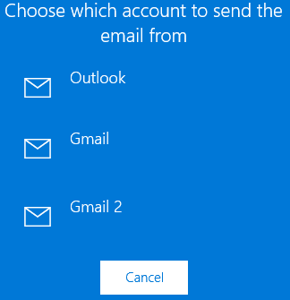

+++
title = "طريقة مشاركة جهات الاتصال في ويندوز 10"
date = "2016-01-27"
description = "نحتاج في كثير من الأحيان إلى مشاركة جهات اتصالنا مع الأقارب أو في العمل، وويندوز 10 يوفر لنا هذه الميزة في تطبيق الأشخاص، إليك عزيزي القارئ طريقة بسيطة لمشاركة جهات اتصالك"
categories = ["ويندوز",]
series = ["ويندوز 10"]
tags = ["موقع لغة العصر"]
+++

نحتاج في كثير من الأحيان إلى مشاركة جهات اتصالنا مع الأقارب أو في العمل، وويندوز 10 يوفر لنا هذه الميزة في تطبيق الأشخاص، إليك عزيزي القارئ طريقة بسيطة لمشاركة جهات اتصالك.

1- قم بفتح تطبيق الأشخاص People.

2- قم باختيار جهة الاتصال التي تريد مشاركتها.

3- اضغط علي زر القائمة ثم اختر Share a contact.

4- اضغط علي علامة موافق.

5- اختر الطريقة التي ستشارك بها جهة الاتصال، أنا سأختار عبر البريد الإلكتروني.

6- إذا كان لديك أكثر من حساب في تطبيق البريد اختر الحساب الذي سترسل من خلاله جهة الاتصال.

7- قم بكتابة عنوان المرسل اليه واضغط Send.

---
هذا الموضوع نٌشر باﻷصل على موقع مجلة لغة العصر.

http://aitmag.ahram.org.eg/News/42195.aspx