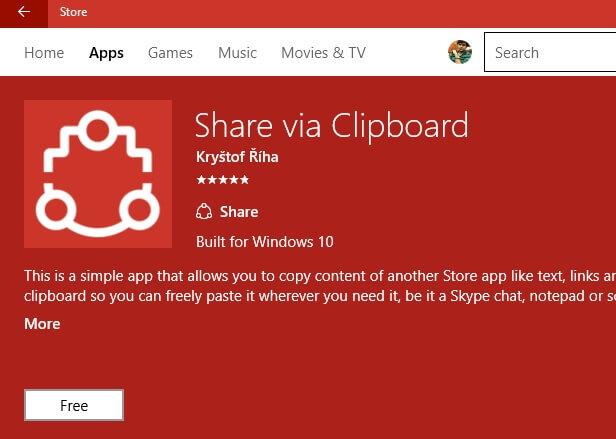
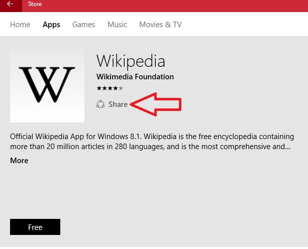
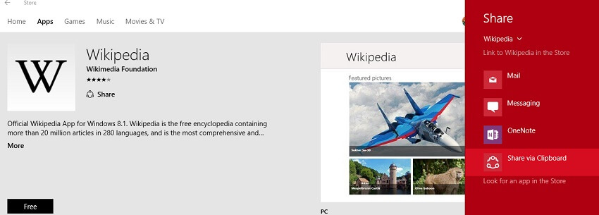
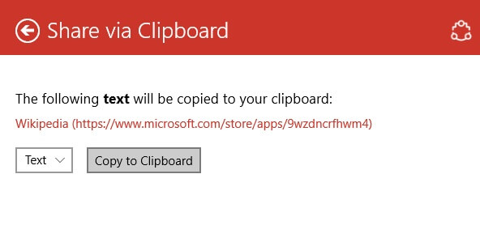
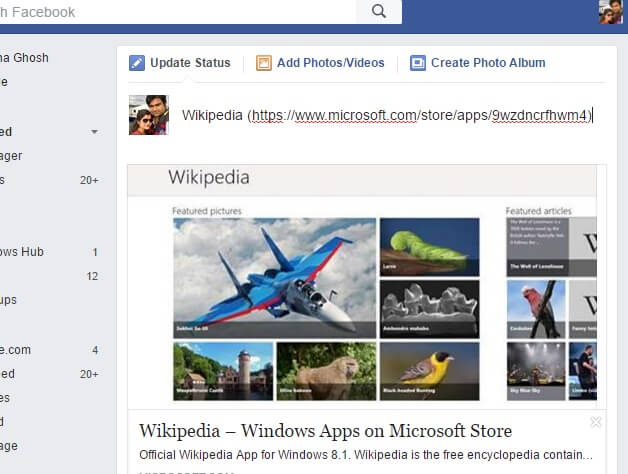

+++
title = "طريقة نسخ رابط تطبيق من المتجر في ويندوز 10"
date = "2016-09-16"
description = "عندما تقوم بفتح رابط لتطبيق من المتجر في المتصفح فإنه يفتح تلقائيا في متجر التطبيقات، ولكن لا يوفر المتجر طريقة لنسخ روابط التطبيقات بداخله لهذا سنستخدم هذه الحيلة"
categories = ["ويندوز",]
series = ["ويندوز 10"]
tags = ["موقع لغة العصر"]
images = ["images/0.png"]
+++

عندما تقوم بفتح رابط لتطبيق من المتجر في المتصفح فإنه يفتح تلقائيا في متجر التطبيقات، ولكن لا يوفر المتجر طريقة لنسخ روابط التطبيقات بداخله لهذا سنستخدم هذه الحيلة.

1. قم بتثبيت تطبيق Share via Clipboard [من هنا](https://www.microsoft.com/store/apps/9nblggh1rq92).

2. بعد التثبيت انتقل إلى التطبيق الذي تريد نسخ الرابط الخاص به ستجد زر مشاركة Share اضغط عليه.

3. سيظهر لك مجموعة من الاختيارات الخاصة بالمشاركة، اختر منها Share via Clipboard.

4. اضغط على زر Copy to Clipboard لنسخ الرابط.

5. الآن تستطيع لصق الرابط ومشاركته في أي مكان تريد.

---
هذا الموضوع نٌشر باﻷصل على موقع مجلة لغة العصر.

http://aitmag.ahram.org.eg/News/60821.aspx