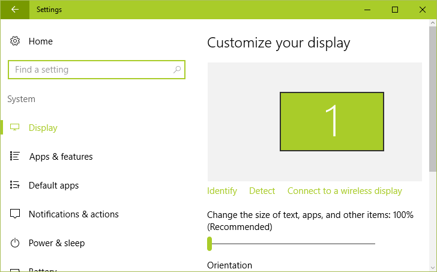
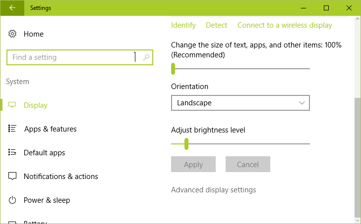
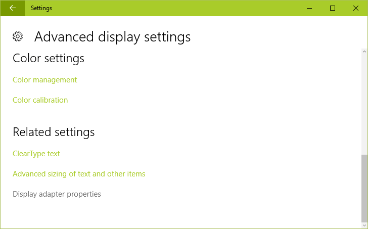
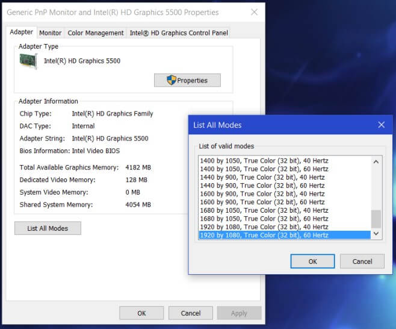

+++
title = "كيفية إضافة دقم شاشة مخصصة في ويندوز 10"
date = "2016-08-28"
description = "يتيح ويندوز 10 للمستخدم اختيار Screen Resolution دقة شاشة من القائمة المتاحة فقط، ولكن توجد حيلة بسيطة لاختيار دقة شاشة مخصصة حتى لو كانت غير موجودة بالقائمة، اليكم الطريقة."
categories = ["ويندوز",]
series = ["ويندوز 10"]
tags = ["موقع لغة العصر"]
+++

يتيح ويندوز 10 للمستخدم اختيار Screen Resolution دقة شاشة من القائمة المتاحة فقط، ولكن توجد حيلة بسيطة لاختيار دقة شاشة مخصصة حتى لو كانت غير موجودة بالقائمة، اليكم الطريقة.

1- قم بالدخول إلى تطبيق الإعدادات – القسم System ثم التبويب Display.

2- انزل إلى أسفل الشاشة ثم اختر Advanced Settings.

3- قم بالنزول إلى آخر اختيار Display adapter properties ثم اضغط عليه.

4- اضغط على زر List all modes لعرض كل دقات الشاشة المتاحة، اختر الدقة التي تريدها ثم اضغط OK ثم Apply.

5- سيتم تطبيق الإعدادات التي اخترتها، وبالطبع يمكنك التراجع عن هذه الاختيارات باستخدام الطريقة العادية.

---
هذا الموضوع نٌشر باﻷصل على موقع مجلة لغة العصر.

http://aitmag.ahram.org.eg/News/58345.aspx