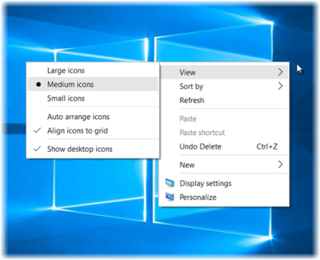
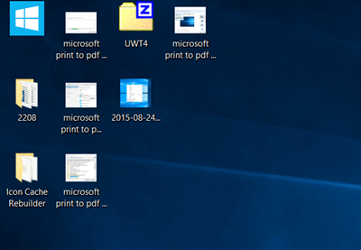
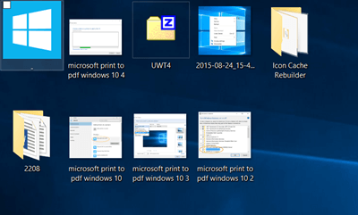
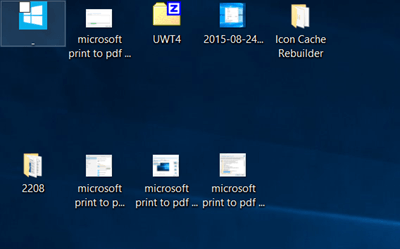
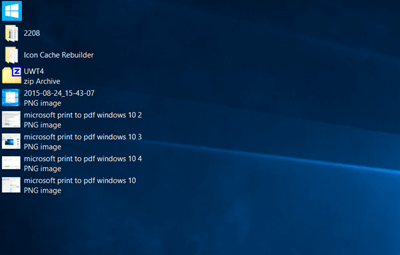
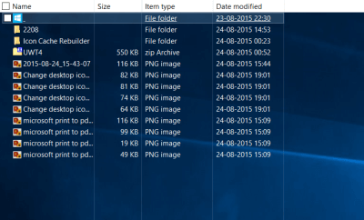

+++
title = "كيفية تغيير طريقة عرض أيقونات سطح المكتب في ويندوز 10"
date = "2016-01-30"
description = "سطح المكتب هو المكان الذي يسهل على المستخدم الوصول إلى الملفات والبرامج، ولكل مستخدم طريقة الخاصة في عرض الأيقونات وترتيبها، في درس اليوم سنتعرف على كيفية تغيير طريقة عرض أيقونات سطح المكتب في ويندوز 10."
categories = ["ويندوز",]
tags = ["موقع لغة العصر"]
series = ["ويندوز 10"]
+++

سطح المكتب هو المكان الذي يسهل على المستخدم الوصول إلى الملفات والبرامج، ولكل مستخدم طريقة الخاصة في عرض الأيقونات وترتيبها، في درس اليوم سنتعرف على كيفية تغيير طريقة عرض أيقونات سطح المكتب في ويندوز 10.

عندما تضغط بزر الماوس الأيمن على سطح المكتب لتغيير طريقة عرض الأيقونات، ستجد ثلاثة اختيارات Large icons, Medium icons وSmall icon.

طريقة العرض الافتراضية للأيقونات هي Medium icons وتظهر كما بالصورة.

عندما تقوم باختيار Large icons سيزداد حجم الأيقونات كما بالصورة.

وعندما تقوم باختيار Small icons سيقل حجم الأيقونات كما بالصورة.

**ملاحظة**: يمكنك الضغط مع الاستمرار على زر Ctrl واستخدام عجلة الماوس للتحكم في الحجم.

**حيلة:**
كما رأيت عزيزي القارئ فإن الويندوز لا يتيح اختيار سوي طرق العرض هذه، ولكن يمكنك أيضا تغيير طريقة العرض إلى List view عن طريق الضغط على Ctrl+Shift+0+8.

أيضا يمكنك تغيير طريقة العرض إلى Display view بالضغط على Ctrl+Shift+6.

---
هذا الموضوع نٌشر باﻷصل على موقع مجلة لغة العصر.

http://aitmag.ahram.org.eg/News/17617.aspx