+++
title = "تعطيل كل الإعلانات المدمجة في ويندوز 10 بخطوات بسيطة"
date = "2016-10-01"
description = "يحتوي ويندوز 10 على العديد من الإعلانات المدمجة بداخله، ليست تلك المتعلقة بالترقية المجانية، بل هي إعلانات دعائية أخرى تأتى مع الويندوز، منها ما يظهر في قائمة البداية، وأخرى تظهر على شاشة القفل، إليك عزيزي القارئ طريقة تعطليها جميعا."
categories = ["ويندوز",]
tags = ["مجلة لغة العصر"]
series = ["ويندوز 10"]
images = ["images/0.png"]

+++
يحتوي ويندوز 10 على العديد من الإعلانات المدمجة بداخله، ليست تلك المتعلقة بالترقية المجانية، بل هي إعلانات دعائية أخرى تأتى مع الويندوز، منها ما يظهر في قائمة البداية، وأخرى تظهر على شاشة القفل، إليك عزيزي القارئ طريقة تعطليها جميعا.

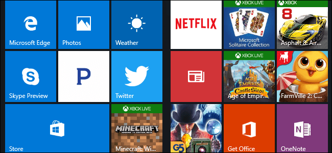

## تعطيل إعلانات شاشة القفل

يعرض ويندوز 10 الآن الإعلانات على شاشة القفل، وذلك عن طريق ميزة Windows Spotlight التي تعرض غالبا خلفيات متميزة، لكن في بعض الأحيان تقوم بعرض إعلانات (مثل إعلان لعبة Tomb Raider)، وللتخلص من إعلانات شاشة القفل عليك بتنفيذ الخطوات التالية.

1. قم بفتح تطبيق الإعدادات (Windows + I) ثم انتقل إلى القسم Personalization ثم التبويب Lock Screen.
2. اختر خلفية شاشة القفل صورة أو عرض شرائح، ولا تقم باختيار Windows Spotlight.
3. بعد ذلك قم بإزالة العلامة من الاختيار Get fun facts, tips, and more from Windows and Cortana on your lock screen.

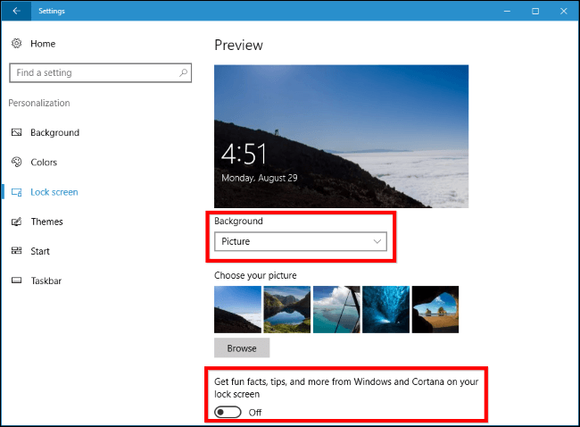

## تعطيل إعلانات قائمة البداية

تظهر الإعلانات في قائمة البداية عن طريق ميزة التطبيقات المقترحة Suggested apps وهي طريقة لتسويق التطبيقات والألعاب الموجودة في متجر الويندوز.

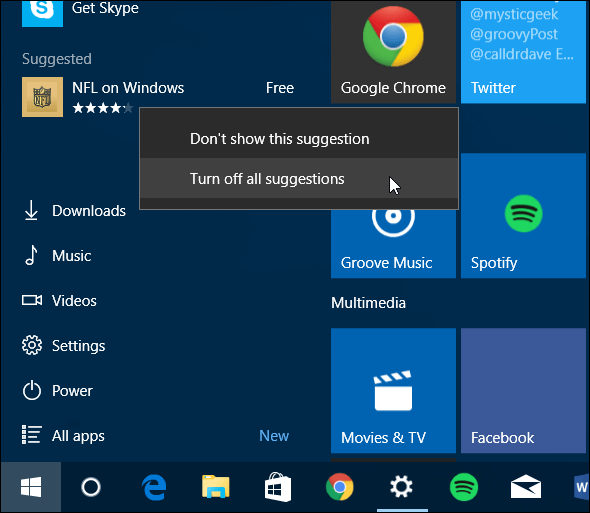

1. قم بفتح تطبيق الإعدادات (Windows + I) ثم انتقل إلى القسم Personalization ثم التبويب Start.
2. قم بتعطيل الاختيار Occasionally show suggestions in Start” setting.

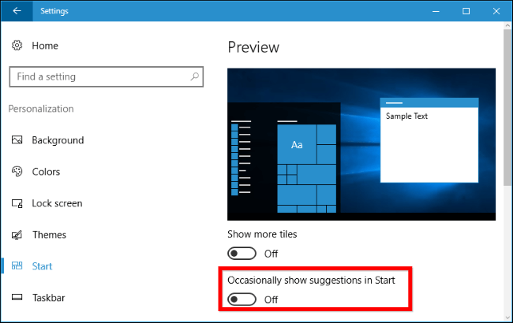

## منع الويندوز من تقديم النصائح

يقدم ويندوز 10 نصائح مفيدة للمستخدم، والتي تستخدم غالبا لعرض مميزات تطبيق مايكروسوفت وتحفيز المستخدم على تجربتها مثل (استخدام متصفح Microsoft Edge لعمر أطول للبطارية)، فإذا كنت لا ترغب في تلقى مثل هذه التوجيهات والنصائح قم بالخطوات التالية:

1. قم بفتح تطبيق الإعدادات (Windows + I) ثم انتقل إلى القسم System ثم التبويب Notifications & Actions.
2. قم بتعطيل الاختيار Get tips, tricks, and suggestions as you use Windows.

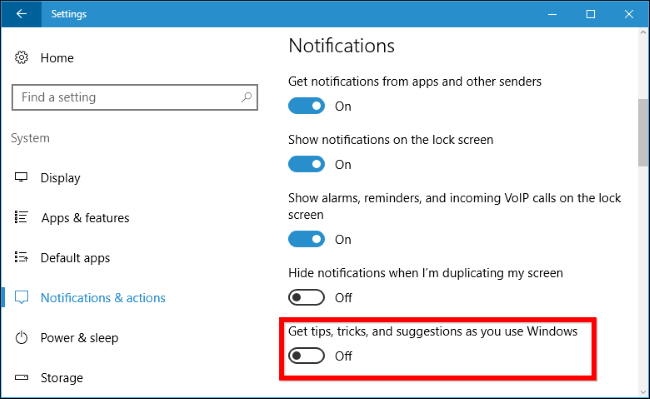

## منع كورتانا من الظهور فجأة على شريط المهام

بعد تحديث الذكرى السنوية لويندوز 10 أصبحت المساعدة الصوتية كورتانا أكثر نشاطا! فهي الآن تظهر فجأة للمستخدم بدون الضغط عليها، لتشجع المستخدم على تجربتها.

1. اضغط على أيقونة Cortana من شريط المهام ثم اختر الإعدادات من القائمة الجانبية.
2. قم بالنزول إلى الأسفل ثم عطل الاختيار Taskbar Tidbits.

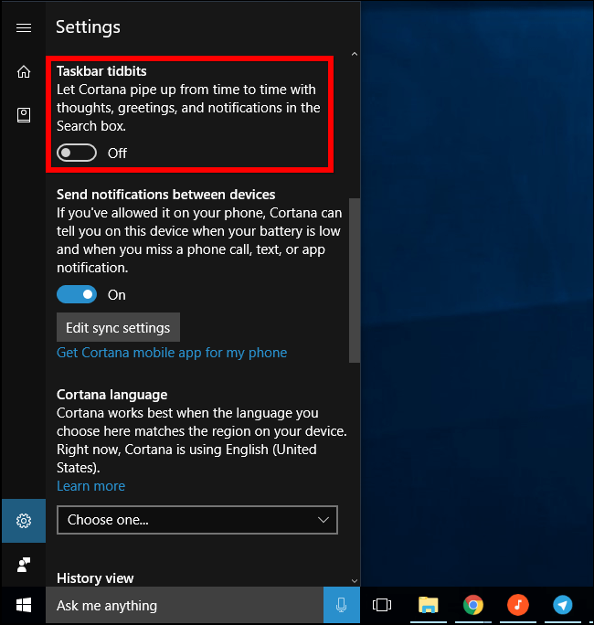

## التخلص من إشعارات الحصول على الأوفيس

تطبيق Get Office في ويندوز 10 يقوم بعرض إشعارات تقترح على المستخدم تحميل حزمة برامج Office 365 للحصول على نسخة تجريبية مجانية لمدة شهر، يمكنك التخلص من هذا الإزعاج بطريقتين:

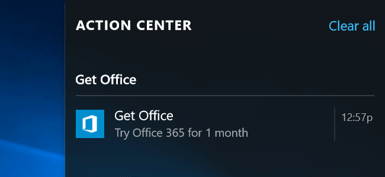

- تعطيل إشعارات تطبيق Get Office:

1. قم بفتح تطبيق الإعدادات (Windows + I) ثم انتقل إلى القسم System ثم التبويب Notifications & Actions.
2. قم بالنزول إلى الأسفل حتى تجد تطبيق Get Office، قم بإيقاف اشعاراته.

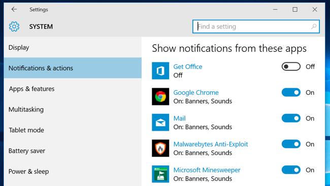

- إزالة تطبيق Get Office:
  قم بفتح قائمة البداية ثم من قائمة التطبيقات اضغط بزر الماوس الأيمن على تطبيق Get Office واختر Uninstall.

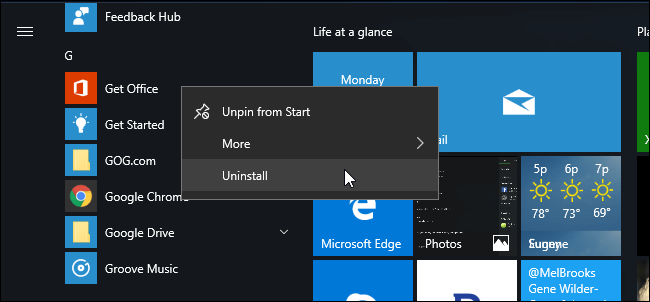

## إزالة التطبيقات المثبتة تلقائيا

بعد تثبيت ويندوز 10 يتم تحميل بعض التطبيقات تلقائيا مثل Candy Crush Soda Saga, Flipboard, Twitter، وهذه التطبيقات تثبت على جهازك كجزء من خدمة Microsoft Consumer Experience.
كل ما عليك هو الضغط بزر الماوس الأيمن على التطبيق واختيار Uninstall من القائمة المختصرة.
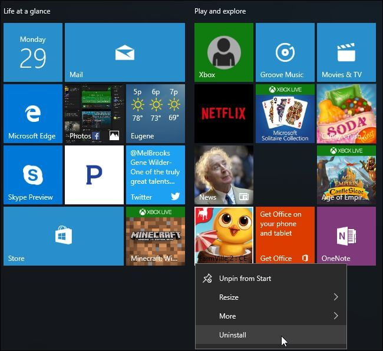

بعض التطبيقات لن تجد بها الاختيار Uninstall لأنها عبارة عن روابط للتحميل من المتجر، ولإزالتها اختر Unpin from Start من القائمة المختصرة.

## تعطيل المربعات الحية وإزالة تثبيت تطبيقات الويندوز من قائمة البداية

على عكس التطبيقات التي بالأعلى، هناك بعض التطبيقات التي لا يمكن إزالتها وتقوم بعرض الإعلانات أيضا مثل المتجر وتطبيق Xbox.
لتعطيل هذه التطبيقات، قم بالضغط بزر الماوس الأيمن على التطبيق واختيار Turn live tile off لمنعه من عرض الإعلانات والاقتراحات.
كما يمكنك أيضا إزالة تثبيت التطبيق من قائمة البداية باختيارك ل Unpin from Start من القائمة المختصرة.

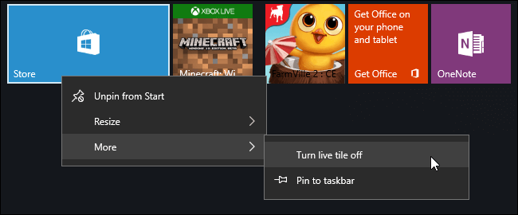

## تجنب لعبة Solitaire المدمجة في الويندوز

تحتوي لعبة Solitaire على فيديوهات إعلانية مدتها 30 ثانية، وللتخلص من هذه الإعلانات يجب عليك دفع اشتراك سنوي قيمة 10$ وأيضا لعبة Minesweeper مثلها.
ولهذا يجب عليك استبدال هذه اللعبة الموجودة على الويندوز بأي نسخة أخرى، فمثلا يمكنك استخدام جوجل من أجل اللعب، كل ما عليك هو كتابة solitaire في مربع البحث وبدء اللعب بدون إعلانات.

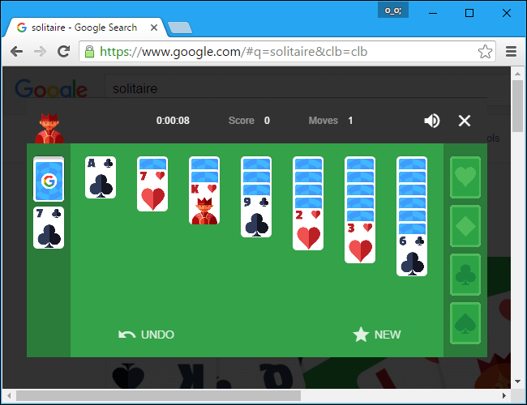

---

هذا الموضوع نُشر باﻷصل في مجلة لغة العصر العدد 190 شهر 10-2016 ويمكن الإطلاع عليه [هنا](https://drive.google.com/file/d/11yob8vKTxY-Nk2c1KWJ3_-eO5ZXw-OlV/view?usp=sharing).

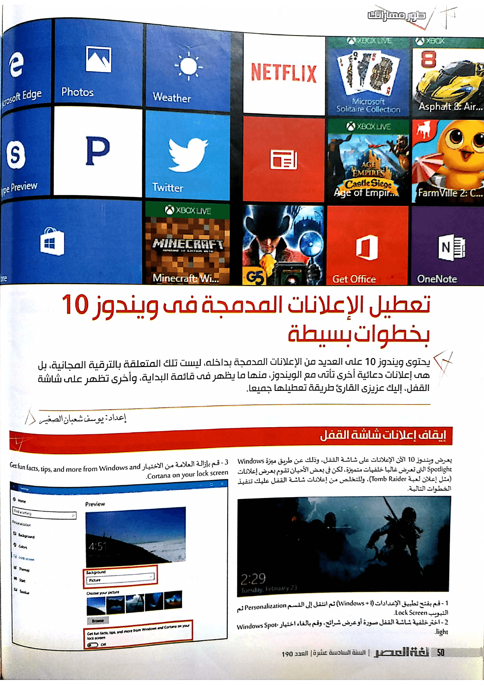

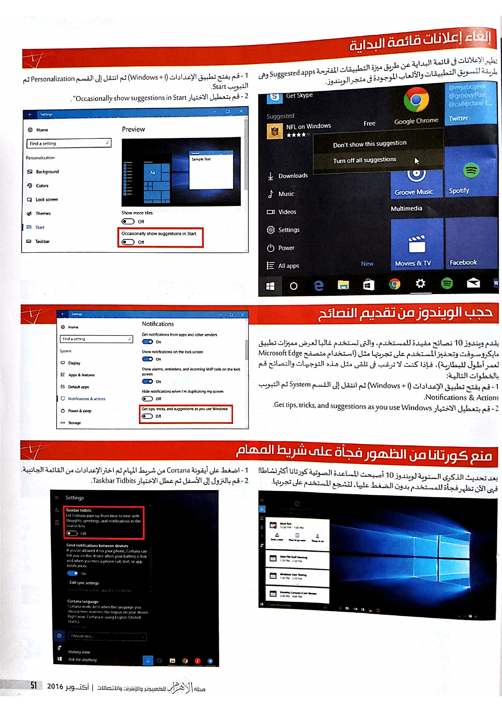

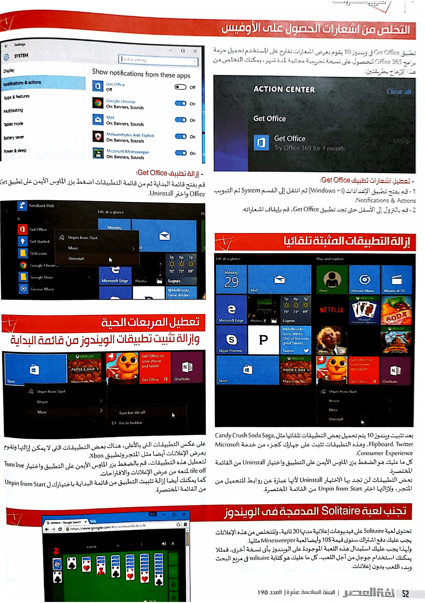
