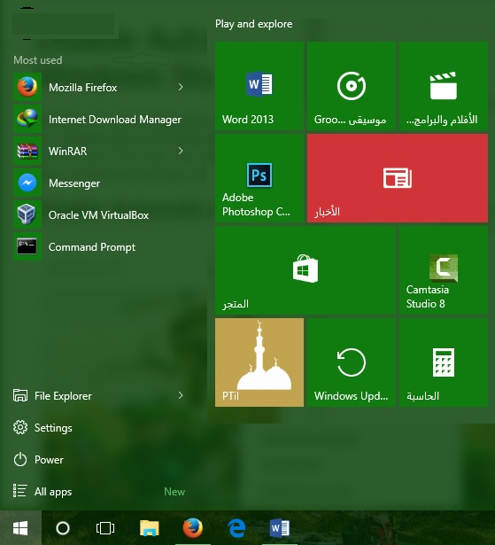
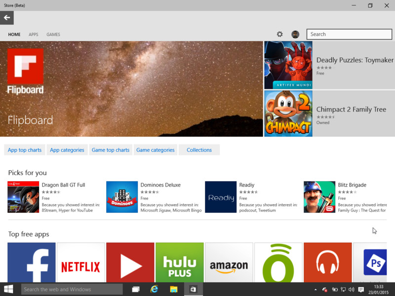
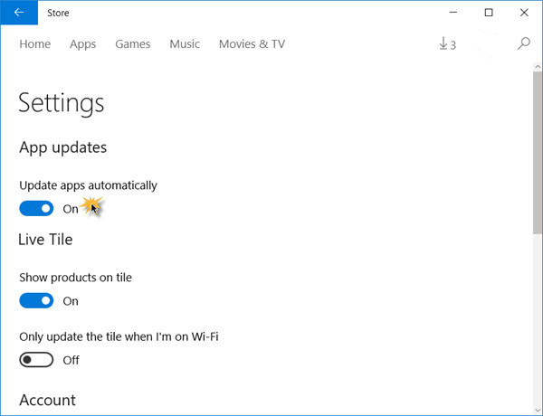

+++
title = "طريقة تعطيل التحديث التلقائي للتطبيقات في ويندوز 10"
date = "2015-08-15"
description = "في ويندوز 10 كل التحديثات تتم تلقائيا، بما فيها تطبيقات النظام والتطبيقات التي يتم تحميلها من المتجر، بالتأكيد التحديث تلقائيا هو الأفضل ولكن نحتاج في يعض الأحيان إلى تعطيل التحديث التلقائي للتطبيقات، إليكم الطريقة."
categories = ["ويندوز",]
series = ["ويندوز 10"]
tags = ["موقع لغة العصر"]

+++

في ويندوز 10 كل التحديثات تتم تلقائيا، بما فيها تطبيقات النظام والتطبيقات التي يتم تحميلها من المتجر، بالتأكيد التحديث تلقائيا هو الأفضل ولكن نحتاج في يعض الأحيان إلى تعطيل التحديث التلقائي للتطبيقات، إليكم الطريقة.

1. قم بفتح متجر التطبيقات من قائمة البداية.

2. سيفتح المتجر كما بالصورة.

3. اضغط على صورة حساب الويندوز ثم اختر Settings.

4. ستجد الاختيار **Update apps automatically** مفعلا بشكل افتراضي قم بتحويله إلى Off.

ملاحظة: لا تعمل هذه الطريقة إلا على [Windows 10 Pro/Enterprise فقط ولا تعمل على Home.

يمكنك إعادة تشغيل التحديثات التلقائية بنفس الطريقة وقم بتغيير **Update apps automatically** إلى **On.**

---
هذا الموضوع نٌشر باﻷصل على موقع مجلة لغة العصر.

http://aitmag.ahram.org.eg/News/22743.aspx