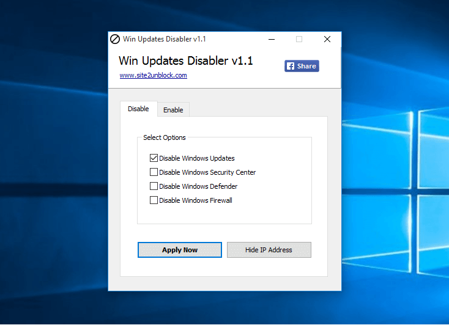
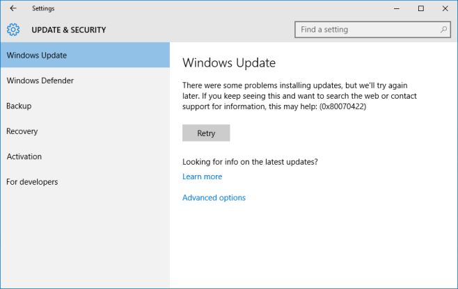

+++
title = "طريقة سحرية لإيقاف تحديثات ويندوز 10 التلقائية"
date = "2015-12-21"
description = "تحدثنا في درس سابق عن طريقة إيقاف التحديثات التلقائية في ويندوز 10 وفى درس اليوم ستتعرف عزيزي القارئ على أحدث طريقة لإيقاف التحديثات التلقائية بضغط زر! اليك الطريقة"
categories = ["ويندوز",]
series = ["ويندوز 10"]
tags = ["موقع لغة العصر"]
+++

تحدثنا في درس سابق عن "طريقة إيقاف التحديثات التلقائية في ويندوز 10" وفى درس اليوم ستتعرف عزيزي القارئ على أحدث طريقة لإيقاف التحديثات التلقائية بضغط زر! اليك الطريقة.

تطبيق Win Updates Disabler هو تطبيق مجاني محمول يمكن مستخدم ويندوز 10 من تعطيل التحديث التلقائي عن طريق ضغطة زر واحدة، كما تعمل هذه الأداة على ويندوز XP، Vista، 7، 8، 8.1، و10 (32 بت و64 بت).

1- قم بتحميل التطبيق [من هنا](http://www.site2unblock.com/download/win-updates-disabler-portable.zip).

2- فك ضغط الملف ثم قم بتشغيل التطبيق المتوافق مع نسخة الويندوز 10، ستجد الواجهة كما بالصورة.

3- من التبويب Disable قم باختيار Disable Windows Updates، ثم اضغط على Apply Now، سيحتاج الجهاز لإعادة التشغيل.

4- إذا قمت بفتح تطبيق الإعدادات ثم قسم التحديثات ستجد أن التحديث يظهر خطأ ولا يقوم بتحميل أي شيء.

5- إذا أردت تفعيل التحديثات مرة أخري من التبويب Enable اختر Enable Windows Update ثم اضغط Apply Now.

---
هذا الموضوع نٌشر باﻷصل على موقع [مجلة لغة العصر](http://aitmag.ahram.org.eg/News/40396/%D8%AF%D8%B1%D9%88%D8%B3/%D8%B4%D8%B1%D8%AD-%D9%88%D8%AA%D8%B9%D9%84%D9%8A%D9%85/%D8%B7%D8%B1%D9%8A%D9%82%D8%A9-%D8%B3%D8%AD%D8%B1%D9%8A%D8%A9-%D9%84%D8%A5%D9%8A%D9%82%D8%A7%D9%81-%D8%AA%D8%AD%D8%AF%D9%8A%D8%AB%D8%A7%D8%AA-%D9%88%D9%8A%D9%86%D8%AF%D9%88%D8%B2--%D8%A7%D9%84%D8%AA%D9%84%D9%82%D8%A7%D8%A6%D9%8A%D8%A9.aspx).