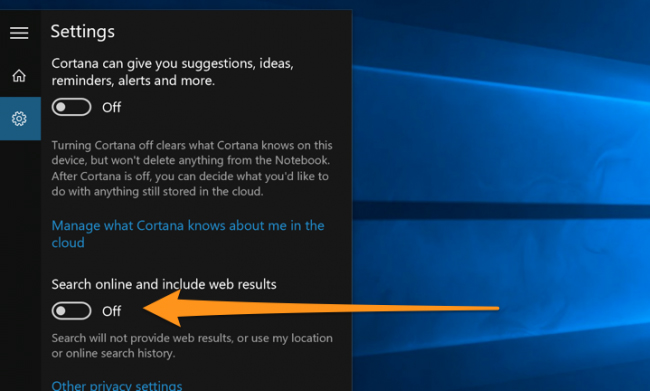

+++
title = "تعطيل محرك بحث Bing في قائمة البداية لويندوز 10"
date = "2015-08-18"
description = "في قائمة بداية ويندوز 10 يمكن للمستخدم البحث مباشرة عن أي شيء يريده على الانترنت عبر محرك البحث Bing، ولكن ما يعيب هذه الخاصية هو البطء الشديد في البحث خصوصا إذا كانت سرعة الانترنت ضعيفة، إليك عزيزي القارئ طريقة تعطيل محرك بحث Bing في قائمة البداية في ويندوز 10."
categories = ["ويندوز",]
series = ["ويندوز 10"]
tags = ["موقع لغة العصر"]
images = ["images/2015-635755038469834766-983.png"]

+++

في قائمة بداية ويندوز 10 يمكن للمستخدم البحث مباشرة عن أي شيء يريده على الانترنت عبر محرك البحث Bing، ولكن ما يعيب هذه الخاصية هو البطء الشديد في البحث خصوصا إذا كانت سرعة الانترنت ضعيفة، إليك عزيزي القارئ طريقة تعطيل محرك بحث Bing في قائمة البداية في ويندوز 10.

1. اضغط على زر Cortana / مربع البحث على شريط المهام.
2. قم بالبحث عن " Cortana & Search settings"

3. سيظهر لك مربع الاعدادات كما بالصورة:

4. بالضغط على Off سيتم إغلاق البحث عبر الانترنت وخاصية Cortana أيضا.
5. قم أيضا بتعطيل خاصية " Search online and include web results" لمنع استخدام محرك البحث Bing.

6. الآن عند قيامك بأي عملية بحث ستظهر نتائج البحث المحلية الموجودة على جهازك فقط ولن يتم استخدام البحث عبر الانترنت.

يمكنك أيضا مشاهدة طريقة إلغاء ميزة البحث عبر الانترنت بدون إيقاف Cortana في هذا الدرس: "بالفيديو.. إلغاء البحث عبر الإنترنت في الويندوز 10"

---
هذا الموضوع نٌشر باﻷصل على موقع مجلة لغة العصر.

http://aitmag.ahram.org.eg/News/22720.aspx