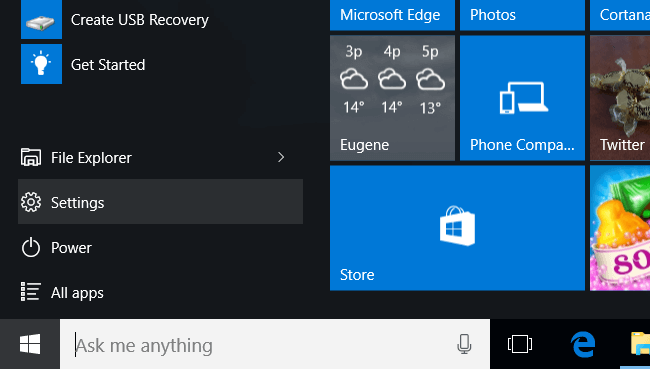
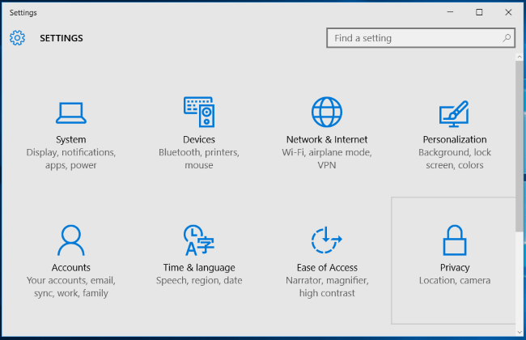
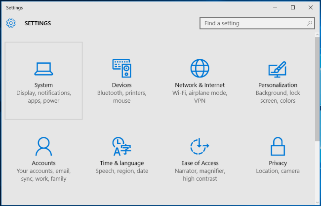
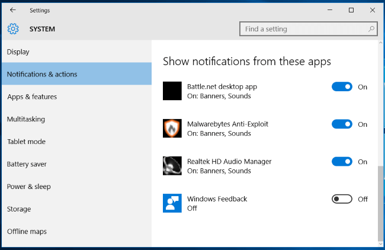

+++
title = "كيفية منع ويندوز 10 من سؤالك عن انطباعاتك عنه"
date = "2015-12-12"
description = "لا يقوم ويندوز 10 بتجميع معلومات حول استخدامك للجهاز فقط ولكنه أيضا يقوم بعرض إشعارات وأسئلة عن انطباعك عنه، إليك عزيزي القارئ طريقة إيقاف هذا الإزعاج."
categories = ["ويندوز",]
series = ["ويندوز 10"]
tags = ["موقع لغة العصر"]

+++

لا يقوم ويندوز 10 بتجميع معلومات حول استخدامك للجهاز فقط ولكنه أيضا يقوم بعرض إشعارات وأسئلة عن انطباعك عنه، إليك عزيزي القارئ طريقة إيقاف هذا الإزعاج.

1- قم بالدخول إلى تطبيق الإعدادات.

2- اختر القسم Privacy.

3- انتقل إلى التبويب Feedback & diagnostics.

4- ستجد الاختيار Windows should ask for my feedback قم باختيار Never من القائمة المنسدلة.

**- تعطيل اشعارات** **Windows Feedback:**

1- من [تطبيق الإعدادات]() توجه إلى القسم Settings.

2- انتقل إلى التبويب Notifications & actions.

3- قم بإيقاف اشعارات تطبيق Windows Feedback كما بالصورة.

---

هذا الموضوع نٌشر باﻷصل على موقع مجلة لغة العصر.

http://aitmag.ahram.org.eg/News/38921.aspx
