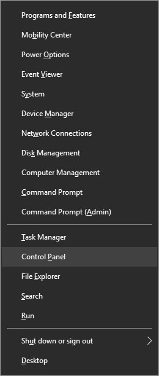

+++
title = "كيفية تعطيل جدار الحماية في ويندوز 10"
date = "2016-06-05"
description = "في هذا الدرس ستتعرف عزيزي القارئ على طريقة التحكم في جدار الحماية وتفعيله أو تعطيله في ويندوز 10، كما تعمل هذه الطريقة مع كل من ويندوز 8 وويندوز 7"
categories = ["ويندوز",]
series = ["ويندوز 10"]
tags = ["موقع لغة العصر"]
images = ["images/0.png"]
+++

في هذا الدرس ستتعرف عزيزي القارئ على طريقة التحكم في جدار الحماية وتفعيله أو تعطيله في ويندوز 10، كما تعمل هذه الطريقة مع كل من ويندوز 8 وويندوز 7.

من المهم أن تعرف عزيزي القارئ أنه لا ينبغي عليك إيقاف أو تعطيل جدار الحماية في الويندوز إلا إذا كنت تملك برنامج حماية آخر مثبت على جهازك، حتى لا تجعل جهازك عرضة للهجمات والفيروسات.

ولتعطيل جدار الحماية Windows Firewall قم بالخطوات التالية:

1. قم بالدخول إلى لوحة التحكم Control Panel (يمكنك استخدام الاختصار Win + X).

2. انتقل إلى Windows Firewall.

3. من القائمة على الجانب الأيسر اختر Turn Windows Firewall On or Off لتظهر لك الإعدادات كما بالصورة.

4. ستجد اختيارين اختر ما تريد منهما:

- Turn on Windows Firewall: لتفعيل جدار الحماية.

- Turn off Windows Firewall (not recommended): لتعطيل جدار الحماية.

5. بعد ذلك اضغط OK ثم اخرج لتطبيق التغييرات.

---
هذا الموضوع نٌشر باﻷصل على موقع مجلة لغة العصر.

http://aitmag.ahram.org.eg/News/52504.aspx