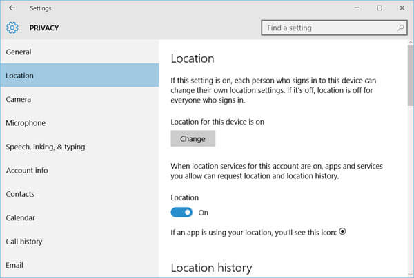
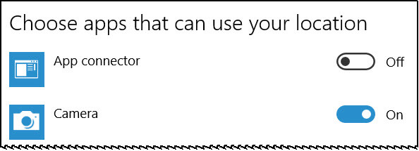

+++
title = "كيف تمنع ويندوز 10 من الوصول لموقعك الجغرافي؟"
date = "2016-05-31"
description = "هل تعلم عزيزي القارئ أن ويندوز 10 يقوم بتحديد الموقع الجغرافي الخاص بك، وذلك لغرض عرض الإعلانات او تسجيل موقع جهازك، إليك طريقة إيقاف هذه الخدمة."
categories = ["ويندوز",]
series = ["ويندوز 10"]
tags = ["موقع لغة العصر"]
images = ["images/2016-636003035325163181-516_thumb705x335.png"]

+++

هل تعلم عزيزي القارئ أن ويندوز 10 يقوم بتحديد الموقع الجغرافي الخاص بك، وذلك لغرض عرض الإعلانات او تسجيل موقع جهازك، إليك طريقة إيقاف هذه الخدمة.

عندما يقوم الويندوز بتحديد مكانك تظهر هذه الأيقونة كما بالصورة:

وكما أوضحت بالمقدمة – يستخدم ويندوز 10 خدمة تحديد المواقع لتحديد المكان الذي تتواجد به، ليقوم بعرض الإعلانات الموجهة للمكان الجغرافي الحالي، أو تحديد موقع جهازك إذا قمت بتفعيل خاصية Find my device.

ولمنع الويندوز من التعرف على موقعك قم بالخطوات التالية:

1- قم بالدخول لتطبيق الإعدادات ثم القسم Privacy ثم التبويب Location.

2- قم بإغلاق الاختيار Location.

3- بعد ذلك اضغط على الزر Clear لمسح كل بيانات الموقع الجغرافي المتعلقة بجهازك.

4- إذا أردت منع تطبيقات معينة من الوصول لموقعك، قم بالنزول إلى الأسفل، ستجد Choose apps that can use your location والتي من خلالها تستطيع التحكم في وصول التطبيقات للموقع الجغرافي.

---
هذا الموضوع نٌشر باﻷصل على موقع مجلة لغة العصر.

http://aitmag.ahram.org.eg/News/50256.aspx