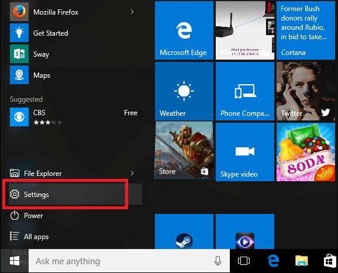
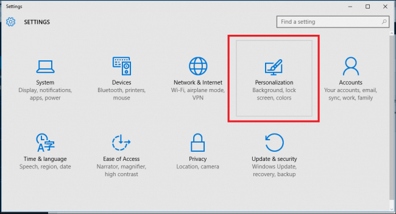
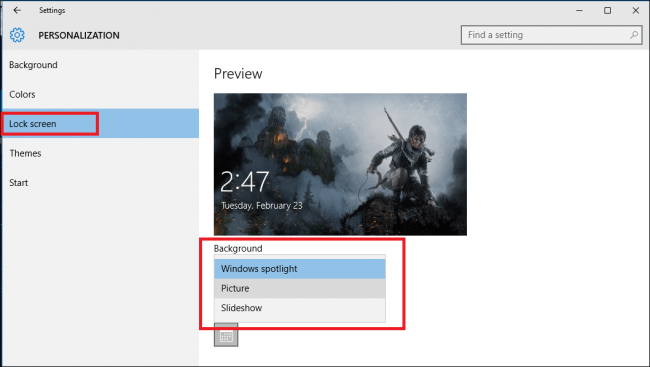
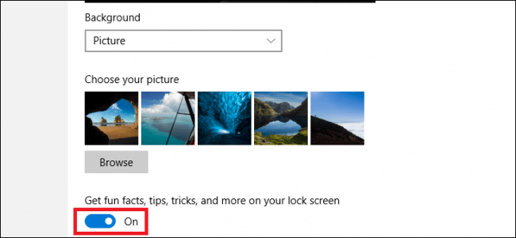
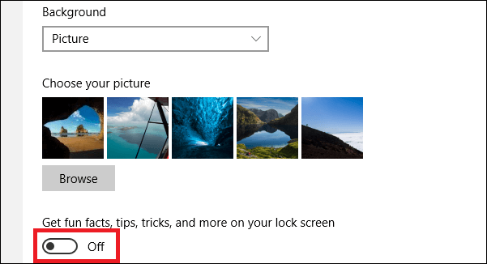

+++
title = "كيفية تعطيل الإعلانات على شاشة قفل ويندوز 10"
date = "2016-02-25"
description = "يواجه بعض المستخدمين مشكلة مع ويندوز 10 وهي ظهور الإعلانات على شاشة القفل، وهو بسبب خدمة مايكروسوفت Windows Spotlight في درس اليوم أقدم لك عزيزي القارئ طريقة الغائها"
categories = ["ويندوز",]
series = ["ويندوز 10"]
tags = ["موقع لغة العصر"]
images = ["images/2016-635920089183139750-313_thumb705x335.jpg"]
+++

يواجه بعض المستخدمين مشكلة مع ويندوز 10 وهي ظهور الإعلانات على شاشة القفل، وهو بسبب خدمة مايكروسوفت Windows Spotlight في درس اليوم أقدم لك عزيزي القارئ طريقة الغائها.

1- قم يفتح قائمة البداية ثم قم بالدخول إلى Settings.

2- انتقل إلى القسم Personalization.

3- قم بالدخول إلى القسم Lock Screen.

4- قم بتغيير Windows Spotlight إلى Picture أو Slideshow كما تريد.

5- هكذا تكون قد عطلت إعلانات مايكروسوفت على شاشة القفل.

6- وأخيرا، ستجد الاختيار Get fun facts, tips, tricks, and more on your lock screen مفعلا.

7- قم بإلغاء تفعيله.

---
هذا الموضوع نٌشر باﻷصل على موقع مجلة لغة العصر.

http://aitmag.ahram.org.eg/News/44675.aspx