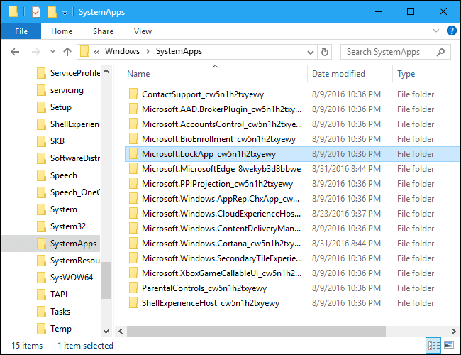
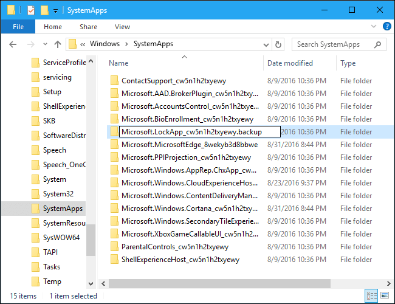
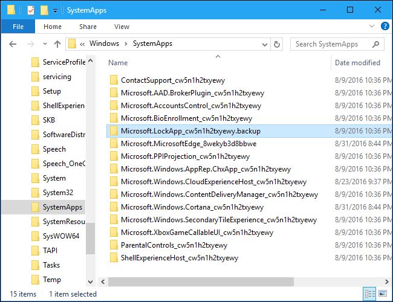
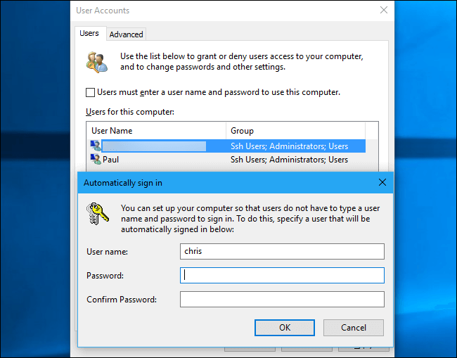

+++
title = "طريقة تعطيل شاشة القفل في ويندوز 10"
date = "2017-07-11"
description = "بعد تحديث الذكرى السنوية لويندوز 10 لم يعد بإمكان المستخدمين تعطيل شاشة القفل عن طريق الرجيستري أو Group Policy، لكن توجد طريقة جديد سنتعرف عليها في هذا الموضوع."
categories = ["ويندوز",]
series = ["ويندوز 10"]
tags = ["موقع لغة العصر"]
+++

بعد تحديث الذكرى السنوية لويندوز 10 لم يعد بإمكان المستخدمين تعطيل شاشة القفل عن طريق الرجيستري أو Group Policy، لكن توجد طريقة جديد سنتعرف عليها في هذا الموضوع.

**كيفية تعطيل شاشة القفل (ماعدا عند الإقلاع):**

كل ما سنقوم بفعله هو منع الويندوز من الوصول إلى تطبيق Microsoft.LockApp، وأبسط طريقة لفعل ذلك دون الدخول في تعقيدات هو عن طريق إعادة تسمية ملفات التطبيق.

1. قم بفتح مستعرض الملفات File Explorer ثم انتقل إلى المسار:

`C:\Windows\SystemApps`

2. ستجد المجلد Microsoft.LockApp\_cw5n1h2txyewy قم بالضغط بزر الماوس الأسمن عليه ثم اختر Rename من القائمة المختصرة، وغير اسمه إلى

`Microsoft.LockApp\_cw5n1h2txyewy.backup`

3. وهكذا لن يستطيع الويندوز الوصول لتطبيق شاشة القفل.

- إذا أردت إعادة تفعيل شاشة القفل مرة أخرى، توجه إلى نفس المسار وأعد تسميه المجلد مجددا إلى Microsoft.LockApp\_cw5n1h2txyewy

**كيفية تعطيل شاشة القفل عند تسجيل الدخول:**

1. قم بفتح مربع Run ثم اكتب netplwiz

2. قم بتحديد الحساب ثم اضغط أزل العلامة من الاختيار Users must enter a user name and password to use this computer واضغط OK.

3. ستظهر لك نافذة تطلب ادخال بينات المستخدم من اسم وكلمة مرور، قم بكتابتهم ثم اضغط OK.

---
هذا الموضوع نٌشر باﻷصل على موقع مجلة لغة العصر.

http://aitmag.ahram.org.eg/News/72882.aspx