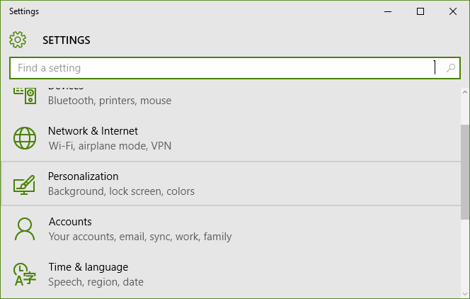
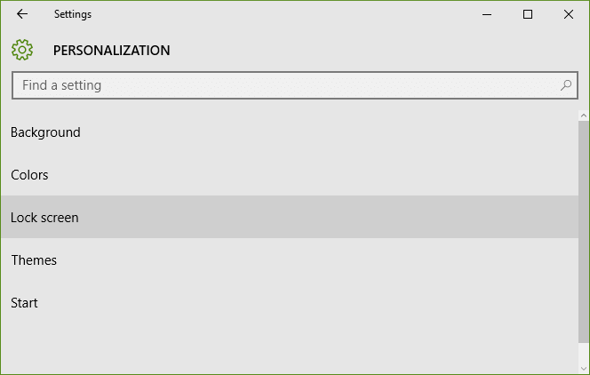
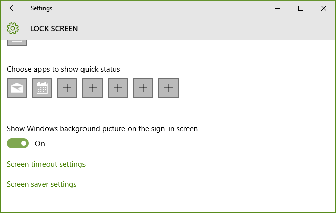
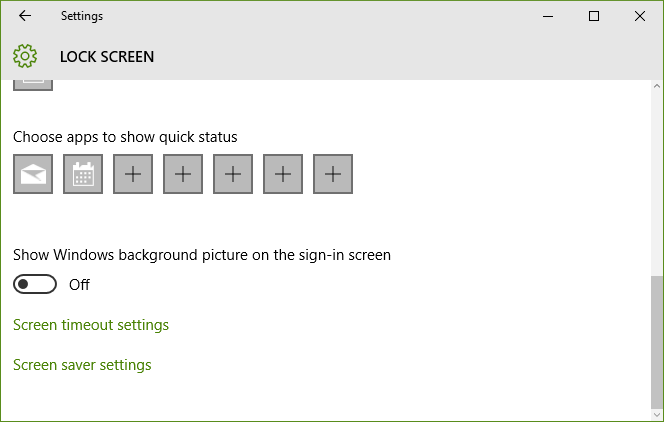

+++
title = "كيفية تعطيل خلفية شاشة تسجيل الدخول في ويندوز 10"
date = "2016-02-15"
description = "من ضمن الخصائص الجديدة التي أضافتها مايكروسوفت إلى بناء ويندوز 10 الأخير 1511، هي إمكانية إلغاء خلفية شاشة تسجيل الدخول، في درس اليوم سنتعرف عزيزي القارئ عليها"
categories = ["ويندوز",]
series = ["ويندوز 10"]
tags = ["موقع لغة العصر"]
+++

من ضمن الخصائص الجديدة التي أضافتها مايكروسوفت إلى بناء ويندوز 10 الأخير 1511، هي إمكانية إلغاء خلفية شاشة تسجيل الدخول، في درس اليوم سنتعرف عزيزي القارئ عليها.

1- قم بالدخول إلى تطبيق الإعدادات ثم القسم Personalization.

2- انتقل إلى التبويب Lock Screen.

3- قم بالنزول إلى أسفل التبويب ستجد الاختيار Show Windows background picture on the sign-in screen مفعلا.

4- قم بإيقافه كما بالصورة.

5- تحتاج إلى تسجيل الخروج ثم تسجيل الدخول مرة أخري لتطبيق التغييرات.

---
هذا الموضوع نٌشر باﻷصل على موقع مجلة لغة العصر.

http://aitmag.ahram.org.eg/News/43450.aspx