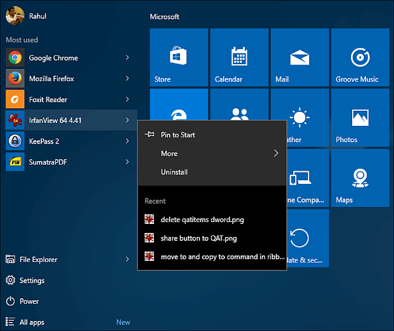
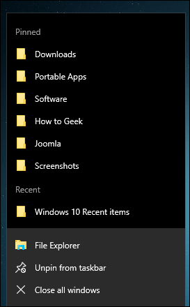
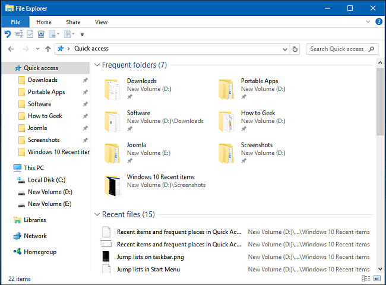
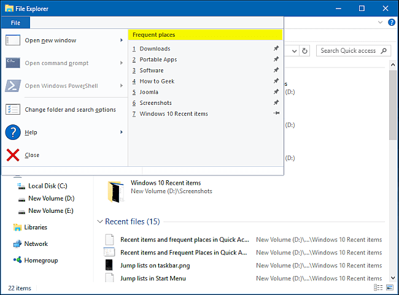
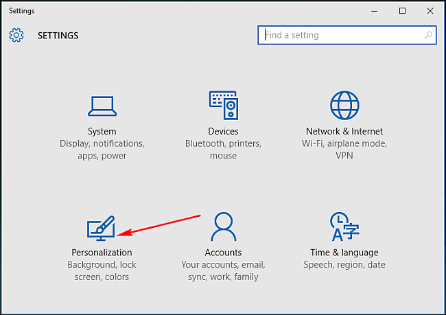
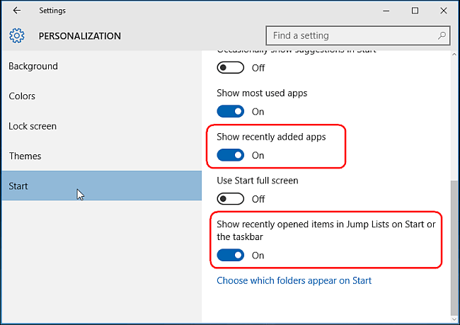

+++
title = "طريقة تعطيل عرض الملفات الأخيرة في ويندوز 10"
date = "2016-01-18"
description = "في كل أماكن ويندوز 10 ستري قوائم تعرض ملفاتك التي استخدمتها مؤخرا، ولكن اذا كان جهازك يستخدمه أكثر من شخص ستكون هذه القوائم مزعجة لخصوصيتك، إليك طريقة تعطيلها"
categories = ["ويندوز",]
series = ["ويندوز 10"]
tags = ["موقع لغة العصر"]

+++

في كل أماكن ويندوز 10 ستري قوائم تعرض ملفاتك التي استخدمتها مؤخرا، ولكن اذا كان جهازك يستخدمه أكثر من شخص ستكون هذه القوائم مزعجة لخصوصيتك، إليك طريقة تعطيلها.

**الأماكن التي يخزن بها قوائم الملفات الأخيرة والأماكن المتكررة:**

%AppData%\Microsoft\Windows\Recent Items 

%AppData%\Microsoft\Windows\Recent\AutomaticDestinations 

%AppData%\Microsoft\Windows\Recent\CustomDestinations

وهكذا تظهر في قائمة البداية

وهكذا تظهر في قوائم سطح المكتب

كما تظهر هكذا في قائمة Quick Access

وفي قائمة File

**كيفية إيقاف قوائم العناصر الحديثة في ويندوز 10**

أسهل طريقة لتعطيلها هي عن طريق تطبيق الإعدادات:

1- قم بفتح تطبيق الإعدادات ثم انتقل إلى القسم Personalization.

2- اضغط على التبويب Start ثم قم بإلغاء تفعيل " Show recently added apps" و " Show recently opened items in Jump Lists on Start or the taskbar ".

3- عندما تقوم بإغلاق قوائم الملفات الأخيرة والأماكن المتكررة سيقوم الويندوز بحذفها باستثناء العناصر التي قمت بتثبيتها، فإذا أردت ازالتها قم بعمل unpin لها.

---
هذا الموضوع نٌشر باﻷصل على [موقع مجلة لغة العصر](http://aitmag.ahram.org.eg/News/41604/%D8%AF%D8%B1%D9%88%D8%B3/%D8%B4%D8%B1%D8%AD-%D9%88%D8%AA%D8%B9%D9%84%D9%8A%D9%85/%D8%B7%D8%B1%D9%8A%D9%82%D8%A9-%D8%AA%D8%B9%D8%B7%D9%8A%D9%84-%D8%B9%D8%B1%D8%B6-%D8%A7%D9%84%D9%85%D9%84%D9%81%D8%A7%D8%AA-%D8%A7%D9%84%D8%A3%D8%AE%D9%8A%D8%B1%D8%A9-%D9%81%D9%8A-%D9%88%D9%8A%D9%86%D8%AF%D9%88%D8%B2-.aspx).