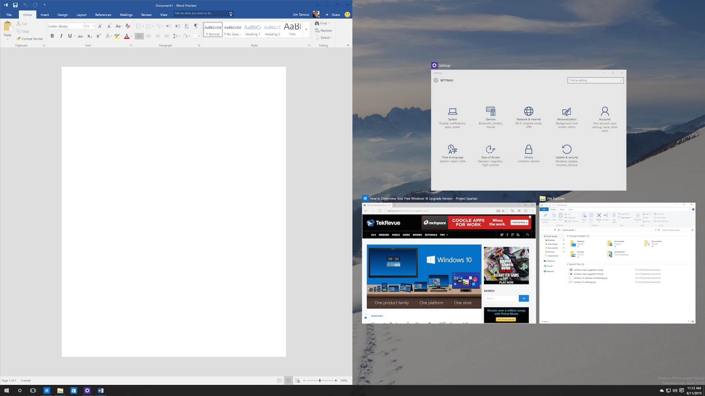
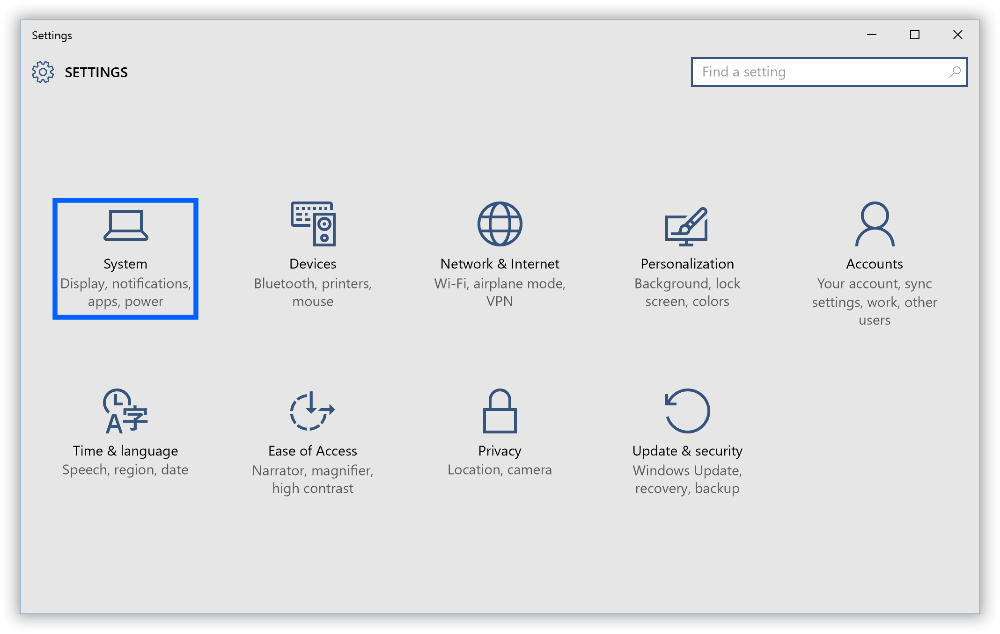
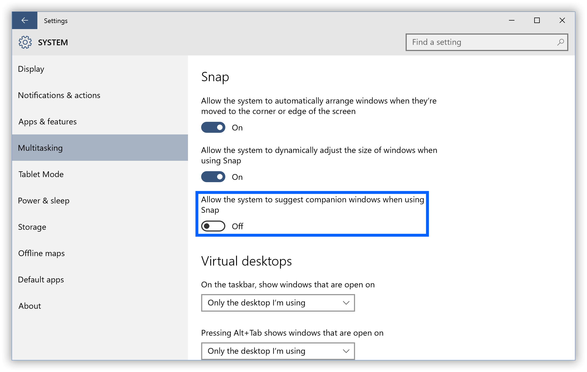
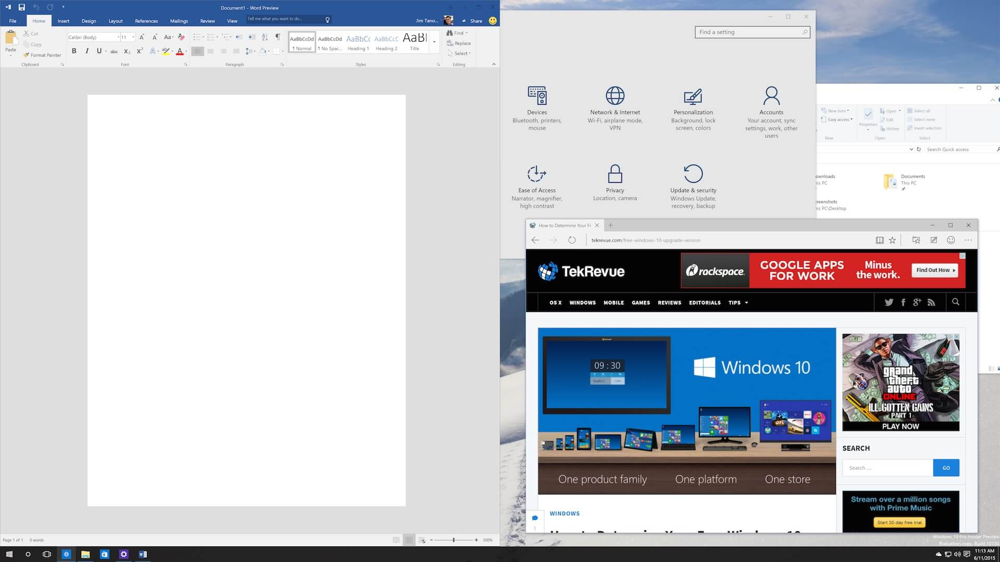

+++
title = "طريقة تعطيل خاصية Snap Suggestions فى ويندوز 10"
date = "2016-03-03"
description = "خاصية Snap فى ويندوز 10 من أفضل الخصائص الجديدة، فهى تمكن المستخدم من ترتيب النوافذ المفتوحة بطريقة بسيطة وأنيقة بواسطة الاقتراحات، ولكن قد لا تعجب بعض المستخدمين، اليكم طريقة تعطيلها"
categories = ["ويندوز",]
series = ["ويندوز 10"]
tags = ["موقع لغة العصر"]
images = ["images/2016-635925272130784465-78_thumb705x335.png"]
+++

خاصية Snap فى ويندوز 10 من أفضل الخصائص الجديدة، فهى تمكن المستخدم من ترتيب النوافذ المفتوحة بطريقة بسيطة وأنيقة بواسطة الاقتراحات، ولكن قد لا تعجب بعض المستخدمين، اليكم طريقة تعطيلها.

كما أوضحت فى المقدمة، فهذه هى كيفية عمل خاصية Snap:

وعند تعطيل الاقتراحات لن يظهر الجزء الأيمن من الصورة.

1- قم بالدخول إلى تطبيق الإعدادات ثم القسم System.

2- انتقل إلى التبويب Multitasking.

3- ستجد الخاصية Allow the system to suggest companion windows when using Snap مفعله، قم بغييرها إلى Off.

4- قم بتجربة خاصية Snap مرة أخرى ستجدها تعمل ولكن بدون الاقتراحات.

---
هذا الموضوع نٌشر باﻷصل على موقع مجلة لغة العصر.

http://aitmag.ahram.org.eg/News/45416.aspx