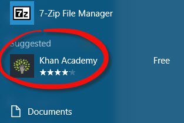
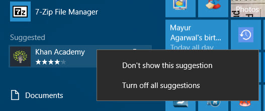
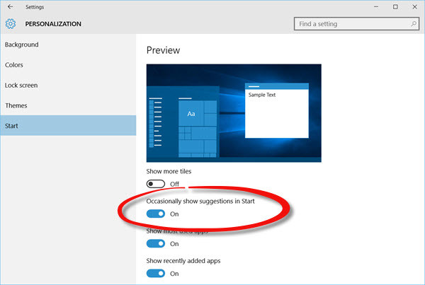

+++
title = "طريقة إزالة إعلانات التطبيقات المقترحة من قائمة البداية في ويندوز 10"
date = "2015-12-03"
description = "بعد التحديث إلى الإصدار 1511 البناء 1058614 من ويندوز 10 لاحظ المستخدمون بداية ظهور إعلانات لتطبيقات مقترحة في قائمة البداية، في درس اليوم سأخبرك عزيزي القارئ بطريقة التخلص من هذه الإعلانات المزعجة"
categories = ["ويندوز",]
series = ["ويندوز 10"]
tags = ["موقع لغة العصر"]
images = ["images/0.jpg"]

+++

بعد التحديث إلى الإصدار 1511 البناء 10586.14 من ويندوز 10 لاحظ المستخدمون بداية ظهور إعلانات لتطبيقات مقترحة في قائمة البداية، في درس اليوم سأخبرك عزيزي القارئ بطريقة التخلص من هذه الإعلانات المزعجة.

تظهر الإعلانات كما بالصورة:

**الطريقة الأولى:**

قم بالضغط بزر الفأرة الأيمن على الاقتراحات ثم قم باختيار " Turn off all suggestions".

**الطريقة الثانية:**

1. قم بالدخول إلى تطبيق [الإعدادات](()ٕعدادات.aspx)، ثم إلى القسم Personalization.

2. انتقل إلى التبويب Start.

3. ستجد الاختيار " Occasionally show suggestions in Start" قم بإغلاقه.

4. هكذا لن تظهر الاقتراحات مرة أخري.

---
هذا الموضوع نٌشر باﻷصل على موقع مجلة لغة العصر.

http://aitmag.ahram.org.eg/News/38501.aspx
